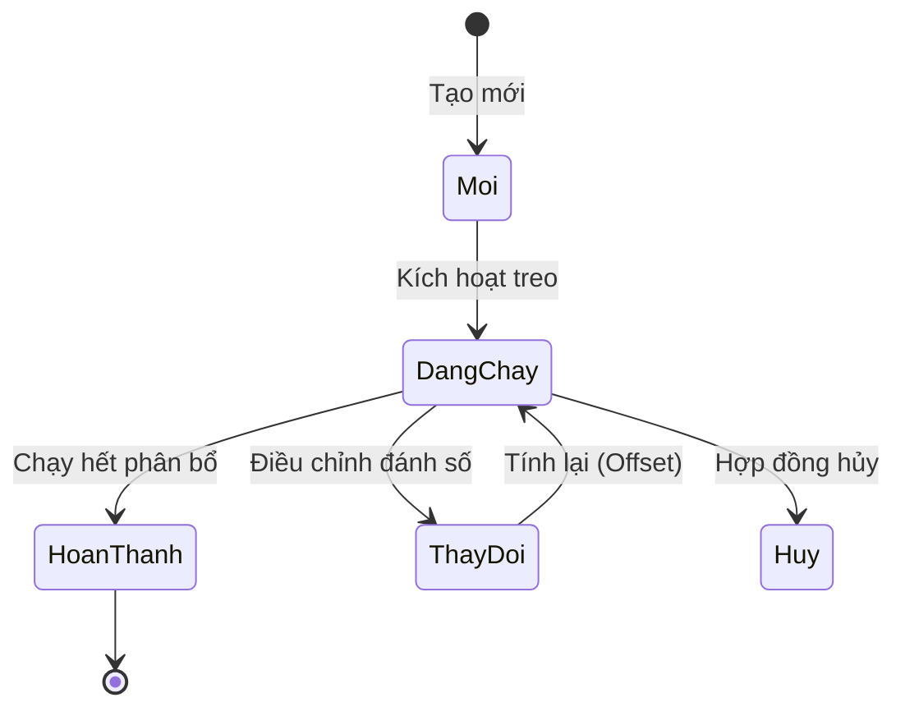

# M10 — RTM, Vấn đề tồn đọng & Phụ lục

> **SRS Module 10 trong 10** | Dự án: Quản lý tính thực chạy

---

## 10.1 Ma trận truy xuất yêu cầu (Requirements Traceability Matrix - RTM)

| ID Yêu cầu | Tên yêu cầu | Thành phần mã nguồn (Stored Procedure) | Trạng thái |
|------------|-------------|---------------------------------------|------------|
| FR-M3-01 | Xác định điều kiện tính mới | `ThucChay_CPD_Job`, `ThucChay_PR_Job`... | Đã có |
| FR-M3-02 | Tính toán cho nhóm CPD | `SP_ThucChay_CPDdotchay_PhatSinhThucchay_ThucChayDaTinh` | Đã có |
| FR-M3-03 | Tính toán cho nhóm Mobile | `SP_ThucChay_Mobile_GhiNhanPhatSinh_ThucChayDaTinh` | Đã có |
| FR-M4-02 | Thực hiện đối trừ (Offset) | `SP_ThucChay_PR_ThucChayDaTinh` (LoaiXuLy 1, 2) | Đã có |
| FR-M5-01 | Điều phối thứ tự chạy | SQL Agent Jobs (Steps 1-n) | Đã có |

---

## 10.2 Các vấn đề chưa giải quyết (Open Issues)

Các câu hỏi và điểm chưa rõ ràng cần xác nhận với Stakeholders:

| ID | Vấn đề | Nguồn gốc | Trạng thái | Người phụ trách |
|----|--------|-----------|------------|-----------------|
| ISS-01 | Tại sao nhóm CPV, CPR chưa có logic tính thay đổi? | INPUT_LOGIC_TINH_THAYDOI | OPEN | Business Analyst |
| ISS-02 | Quy trình xử lý khi giá trị phân bổ Admarket GIẢM là gì? | INPUT_LOGIC_TINH_THAYDOI | OPEN | Accounting |
| ISS-03 | Bảng nào chính xác dùng để phát hiện thay đổi cho Inventory? | INPUT_LOGIC_TINH_THAYDOI | OPEN | Developer |
| ISS-04 | Logic tính thay đổi cụ thể cho Performance Base ra sao? | INPUT_LOGIC_TINH_THAYDOI | OPEN | Tech Lead |

---

## 10.3 Phụ lục (Appendix)

### A. Từ điển dữ liệu thực thể (Data Dictionary)

| Thực thể | Định nghĩa | Tham chiếu |
|----------|------------|------------|
| `ThucChayDaTinh` | Bảng đích lưu trữ kết quả thực chạy cuối cùng. | M8 |
| `HopDongChiTiet` | Thực thể phân bổ của hợp đồng, chứa thông tin số lượng, đơn giá. | M3 |
| `ThucChay` | Log treo banner hàng ngày từ hệ thống vận hành. | M3 |

### B. Ma trận đặc quyền người dùng (Privilege Matrix)

| Lớp người dùng | Dữ liệu | Đọc | Thêm mới | Cập nhật | Xóa |
|----------------|---------|-----|----------|----------|-----|
| Vận hành | ThucChayDaTinh | ✓ | ✓ | ✓ | ✗ |
| Kinh doanh | ThucChayDaTinh | ✓ (Own) | ✗ | ✗ | ✗ |
| Kế toán | ThucChayDaTinh | ✓ | ✗ | ✗ | ✗ |
| Admin | Tất cả | ✓ | ✓ | ✓ | ✓ |

### C. Sơ đồ trạng thái Hợp đồng (Contract State Diagram)

