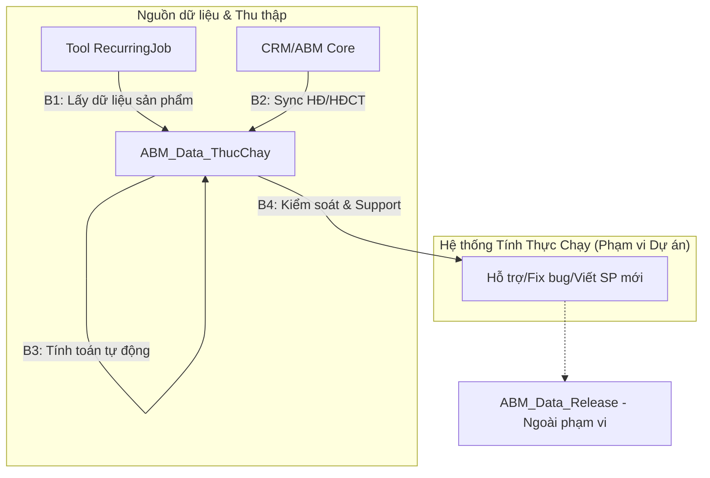

# M2 — Mô tả Tổng quan (Overall Description)

> **SRS Module 2 trong 10** | Dự án: Quản lý tính thực chạy | Phiên bản: v0.1 (DRAFT)

---

## 2.1 Bối cảnh Sản phẩm (Product Perspective)

### Ngữ cảnh
Hệ thống Quản lý tính thực chạy (ABM_Data_ThucChay) là một thành phần quan trọng trong hệ sinh thái quản lý quảng cáo (ABM). Hệ thống này đóng vai trò cầu nối giữa dữ liệu vận hành kỹ thuật (banner treo, lượt view/click) và dữ liệu tài chính (doanh thu thực tế). Hệ thống thay thế các quy trình tính toán thủ công bằng các thuật toán tự động hóa trên nền tảng SQL Server.

### Sơ đồ ngữ cảnh hệ thống (System context)

Các hệ thống liên quan:

| Hệ thống | Vai trò |
|----------|---------|
| Tool RecurringJob | Thu thập dữ liệu vận hành từ các nguồn sản phẩm (B1). |
| thucchay-ag / asdag2 | Các server chạy SQL Agent Jobs để đồng bộ, chuẩn hóa và tính toán (B2, B3). |
| Đội Kiểm soát (Support) | Nhận kết quả B4, yêu cầu viết SP bổ sung hoặc phản ánh lỗi để hệ thống thực hiện Fix (B4). |

---

## 2.2 Các chức năng chính (Product Functions)

Tóm tắt các nhóm chức năng chính (Chi tiết tại M3-M8):

- **Tính thực chạy mới (New Calc)** — Tự động tính doanh số dựa trên kết quả vận hành lần đầu.
- **Tính thay đổi & Đối trừ (Recalc & Offset)** — Tự động điều chỉnh doanh số khi có thay đổi từ phía hợp đồng hoặc thực treo.
- **Điều phối tiến trình (Orchestration)** — Quản lý thứ tự thực thi của các Job SQL để đảm bảo dữ liệu đúng đắn.
- **Kiểm soát & Đối soát** — Tự động rà soát sai lệch dữ liệu sau khi tính toán.
- **Cảnh báo vận hành** — Thông báo tức thời khi các tiến trình tính toán gặp sự cố.

---

## 2.3 Các lớp người dùng (User Classes)

| Lớp người dùng | Mô tả | Trình độ kỹ thuật | Tần suất sử dụng | Quyền hạn |
|----------------|-------|-------------------|------------------|-----------|
| Nhân viên Vận hành | Theo dõi Job, xử lý các bản ghi lỗi. | Trung bình | Hàng ngày | Xem log, chạy lại Job cho từng hợp đồng. |
| Nhân viên Kinh doanh | Xem báo cáo thực chạy để tư vấn khách hàng. | Thấp | Hàng ngày | Xem dữ liệu thực chạy của hợp đồng phụ trách. |
| Kế toán | Đối soát doanh thu cuối tháng. | Thấp | Hàng tháng | Xem và chốt dữ liệu doanh số thực chạy. |
| Admin hệ thống | Cấu hình tham số, quản lý Job SQL. | Cao | Thường xuyên | Toàn quyền cấu hình logic và hệ thống. |

---

## 2.4 Môi trường vận hành (Operating Environment)

### Nền tảng
- **Cơ sở dữ liệu:** Microsoft SQL Server (MSSQL).
- **Hệ điều hành máy chủ:** Windows Server.
- **Công cụ điều phối:** SQL Server Agent, PowerShell.

---

## 2.5 Các ràng buộc thiết kế và triển khai (Constraints)

### Ràng buộc về Nghiệp vụ & Pháp lý
- **CON-REG-01:** Doanh số thực chạy phải khớp 100% với các điều khoản trong hợp đồng đã ký kết.
- **CON-REG-02:** Mọi thay đổi về doanh số phải có log đối trừ (Offset) rõ ràng để phục vụ kiểm toán.

### Ràng buộc về Công nghệ
- **CON-TECH-01:** Logic tính toán phải được thực hiện chủ yếu bằng Stored Procedures trên SQL Server để đảm bảo hiệu năng xử lý dữ liệu lớn.
- **CON-TECH-02:** Sử dụng Change Data Capture (CDC) để theo dõi các thay đổi trên bảng dữ liệu gốc.

---

## 2.6 Giả định và Phụ thuộc (Assumptions & Dependencies)

### Giả định
- **ASM-01:** Dữ liệu đánh số từ CRM/ABM Core luôn được cập nhật kịp thời trước khi Job tính thực chạy bắt đầu.
- **ASM-02:** Cấu trúc bảng `thucchay` (log treo) không thay đổi đột ngột làm gãy các logic quy đổi.

### Phụ thuộc
- **DEP-01:** Phụ thuộc vào tính ổn định của hệ thống mạng để lấy dữ liệu từ Google/Facebook API.
- **DEP-02:** Phụ thuộc vào kết quả của các Job chuẩn bị dữ liệu (Phase 1) trước khi tiến hành Phase 2.
