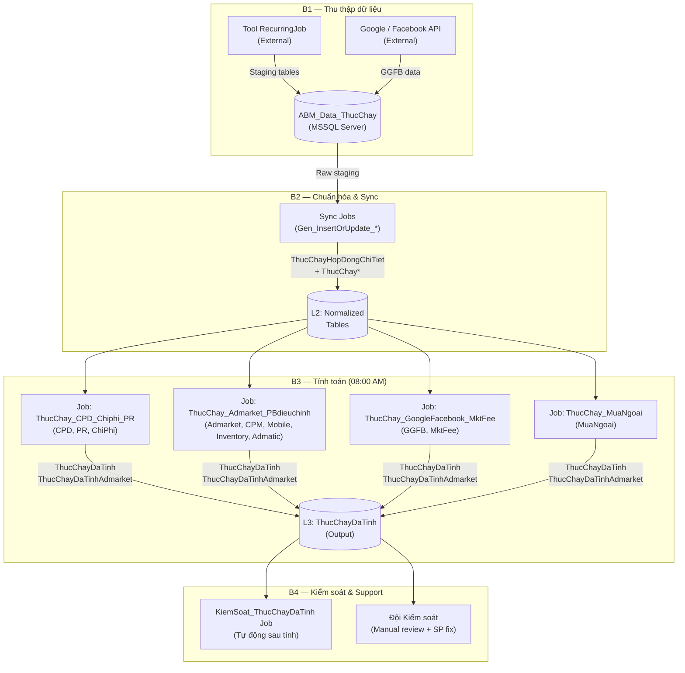

# TECH_SOLUTION_DESIGN — Hệ thống Tính Thực Chạy

> **Skill:** `tech-solution-design` | **Trạng thái:** 🟢 Complete
> **Ngày tạo:** 2026-05-12 | **Phiên bản:** v1.0

---

## 1. Solution Overview (Tổng quan giải pháp)

Hệ thống **ABM_Data_ThucChay** áp dụng kiến trúc **Database-Centric Pipeline** trên nền tảng Microsoft SQL Server. Toàn bộ logic tính toán được đặt trong Stored Procedures, điều phối bởi SQL Server Agent Jobs theo lịch hàng ngày.

### Sơ đồ kiến trúc tổng thể



---

## 2. Architecture Decision Records (ADRs)

### ADR-001: SQL Server Agent Jobs làm Orchestrator

**Ngày:** Pre-2024 (kiến trúc gốc)
**Trạng thái:** ✅ Accepted

**Ngữ cảnh:**
Cần điều phối thứ tự thực thi của nhiều Stored Procedures tính toán hàng ngày theo lịch cố định (08:00 AM).

**Quyết định:**
Sử dụng **SQL Server Agent Jobs** với nhiều Steps, mỗi Step gọi 1 SP. Steps liên kết theo kiểu `Go to next step on success / Go to step N on failure`.

**Alternatives đã xem xét:**

| Option | Lý do không chọn |
|--------|-----------------|
| Windows Task Scheduler | Không native SQL; khó quản lý dependency giữa các bước |
| External Orchestrator (Airflow, etc.) | Overhead infrastructure; team SQL-centric |
| SSIS Package | Complexity cao hơn cần thiết cho use case này |

**Hệ quả:**
- ✅ Native SQL Server, không cần infrastructure bổ sung
- ✅ Email alert built-in khi fail (PowerShell script step)
- ⚠️ Khó visualize dependency phức tạp khi số Job tăng lên
- ⚠️ Không có retry logic linh hoạt — fail là dừng ngay

---

### ADR-002: T-SQL Stored Procedures cho toàn bộ Business Logic

**Ngày:** Pre-2024 (kiến trúc gốc)
**Trạng thái:** ✅ Accepted

**Ngữ cảnh:**
Cần xử lý tính toán cho hàng triệu dòng dữ liệu mỗi ngày với các công thức phức tạp (đối trừ, CTE recursive, chốt chặn vượt phân bổ).

**Quyết định:**
Toàn bộ business logic — bao gồm tính mới, tính thay đổi/offset, và kiểm soát — được implement **100% trong T-SQL Stored Procedures** chạy trực tiếp trên database server.

**Hệ quả:**
- ✅ Hiệu năng cao — tính toán set-based, không di chuyển dữ liệu qua network
- ✅ Transaction native SQL Server, đảm bảo atomicity
- ⚠️ Logic phân mảnh trong ~140 SPs — khó trace end-to-end
- ⚠️ Hardcoded ID (DmSanPhamID, DmHinhThucQuangCaoID) → khó mở rộng (TD-002)

---

### ADR-003: Single Database (ABM_Data_ThucChay) cho toàn bộ pipeline

**Ngày:** Pre-2024
**Trạng thái:** ✅ Accepted

**Ngữ cảnh:**
Staging, normalized, và output data cần chia sẻ transaction boundary và tránh network hop.

**Quyết định:**
Tất cả staging, normalized, output tables đều nằm trong **1 database duy nhất**: `ABM_Data_ThucChay` trên server `asdag2/thucchay-ag`.

**Hệ quả:**
- ✅ Join trực tiếp giữa các layer, không cần ETL pipeline phức tạp
- ✅ Transaction spanning nhiều tables dễ dàng
- ⚠️ Single point of failure — nếu DB down, toàn bộ pipeline dừng
- ⚠️ Schema evolution phức tạp khi DB lớn (~507 tables)

---

### ADR-004: Soft Relationships (không dùng FK cứng)

**Ngày:** Pre-2024
**Trạng thái:** ⚠️ Accepted (với khuyến nghị review)

**Ngữ cảnh:**
Hệ thống có nhiều cross-reference giữa tables (HopDong ↔ HopDongChiTiet ↔ ThucChayDaTinh). Data integrity cần được đảm bảo.

**Quyết định:**
Sử dụng **naming convention** (`REF`, `FK`, `ID` suffix) thay vì Foreign Key constraints cứng. Integrity được enforce bởi logic SP.

**Hệ quả:**
- ✅ Linh hoạt khi bulk insert staging data
- ✅ Không bị block bởi FK violation trong quá trình sync
- ⚠️ **P1 Risk (TD-001):** Orphan records có thể tồn tại nếu SP logic có bug
- ⚠️ Không có DB-level protection — toàn bộ phụ thuộc vào SP correctness

**Khuyến nghị:** Review và lộ trình thêm FK cho các bảng core (HopDong, HopDongChiTiet, ThucChayDaTinh) — xem MASTER_PLAN Phase B.

---

### ADR-005: CDC (Change Data Capture) cho phát hiện thay đổi

**Ngày:** ~2022
**Trạng thái:** ✅ Accepted

**Ngữ cảnh:**
Hệ thống cần phát hiện khi dữ liệu gốc (HopDong, HopDongChiTiet, ThucChay) thay đổi để trigger logic đối trừ.

**Quyết định:**
Bật **SQL Server CDC** cho database `ABM_Data_ThucChay`. CDC Log Scan Job và Cleanup Job chạy tự động.

**Hệ quả:**
- ✅ Native SQL Server, không cần polling
- ✅ Capture được tất cả INSERT/UPDATE/DELETE
- ⚠️ CDC retention cần quản lý (cleanup job) tránh log phình to
- ⚠️ Overhead nhỏ trên write operations

---

## 3. Component Design (Thiết kế thành phần)

### 3.1 Data Layer Architecture (4 lớp)

| Layer | Tables (ví dụ) | Mục đích | Managed by |
|-------|--------------|---------|----------|
| **L1 Staging** | `Data thuc chay (Raw)`, `ThucChayMuaNgoaiChiTiet` | Nhận dữ liệu thô từ RecurringJob | RecurringJob (External) |
| **L2 Normalized** | `ThucChayHopDongChiTiet`, `ThucChay`, `HopDong`, `HopDongChiTiet` | Dữ liệu chuẩn hóa, sẵn sàng tính | Sync Jobs (Gen_*) |
| **L3 Output** | `ThucChayDaTinh`, `ThucChayDaTinhAdmarket`, `ThucChayDaTinh_MuaNgoai` | Kết quả thực chạy cuối cùng | Calculation Jobs |
| **L4 Release** | `ABM_Data_Release` (Server khác) | Phục vụ BI/IBiz | Ngoài phạm vi |

### 3.2 Calculation Module Map (theo nhóm sản phẩm)

| Module | Nhóm SP | Stored Procedure chính | Job chứa |
|--------|---------|----------------------|----------|
| **CPD** | CPD đợt chạy, không đợt, đơn vị gói | `ThucChay_CPD_Job` | ThucChay_CPD_Chiphi_PR |
| **PR** | Tuyến bài, giao lưu trực tuyến, adpage | `ThucChay_PR_Job` | ThucChay_CPD_Chiphi_PR |
| **Chi phí** | Chi phí khác, Chi phí SP chính | `ThucChay_ChiPhi_Job` | ThucChay_CPD_Chiphi_PR |
| **CPM** | CPM thuần, CPV, CPR, Trueview, Native, Đơn vị bài/gói/ngày | `ThucChay_CPM_Job`, `ThucChay_TinhCPM_With_DonViTinh_Ngay_BySQLJobs` | ThucChay_Admarket_PBdieuchinh_... |
| **Mobile** | Mobile (CTE Recursive) | `ThucChay_Mobile_Job` | ThucChay_Admarket_PBdieuchinh_... |
| **Inventory** | Inventory (nội bộ + hợp tác) | `ThucChay_job_TinhthucchayInventory` | ThucChay_Admarket_PBdieuchinh_... |
| **Admarket** | Admarket thuần, Admarket điều chỉnh | `job_prc_asd_calc_admarket_PhanBo`, `prc_asd_calc_admarket_UpdateValue_With_HopDong` | ThucChay_Admarket_PBdieuchinh_... |
| **Admatic** | Admatic (Safe-Eco, Premium) | `ThucChay_Admatic_Job` | ThucChay_Admarket_PBdieuchinh_... |
| **GGFB** | Google/Facebook theo thực tế + sản lượng chốt | `ThucChay_GGFB_Job` | ThucChay_GoogleFacebook_MktFee |
| **Marketing Fee** | Marketing fee | `ThucChay_MKT_FEE_Job` | ThucChay_GoogleFacebook_MktFee |
| **Mua ngoài** | Tất cả SP mua ngoài | `ThucChay_TinhMuaNgoai_BySQLJobs` | ThucChay_MuaNgoai |

### 3.3 Calculation Pattern (2 luồng cốt lõi)

**Luồng 1 — Tính mới (New Calculation):**
```
Điều kiện: Có dữ liệu vận hành (treo/click/view)
           VÀ chưa có bản ghi trong ThucChayDaTinh cho (HDCT_REF, NgayThucHien)
Action:    INSERT vào ThucChayDaTinh với ThanhTienThucChay theo công thức nhóm SP
```

**Luồng 2 — Tính thay đổi / Đối trừ (Offset):**
```
Điều kiện: Dữ liệu gốc thay đổi (phát hiện qua CDC hoặc ThayDoi tables)
Action:    GiaTriThayDoi = Giá trị mới (tính lại toàn bộ) - Giá trị đã ghi nhận trước đó
           UPDATE/INSERT bản ghi với GiaTriThayDoi, SoLuongThayDoi
```

### 3.4 Anti-overcap Pattern (Chốt chặn vượt phân bổ)

Cơ chế đảm bảo `ThanhTienThucChay_cumulative ≤ GiaTriPhanBo`:

```
Mobile (CTE Recursive): Chốt theo LoaiXuLy
  - LoaiXuLy 1 (Gói): Chốt theo ThanhTien
  - LoaiXuLy 2 (Thường): Chốt theo SoLuong

CPM/Chi phí: Kiểm tra trước khi INSERT
  IF (TTdaTinh + TTmoi) <= GiaTriPhanBo THEN INSERT full
  ELSE INSERT (GiaTriPhanBo - TTdaTinh)  → không vượt trần

Admatic: CheckVuotGiaTri() / CheckVuotSoLuong() function calls
```

---

## 4. Ghi chú & Caveats

- **Scope:** Tài liệu này mô tả kiến trúc đã deploy, không phải đề xuất mới
- **ADR-004 review:** Cần lộ trình cụ thể ở MASTER_PLAN Phase B
- **Tham chiếu:** SRS M3-M8 cho chi tiết business logic per nhóm SP
