# Job: Job_GetInfo_ThucChay_GGFB

## Thông Tin Cơ Bản
| Thuộc tính | Giá trị |
|---|---|
| Job Name | Job_GetInfo_ThucChay_GGFB |
| Database | ABM_Data_ThucChay |
| Hệ thống | Tính toán thực chạy |

## Các Bước (Steps)
| Step ID | Step Name | Command | Tác dụng |
|---|---|---|---|
| 1 | Job_InsertOrUpdate_Operating_Order_GGFB | `EXEC Gen_InsertOrUpdate_Operating_Order_GGFB` | Gọi SP |
| 2 | Job_InsertOrUpdate_Operating_Result_GGFB | `EXEC Gen_InsertOrUpdate_Operating_Result_GGFB` | Gọi SP |
| 3 | Job_InsertOrUpdate_Operating_Result_Map_Order_GGFB | `EXEC Gen_InsertOrUpdate_Operating_Result_Map_Order_GGFB` | Gọi SP |
| 4 | Job_InsertOrUpdate_Operating_Result_Quantity_GGFB | `EXEC [dbo].[Gen_InsertOrUpdate_Operating_Result_Quantity_GGFB]` | Gọi SP |

## Data Flow (Luồng Dữ Liệu)

```mermaid
graph TD
    Job_Job_GetInfo_ThucChay_GGFB[Job: Job_GetInfo_ThucChay_GGFB]
    Job_Job_GetInfo_ThucChay_GGFB --> SP_dbo_Gen_InsertOrUpdate_Operating_Order_GGFB(SP: dbo.Gen_InsertOrUpdate_Operating_Order_GGFB)
    SP_dbo_Gen_InsertOrUpdate_Operating_Order_GGFB --> Ent_ADS_Operating_Order[(Table: ADS_Operating_Order)]
    SP_dbo_Gen_InsertOrUpdate_Operating_Order_GGFB --> Ent_Cau_hinh_linkserver[(Table: Cau_hinh_linkserver)]
    SP_dbo_Gen_InsertOrUpdate_Operating_Order_GGFB --> Ent_D[(Table: D)]
    SP_dbo_Gen_InsertOrUpdate_Operating_Order_GGFB --> Ent_t[(Table: t)]
    Job_Job_GetInfo_ThucChay_GGFB --> SP_dbo_Gen_InsertOrUpdate_Operating_Result_GGFB(SP: dbo.Gen_InsertOrUpdate_Operating_Result_GGFB)
    SP_dbo_Gen_InsertOrUpdate_Operating_Result_GGFB --> Ent_ADS_Operating_Result[(Table: ADS_Operating_Result)]
    SP_dbo_Gen_InsertOrUpdate_Operating_Result_GGFB --> Ent_Cau_hinh_linkserver[(Table: Cau_hinh_linkserver)]
    SP_dbo_Gen_InsertOrUpdate_Operating_Result_GGFB --> Ent_D[(Table: D)]
    SP_dbo_Gen_InsertOrUpdate_Operating_Result_GGFB --> Ent_t[(Table: t)]
    Job_Job_GetInfo_ThucChay_GGFB --> SP_dbo_Gen_InsertOrUpdate_Operating_Result_Map_Order_GGFB(SP: dbo.Gen_InsertOrUpdate_Operating_Result_Map_Order_GGFB)
    SP_dbo_Gen_InsertOrUpdate_Operating_Result_Map_Order_GGFB --> Ent_ADS_Operating_Result_Map_Order[(Table: ADS_Operating_Result_Map_Order)]
    SP_dbo_Gen_InsertOrUpdate_Operating_Result_Map_Order_GGFB --> Ent_Cau_hinh_linkserver[(Table: Cau_hinh_linkserver)]
    SP_dbo_Gen_InsertOrUpdate_Operating_Result_Map_Order_GGFB --> Ent_D[(Table: D)]
    SP_dbo_Gen_InsertOrUpdate_Operating_Result_Map_Order_GGFB --> Ent_t[(Table: t)]
    Job_Job_GetInfo_ThucChay_GGFB --> SP_dbo_Gen_InsertOrUpdate_Operating_Result_Quantity_GGFB(SP: dbo.Gen_InsertOrUpdate_Operating_Result_Quantity_GGFB)
    SP_dbo_Gen_InsertOrUpdate_Operating_Result_Quantity_GGFB --> Ent_ADS_Operating_Result_Quantity[(Table: ADS_Operating_Result_Quantity)]
    SP_dbo_Gen_InsertOrUpdate_Operating_Result_Quantity_GGFB --> Ent_Cau_hinh_linkserver[(Table: Cau_hinh_linkserver)]
    SP_dbo_Gen_InsertOrUpdate_Operating_Result_Quantity_GGFB --> Ent_D[(Table: D)]
    SP_dbo_Gen_InsertOrUpdate_Operating_Result_Quantity_GGFB --> Ent_t[(Table: t)]
```

