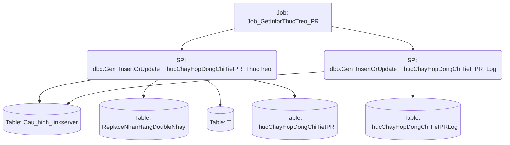

# Job: Job_GetInforThucTreo_PR

## Thông Tin Cơ Bản
| Thuộc tính | Giá trị |
|---|---|
| Job Name | Job_GetInforThucTreo_PR |
| Database | ABM_Data_ThucChay |
| Hệ thống | Tính toán thực chạy |

## Các Bước (Steps)
| Step ID | Step Name | Command | Tác dụng |
|---|---|---|---|
| 1 | Job_GetInforThucTreo_PR | `EXEC [dbo].[Gen_InsertOrUpdate_ThucChayHopDongChiTietPR_ThucTreo]` | Gọi SP |
| 2 | job_GetInforThucTreo_PR_log | `EXEC [dbo].[Gen_InsertOrUpdate_ThucChayHopDongChiTiet_PR_Log]` | Gọi SP |
| 3 | Canh_Bao_job_chay_FAILURE | `--D:\script\send_mail.ps1 -smtpSubject "[Canh bao job loi] Job_GetInforThucTreo_PR" -smtpBody "Job loi Job_GetInforThucTreo_PR"` | Chạy Script |

## Data Flow (Luồng Dữ Liệu)

