# Job: Job_GetInforThucTreo_ThucChayMuaNgoai_GGFB_FromHDCN

## Thông Tin Cơ Bản
| Thuộc tính | Giá trị |
|---|---|
| Job Name | Job_GetInforThucTreo_ThucChayMuaNgoai_GGFB_FromHDCN |
| Database | ABM_Data_ThucChay |
| Hệ thống | Tính toán thực chạy |

## Các Bước (Steps)
| Step ID | Step Name | Command | Tác dụng |
|---|---|---|---|
| 1 | job_GetInforThucTreoBranding_From_ThucTreo_SQLServer | `--EXEC [dbo].[Gen_InsertOrUpdate_ThucChayHopDongChiTiet_New] 
 EXEC [Gen_InsertOrUpdate_ThucChayHopDongChiTiet_ThucTreo]` | Gọi SP |
| 2 | job_getInfor_ThucTreoTrinhDuyet_ThucTreoChiPhi_From_ThucTreo | `EXEC [dbo].[Gen_InsertOrUpdate_ThucTreoHopDongChiTietTrinhDuyet_ThucTreo_fromSQLServer]` | Gọi SP |
| 3 | Job_get_Infor_hdcn_thucchay_muangoai | `EXEC [dbo].[Gen_InsertOrUpdate_HopDongChiTiet_MuaNgoai_New_v1]` | Gọi SP |
| 4 | job_Update_ChietKhau_IsKhuyenMai_HopDongChiTiet | `EXEC [dbo].[ThucChay_Update_ChietKhau_IsKhuyenMai_HopDongChiTiet]` | Gọi SP |
| 5 | Bojob_job_get_ThuctreoPR_from_ThucTreo_SQLServer | `--EXEC [dbo].[Gen_InsertOrUpdate_ThucChayHopDongChiTietPR_ThucTreo]` | Gọi SP |
| 6 | Job_Get_ThucTreo_ChiPhi_SQLServer | `---EXEC [dbo].[Gen_InsertOrUpdate_ThucChayHopDongChiTiet_ThucTreoChiPhi]` | Gọi SP |
| 7 | job_InsertOfUpdate_Operating_Order_GGFB | `--haidh comment vi co job rieng chay luc 1h sang
 --EXEC Gen_InsertOrUpdate_Operating_Order_GGFB` | Gọi SP |
| 8 | job_InsertOrUpdate_Operating_Result_GGFB | `--haidh comment vi co job rieng chay luc 1h sang
 --EXEC Gen_InsertOrUpdate_Operating_Result_GGFB` | Gọi SP |
| 9 | Job_InsertOrUpdate_Operating_Result_Map_Order_GGFB | `--haidh comment vi co job rieng chay luc 1h sang
 --EXEC Gen_InsertOrUpdate_Operating_Result_Map_Order_GGFB` | Gọi SP |
| 10 | Job_InsertOrUpdate_Operating_Result_Quantity_GGFB | `--haidh comment vi co job rieng chay luc 1h sang
 --EXEC [dbo].[Gen_InsertOrUpdate_Operating_Result_Quantity_GGFB]` | Gọi SP |
| 11 | job_PMS_QuanLyThucChay_Account | `EXEC [dbo].[Gen_InsertOrUpdate_PMS_QuanLyThucChay_Account]` | Gọi SP |
| 12 | job get thuc treo chi phi log | `EXEC [dbo].[Gen_InsertOrUpdate_ThucChayHopDongChiTiet_ThucTreoChiPhi_Log]` | Gọi SP |
| 13 | job_Get_AppKetQuaVanHanh_CreatorContent | `EXEC [Gen_InsertOrUpdate_AppKetQuaVanHanh_CreatorContent]` | Gọi SP |
| 14 | job_Get_AppKetQuaVanHanhHistory_CreatorContent | `EXEC [dbo].[Gen_InsertOrUpdate_AppKetQuaVanHanhHistory_CreatorContent]` | Gọi SP |
| 15 | job get ThucChayHopDongChiTiet_ThucTreo_Log | `EXEC [dbo].[Gen_InsertOrUpdate_ThucChayHopDongChiTiet_ThucTreo_Log]` | Gọi SP |
| 16 | Job_Insert_Update_HopDongChiTietAndBanner_CPM | `--exec [dbo].[Job_Insert_Update_HopDongChiTietAndBanner_CPM]
 --THEM HAM CHAY CHO ADMATIC
 exec [dbo].[Job_Insert_Update_HopDongChiTietAndBanner_CPM_Admatic]` | Gọi SP |
| 17 | Canh_Bao_job_chay_FAILURE | `D:\script\send_mail.ps1 -smtpSubject "[Canh bao job loi] Job_GetInforThucTreo_ThucChayMuaNgoai_GGFB_FromHDCN" -smtpBody "Job loi Job_GetInforThucTreo_ThucChayMuaNgoai_GGFB_FromHDCN"` | Chạy Script |

## Data Flow (Luồng Dữ Liệu)

```mermaid
graph TD
    Job_Job_GetInforThucTreo_ThucChayMuaNgoai_GGFB_FromHDCN[Job: Job_GetInforThucTreo_ThucChayMuaNgoai_GGFB_FromHDCN]
    Job_Job_GetInforThucTreo_ThucChayMuaNgoai_GGFB_FromHDCN --> SP_dbo_Gen_InsertOrUpdate_ThucChayHopDongChiTiet_New(SP: dbo.Gen_InsertOrUpdate_ThucChayHopDongChiTiet_New)
    SP_dbo_Gen_InsertOrUpdate_ThucChayHopDongChiTiet_New --> Ent_ReplaceNhanHangDoubleNhay[(Table: ReplaceNhanHangDoubleNhay)]
    SP_dbo_Gen_InsertOrUpdate_ThucChayHopDongChiTiet_New --> Ent_ThucChayHopDongChiTiet[(Table: ThucChayHopDongChiTiet)]
    Job_Job_GetInforThucTreo_ThucChayMuaNgoai_GGFB_FromHDCN --> SP_dbo_Gen_InsertOrUpdate_ThucTreoHopDongChiTietTrinhDuyet_ThucTreo_fromSQLServer(SP: dbo.Gen_InsertOrUpdate_ThucTreoHopDongChiTietTrinhDuyet_ThucTreo_fromSQLServer)
    SP_dbo_Gen_InsertOrUpdate_ThucTreoHopDongChiTietTrinhDuyet_ThucTreo_fromSQLServer --> Ent_B[(Table: B)]
    SP_dbo_Gen_InsertOrUpdate_ThucTreoHopDongChiTietTrinhDuyet_ThucTreo_fromSQLServer --> Ent_Cau_hinh_linkserver[(Table: Cau_hinh_linkserver)]
    SP_dbo_Gen_InsertOrUpdate_ThucTreoHopDongChiTietTrinhDuyet_ThucTreo_fromSQLServer --> Ent_Gen_InsertOrUpdate_ThucChayHopDongChiTiet_ThucTreoChiPhi[(Table: Gen_InsertOrUpdate_ThucChayHopDongChiTiet_ThucTreoChiPhi)]
    SP_dbo_Gen_InsertOrUpdate_ThucTreoHopDongChiTietTrinhDuyet_ThucTreo_fromSQLServer --> Ent_Gen_InsertOrUpdate_ThucChayHopDongChiTiet_ThucTreoChiPhi_Huy[(Table: Gen_InsertOrUpdate_ThucChayHopDongChiTiet_ThucTreoChiPhi_Huy)]
    SP_dbo_Gen_InsertOrUpdate_ThucTreoHopDongChiTietTrinhDuyet_ThucTreo_fromSQLServer --> Ent_t[(Table: t)]
    SP_dbo_Gen_InsertOrUpdate_ThucTreoHopDongChiTietTrinhDuyet_ThucTreo_fromSQLServer --> Ent_ThucTreoHopDongChiTietTrinhDuyet_ThucTreo[(Table: ThucTreoHopDongChiTietTrinhDuyet_ThucTreo)]
    Job_Job_GetInforThucTreo_ThucChayMuaNgoai_GGFB_FromHDCN --> SP_dbo_Gen_InsertOrUpdate_HopDongChiTiet_MuaNgoai_New_v1(SP: dbo.Gen_InsertOrUpdate_HopDongChiTiet_MuaNgoai_New_v1)
    SP_dbo_Gen_InsertOrUpdate_HopDongChiTiet_MuaNgoai_New_v1 --> Ent_Cau_hinh_linkserver[(Table: Cau_hinh_linkserver)]
    SP_dbo_Gen_InsertOrUpdate_HopDongChiTiet_MuaNgoai_New_v1 --> Ent_dt[(Table: dt)]
    SP_dbo_Gen_InsertOrUpdate_HopDongChiTiet_MuaNgoai_New_v1 --> Ent_Gen_InsertOrUpdate_HopDongChiTiet_MuaNgoai_CapNhapTheoDuToan[(Table: Gen_InsertOrUpdate_HopDongChiTiet_MuaNgoai_CapNhapTheoDuToan)]
    SP_dbo_Gen_InsertOrUpdate_HopDongChiTiet_MuaNgoai_New_v1 --> Ent_HopDongChiTiet_MuaNgoai[(Table: HopDongChiTiet_MuaNgoai)]
    SP_dbo_Gen_InsertOrUpdate_HopDongChiTiet_MuaNgoai_New_v1 --> Ent_mn[(Table: mn)]
    SP_dbo_Gen_InsertOrUpdate_HopDongChiTiet_MuaNgoai_New_v1 --> Ent_t[(Table: t)]
    SP_dbo_Gen_InsertOrUpdate_HopDongChiTiet_MuaNgoai_New_v1 --> Ent_tc[(Table: tc)]
    SP_dbo_Gen_InsertOrUpdate_HopDongChiTiet_MuaNgoai_New_v1 --> Ent_ThucChayMuaNgoaiChiTiet[(Table: ThucChayMuaNgoaiChiTiet)]
    Job_Job_GetInforThucTreo_ThucChayMuaNgoai_GGFB_FromHDCN --> SP_dbo_ThucChay_Update_ChietKhau_IsKhuyenMai_HopDongChiTiet(SP: dbo.ThucChay_Update_ChietKhau_IsKhuyenMai_HopDongChiTiet)
    SP_dbo_ThucChay_Update_ChietKhau_IsKhuyenMai_HopDongChiTiet --> Ent_HopDongChiTiet[(Table: HopDongChiTiet)]
    Job_Job_GetInforThucTreo_ThucChayMuaNgoai_GGFB_FromHDCN --> SP_dbo_Gen_InsertOrUpdate_ThucChayHopDongChiTietPR_ThucTreo(SP: dbo.Gen_InsertOrUpdate_ThucChayHopDongChiTietPR_ThucTreo)
    SP_dbo_Gen_InsertOrUpdate_ThucChayHopDongChiTietPR_ThucTreo --> Ent_Cau_hinh_linkserver[(Table: Cau_hinh_linkserver)]
    SP_dbo_Gen_InsertOrUpdate_ThucChayHopDongChiTietPR_ThucTreo --> Ent_ReplaceNhanHangDoubleNhay[(Table: ReplaceNhanHangDoubleNhay)]
    SP_dbo_Gen_InsertOrUpdate_ThucChayHopDongChiTietPR_ThucTreo --> Ent_T[(Table: T)]
    SP_dbo_Gen_InsertOrUpdate_ThucChayHopDongChiTietPR_ThucTreo --> Ent_ThucChayHopDongChiTietPR[(Table: ThucChayHopDongChiTietPR)]
    Job_Job_GetInforThucTreo_ThucChayMuaNgoai_GGFB_FromHDCN --> SP_dbo_Gen_InsertOrUpdate_ThucChayHopDongChiTiet_ThucTreoChiPhi(SP: dbo.Gen_InsertOrUpdate_ThucChayHopDongChiTiet_ThucTreoChiPhi)
    SP_dbo_Gen_InsertOrUpdate_ThucChayHopDongChiTiet_ThucTreoChiPhi --> Ent_DmHinhThucQuangCao[(Table: DmHinhThucQuangCao)]
    SP_dbo_Gen_InsertOrUpdate_ThucChayHopDongChiTiet_ThucTreoChiPhi --> Ent_DmSanPham[(Table: DmSanPham)]
    SP_dbo_Gen_InsertOrUpdate_ThucChayHopDongChiTiet_ThucTreoChiPhi --> Ent_ReplaceNhanHangDoubleNhay[(Table: ReplaceNhanHangDoubleNhay)]
    SP_dbo_Gen_InsertOrUpdate_ThucChayHopDongChiTiet_ThucTreoChiPhi --> Ent_ThucChayHopDongChiTiet[(Table: ThucChayHopDongChiTiet)]
    SP_dbo_Gen_InsertOrUpdate_ThucChayHopDongChiTiet_ThucTreoChiPhi --> Ent_ThucTreoHopDongChiTietTrinhDuyet_ThucTreo[(Table: ThucTreoHopDongChiTietTrinhDuyet_ThucTreo)]
    Job_Job_GetInforThucTreo_ThucChayMuaNgoai_GGFB_FromHDCN --> SP_dbo_Gen_InsertOrUpdate_Operating_Order_GGFB(SP: dbo.Gen_InsertOrUpdate_Operating_Order_GGFB)
    SP_dbo_Gen_InsertOrUpdate_Operating_Order_GGFB --> Ent_ADS_Operating_Order[(Table: ADS_Operating_Order)]
    SP_dbo_Gen_InsertOrUpdate_Operating_Order_GGFB --> Ent_Cau_hinh_linkserver[(Table: Cau_hinh_linkserver)]
    SP_dbo_Gen_InsertOrUpdate_Operating_Order_GGFB --> Ent_D[(Table: D)]
    SP_dbo_Gen_InsertOrUpdate_Operating_Order_GGFB --> Ent_t[(Table: t)]
    Job_Job_GetInforThucTreo_ThucChayMuaNgoai_GGFB_FromHDCN --> SP_dbo_Gen_InsertOrUpdate_Operating_Result_GGFB(SP: dbo.Gen_InsertOrUpdate_Operating_Result_GGFB)
    SP_dbo_Gen_InsertOrUpdate_Operating_Result_GGFB --> Ent_ADS_Operating_Result[(Table: ADS_Operating_Result)]
    SP_dbo_Gen_InsertOrUpdate_Operating_Result_GGFB --> Ent_Cau_hinh_linkserver[(Table: Cau_hinh_linkserver)]
    SP_dbo_Gen_InsertOrUpdate_Operating_Result_GGFB --> Ent_D[(Table: D)]
    SP_dbo_Gen_InsertOrUpdate_Operating_Result_GGFB --> Ent_t[(Table: t)]
    Job_Job_GetInforThucTreo_ThucChayMuaNgoai_GGFB_FromHDCN --> SP_dbo_Gen_InsertOrUpdate_Operating_Result_Map_Order_GGFB(SP: dbo.Gen_InsertOrUpdate_Operating_Result_Map_Order_GGFB)
    SP_dbo_Gen_InsertOrUpdate_Operating_Result_Map_Order_GGFB --> Ent_ADS_Operating_Result_Map_Order[(Table: ADS_Operating_Result_Map_Order)]
    SP_dbo_Gen_InsertOrUpdate_Operating_Result_Map_Order_GGFB --> Ent_Cau_hinh_linkserver[(Table: Cau_hinh_linkserver)]
    SP_dbo_Gen_InsertOrUpdate_Operating_Result_Map_Order_GGFB --> Ent_D[(Table: D)]
    SP_dbo_Gen_InsertOrUpdate_Operating_Result_Map_Order_GGFB --> Ent_t[(Table: t)]
    Job_Job_GetInforThucTreo_ThucChayMuaNgoai_GGFB_FromHDCN --> SP_dbo_Gen_InsertOrUpdate_Operating_Result_Quantity_GGFB(SP: dbo.Gen_InsertOrUpdate_Operating_Result_Quantity_GGFB)
    SP_dbo_Gen_InsertOrUpdate_Operating_Result_Quantity_GGFB --> Ent_ADS_Operating_Result_Quantity[(Table: ADS_Operating_Result_Quantity)]
    SP_dbo_Gen_InsertOrUpdate_Operating_Result_Quantity_GGFB --> Ent_Cau_hinh_linkserver[(Table: Cau_hinh_linkserver)]
    SP_dbo_Gen_InsertOrUpdate_Operating_Result_Quantity_GGFB --> Ent_D[(Table: D)]
    SP_dbo_Gen_InsertOrUpdate_Operating_Result_Quantity_GGFB --> Ent_t[(Table: t)]
    Job_Job_GetInforThucTreo_ThucChayMuaNgoai_GGFB_FromHDCN --> SP_dbo_Gen_InsertOrUpdate_PMS_QuanLyThucChay_Account(SP: dbo.Gen_InsertOrUpdate_PMS_QuanLyThucChay_Account)
    SP_dbo_Gen_InsertOrUpdate_PMS_QuanLyThucChay_Account --> Ent_Cau_hinh_linkserver[(Table: Cau_hinh_linkserver)]
    SP_dbo_Gen_InsertOrUpdate_PMS_QuanLyThucChay_Account --> Ent_dc[(Table: dc)]
    SP_dbo_Gen_InsertOrUpdate_PMS_QuanLyThucChay_Account --> Ent_PMS_QuanLyThucChay_Account[(Table: PMS_QuanLyThucChay_Account)]
    SP_dbo_Gen_InsertOrUpdate_PMS_QuanLyThucChay_Account --> Ent_t[(Table: t)]
    Job_Job_GetInforThucTreo_ThucChayMuaNgoai_GGFB_FromHDCN --> SP_dbo_Gen_InsertOrUpdate_ThucChayHopDongChiTiet_ThucTreoChiPhi_Log(SP: dbo.Gen_InsertOrUpdate_ThucChayHopDongChiTiet_ThucTreoChiPhi_Log)
    SP_dbo_Gen_InsertOrUpdate_ThucChayHopDongChiTiet_ThucTreoChiPhi_Log --> Ent_Cau_hinh_linkserver[(Table: Cau_hinh_linkserver)]
    SP_dbo_Gen_InsertOrUpdate_ThucChayHopDongChiTiet_ThucTreoChiPhi_Log --> Ent_ThucChayHopDongChiTietLog[(Table: ThucChayHopDongChiTietLog)]
    Job_Job_GetInforThucTreo_ThucChayMuaNgoai_GGFB_FromHDCN --> SP_dbo_Gen_InsertOrUpdate_AppKetQuaVanHanh_CreatorContent(SP: dbo.Gen_InsertOrUpdate_AppKetQuaVanHanh_CreatorContent)
    SP_dbo_Gen_InsertOrUpdate_AppKetQuaVanHanh_CreatorContent --> Ent_AppKetQuaVanHanh_CreatorContent[(Table: AppKetQuaVanHanh_CreatorContent)]
    SP_dbo_Gen_InsertOrUpdate_AppKetQuaVanHanh_CreatorContent --> Ent_Cau_hinh_linkserver[(Table: Cau_hinh_linkserver)]
    SP_dbo_Gen_InsertOrUpdate_AppKetQuaVanHanh_CreatorContent --> Ent_dc[(Table: dc)]
    SP_dbo_Gen_InsertOrUpdate_AppKetQuaVanHanh_CreatorContent --> Ent_t[(Table: t)]
    Job_Job_GetInforThucTreo_ThucChayMuaNgoai_GGFB_FromHDCN --> SP_dbo_Gen_InsertOrUpdate_AppKetQuaVanHanhHistory_CreatorContent(SP: dbo.Gen_InsertOrUpdate_AppKetQuaVanHanhHistory_CreatorContent)
    SP_dbo_Gen_InsertOrUpdate_AppKetQuaVanHanhHistory_CreatorContent --> Ent_AppKetQuaVanHanhHistory_CreatorContent[(Table: AppKetQuaVanHanhHistory_CreatorContent)]
    SP_dbo_Gen_InsertOrUpdate_AppKetQuaVanHanhHistory_CreatorContent --> Ent_Cau_hinh_linkserver[(Table: Cau_hinh_linkserver)]
    SP_dbo_Gen_InsertOrUpdate_AppKetQuaVanHanhHistory_CreatorContent --> Ent_t[(Table: t)]
    Job_Job_GetInforThucTreo_ThucChayMuaNgoai_GGFB_FromHDCN --> SP_dbo_Gen_InsertOrUpdate_ThucChayHopDongChiTiet_ThucTreo_Log(SP: dbo.Gen_InsertOrUpdate_ThucChayHopDongChiTiet_ThucTreo_Log)
    SP_dbo_Gen_InsertOrUpdate_ThucChayHopDongChiTiet_ThucTreo_Log --> Ent_Cau_hinh_linkserver[(Table: Cau_hinh_linkserver)]
    SP_dbo_Gen_InsertOrUpdate_ThucChayHopDongChiTiet_ThucTreo_Log --> Ent_ThucChayHopDongChiTietLog[(Table: ThucChayHopDongChiTietLog)]
    Job_Job_GetInforThucTreo_ThucChayMuaNgoai_GGFB_FromHDCN --> SP_dbo_Job_Insert_Update_HopDongChiTietAndBanner_CPM(SP: dbo.Job_Insert_Update_HopDongChiTietAndBanner_CPM)
    SP_dbo_Job_Insert_Update_HopDongChiTietAndBanner_CPM --> Ent_ThucChay_CPM_Update_HopDongChiTietAndBanner[(Table: ThucChay_CPM_Update_HopDongChiTietAndBanner)]
    SP_dbo_Job_Insert_Update_HopDongChiTietAndBanner_CPM --> Ent_ThucChay_NativeAds_Update_HopDongChiTietAndBanner[(Table: ThucChay_NativeAds_Update_HopDongChiTietAndBanner)]
```

