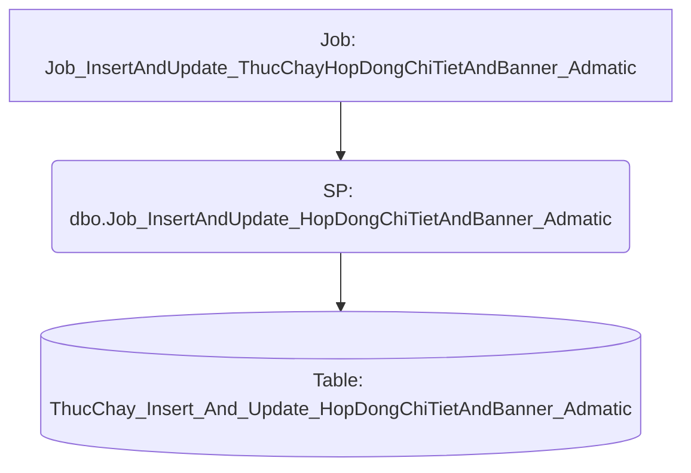

# Job: Job_InsertAndUpdate_ThucChayHopDongChiTietAndBanner_Admatic

## Thông Tin Cơ Bản
| Thuộc tính | Giá trị |
|---|---|
| Job Name | Job_InsertAndUpdate_ThucChayHopDongChiTietAndBanner_Admatic |
| Database | ABM_Data_ThucChay |
| Hệ thống | Tính toán thực chạy |

## Các Bước (Steps)
| Step ID | Step Name | Command | Tác dụng |
|---|---|---|---|
| 1 | Job_InsertAndUpdateThucChayHopDongChiTiet_Admatic | `EXEC [Job_InsertAndUpdate_HopDongChiTietAndBanner_Admatic]` | Gọi SP |
| 2 | Canh_Bao_job_chay_FAILURE | `D:\script\send_mail.ps1 -smtpSubject "[Canh bao job loi] Job_InsertAndUpdate_ThucChayHopDongChiTietAndBanner_Admatic" -smtpBody "Job loi Job_InsertAndUpdate_ThucChayHopDongChiTietAndBanner_Admatic"` | Chạy Script |

## Data Flow (Luồng Dữ Liệu)

