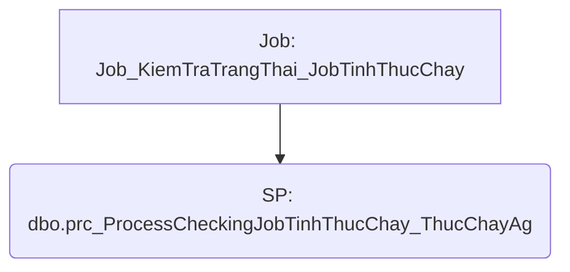

# Job: Job_KiemTraTrangThai_JobTinhThucChay

## Thông Tin Cơ Bản
| Thuộc tính | Giá trị |
|---|---|
| Job Name | Job_KiemTraTrangThai_JobTinhThucChay |
| Database | AbpZeroDb_QuanLyThucChay |
| Hệ thống | Tính toán thực chạy |

## Các Bước (Steps)
| Step ID | Step Name | Command | Tác dụng |
|---|---|---|---|
| 1 | Job_KiemTraTrangThai_JobTinhThucChay | `EXEC dbo.prc_ProcessCheckingJobTinhThucChay_ThucChayAg` | Gọi SP |

## Data Flow (Luồng Dữ Liệu)

