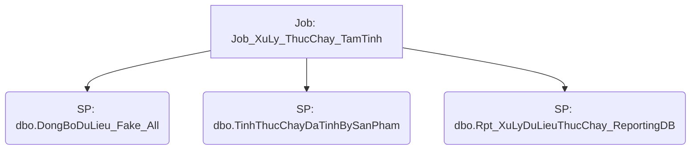

# Job: Job_XuLy_ThucChay_TamTinh

## Thông Tin Cơ Bản
| Thuộc tính | Giá trị |
|---|---|
| Job Name | Job_XuLy_ThucChay_TamTinh |
| Database | ABM_Data_ThucChay |
| Hệ thống | Tính toán thực chạy |

## Các Bước (Steps)
| Step ID | Step Name | Command | Tác dụng |
|---|---|---|---|
| 1 | job_xuly_fake_DongBoDuLieu_ABM_Data_Relase | `exec DongBoDuLieu_Fake_All` | Gọi SP |
| 2 | job_xuly_fake_TinhThucChayDaTinhBySanPham | `EXEC TinhThucChayDaTinhBySanPham` | Gọi SP |
| 3 | job_xuly_fake_XuLyDuLieuThucChay_ReportingDB | `exec Rpt_XuLyDuLieuThucChay_ReportingDB` | Gọi SP |

## Data Flow (Luồng Dữ Liệu)

