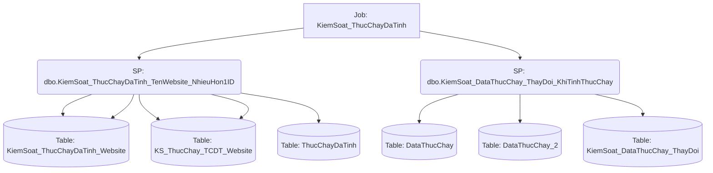

# Job: KiemSoat_ThucChayDaTinh

## Thông Tin Cơ Bản
| Thuộc tính | Giá trị |
|---|---|
| Job Name | KiemSoat_ThucChayDaTinh |
| Database | ABM_Data_ThucChay |
| Hệ thống | Tính toán thực chạy |

## Các Bước (Steps)
| Step ID | Step Name | Command | Tác dụng |
|---|---|---|---|
| 1 | KiemSoat_ThucChayDaTinh_website_nhieuhon1ID | `EXEC dbo.KiemSoat_ThucChayDaTinh_TenWebsite_NhieuHon1ID` | Gọi SP |
| 2 | KiemSoat_DataThucChay_ThayDoi_Mobile | `EXEC [dbo].[KiemSoat_DataThucChay_ThayDoi_KhiTinhThucChay]  @TypeProduct = 1010` | Gọi SP |

## Data Flow (Luồng Dữ Liệu)

