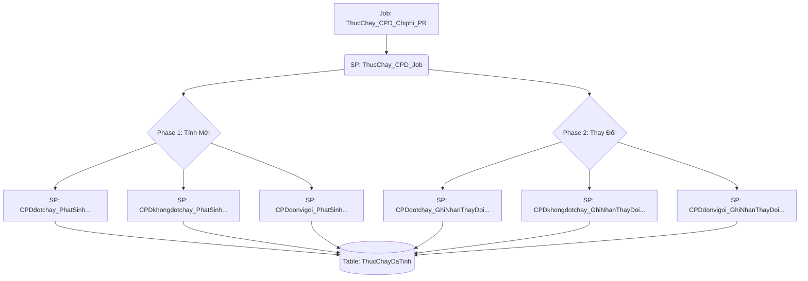

# Job: ThucChay_CPD_Chiphi_PR

## Thông Tin Cơ Bản
| Thuộc tính | Giá trị |
|---|---|
| Job Name | ThucChay_CPD_Chiphi_PR |
| Database | ABM_Data_ThucChay |
| Hệ thống | Tính toán thực chạy |

## Các Bước (Steps) Liên Quan CPD
| Step ID | Step Name | Command | Tác dụng |
|---|---|---|---|
| 1 | Job_TinhThucChay_CPD | `EXEC [dbo].[ThucChay_CPD_Job]` | Gọi SP điều phối chính để tính doanh số cho nhóm CPD |

## Data Flow (Luồng Dữ Liệu)

