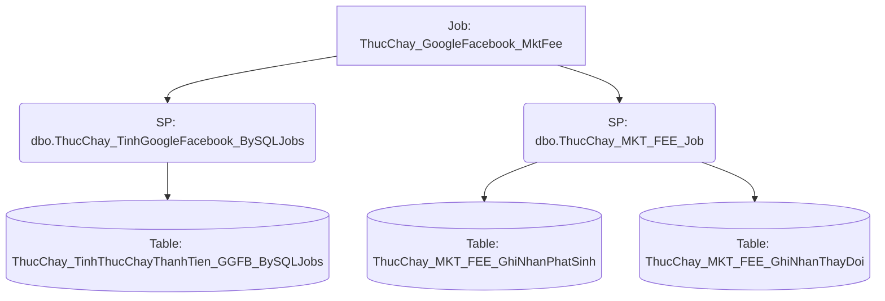

# Job: ThucChay_GoogleFacebook_MktFee

## Thông Tin Cơ Bản
| Thuộc tính | Giá trị |
|---|---|
| Job Name | ThucChay_GoogleFacebook_MktFee |
| Database | ABM_Data_ThucChay |
| Hệ thống | Tính toán thực chạy |

## Các Bước (Steps)
| Step ID | Step Name | Command | Tác dụng |
|---|---|---|---|
| 1 | EXEC [dbo].[ThucChay_GGFB_Job] | `--EXEC dbo.ThucChay_TinhGoogleFacebook_BySQLJobs
 -- job toi uu trien ngay 20250324
 EXEC [dbo].[ThucChay_GGFB_Job]` | Gọi SP |
| 2 | Job Marketing fee | `EXEC [dbo].[ThucChay_MKT_FEE_Job]` | Gọi SP |
| 3 | Canh_Bao_job_chay_FAILURE | `D:\script\send_mail.ps1 -Subject "[Canh bao job loi] ThucChay_GoogleFacebook" -smtpBody "Job loi ThucChay_GoogleFacebook"` | Chạy Script |

## Data Flow (Luồng Dữ Liệu)

