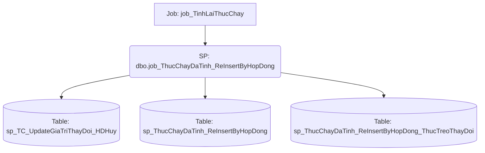

# Job: job_TinhLaiThucChay

## Thông Tin Cơ Bản
| Thuộc tính | Giá trị |
|---|---|
| Job Name | job_TinhLaiThucChay |
| Database | ABM_Data_ThucChay |
| Hệ thống | Tính toán thực chạy |

## Các Bước (Steps)
| Step ID | Step Name | Command | Tác dụng |
|---|---|---|---|
| 1 | exec sql | `exec job_ThucChayDaTinh_ReInsertByHopDong` | Gọi SP |
| 2 | Canh_Bao_job_chay_FAILURE | `D:\script\send_mail.ps1 -Subject "[Canh bao job loi] job_TinhLaiThucChay" -smtpBody "Job loi job_TinhLaiThucChay"` | Chạy Script |

## Data Flow (Luồng Dữ Liệu)

