# Phân tích Luồng nghiệp vụ: `ThucChay_Admatic_Job`

## 1. Sơ đồ Call Graph (Mermaid)

```mermaid
graph TD
    ThucChay_Admatic_Job[ThucChay_Admatic_Job]:::rootNode
    ThucChay_Admatic_Job -->|Level 1| HopDongChiTiet
    ThucChay_Admatic_Job -->|Level 1| ThucChay_Admatic_Adx_Insert_ThucChayDaTinhAdmarket
    ThucChay_Admatic_Job -->|Level 1| ThucChay_Admatic_GhiNhanPhatSinh_ThucChayDaTinh
    ThucChay_Admatic_Job -->|Level 1| ThucChay_Admatic_GhiNhanThayDoi_ThucChayDaTinh
    ThucChay_Admatic_Job -->|Level 1| ThucChay_Admatic_Update_HopDongChiTietAndBanner
    ThucChay_Admatic_Job -->|Level 1| ThucChay_AdmaticDonViBai
    ThucChay_Admatic_Job -->|Level 1| ThucChayDaTinh
    ThucChay_Admatic_Adx_Insert_ThucChayDaTinhAdmarket -->|Level 2| ThucChayDaTinh
    ThucChay_Admatic_Adx_Insert_ThucChayDaTinhAdmarket -->|Level 2| ThucChayDaTinhAdmarket
    ThucChay_Admatic_GhiNhanPhatSinh_ThucChayDaTinh -->|Level 2| DataType_Thucchay_Admatic_DmTinhMoi
    ThucChay_Admatic_GhiNhanPhatSinh_ThucChayDaTinh -->|Level 2| dm
    ThucChay_Admatic_GhiNhanPhatSinh_ThucChayDaTinh -->|Level 2| HopDong
    ThucChay_Admatic_GhiNhanPhatSinh_ThucChayDaTinh -->|Level 2| HopDongChiTiet
    ThucChay_Admatic_GhiNhanPhatSinh_ThucChayDaTinh -->|Level 2| temp
    ThucChay_Admatic_GhiNhanPhatSinh_ThucChayDaTinh -->|Level 2| ThucChay_Admatic_Insert_ThucChayDaTinh
    ThucChay_Admatic_GhiNhanPhatSinh_ThucChayDaTinh -->|Level 2| ThucChay_ThanhTien_Admatic
    ThucChay_Admatic_GhiNhanPhatSinh_ThucChayDaTinh -->|Level 2| ThucChayDaTinh
    ThucChay_Admatic_GhiNhanPhatSinh_ThucChayDaTinh -->|Level 2| ThucChayHopDongChiTietAndBanner_ThanhTien_Admatic
    ThucChay_Admatic_GhiNhanThayDoi_ThucChayDaTinh -->|Level 2| DataType_Thucchay_Admatic_DmTinhlai
    ThucChay_Admatic_GhiNhanThayDoi_ThucChayDaTinh -->|Level 2| dm
    ThucChay_Admatic_GhiNhanThayDoi_ThucChayDaTinh -->|Level 2| DmThongTinHopDongBanInventory
    ThucChay_Admatic_GhiNhanThayDoi_ThucChayDaTinh -->|Level 2| HopDong
    ThucChay_Admatic_GhiNhanThayDoi_ThucChayDaTinh -->|Level 2| HopDongChiTiet
    ThucChay_Admatic_GhiNhanThayDoi_ThucChayDaTinh -->|Level 2| HopDongChiTietLog
    ThucChay_Admatic_GhiNhanThayDoi_ThucChayDaTinh -->|Level 2| temp
    ThucChay_Admatic_GhiNhanThayDoi_ThucChayDaTinh -->|Level 2| ThucChay_Admatic_DoiTruTinhLai_ThucChayDaTinh
    ThucChay_Admatic_GhiNhanThayDoi_ThucChayDaTinh -->|Level 2| ThucChay_ThanhTien_Admatic
    ThucChay_Admatic_GhiNhanThayDoi_ThucChayDaTinh -->|Level 2| ThucChayDaTinh
    ThucChay_Admatic_GhiNhanThayDoi_ThucChayDaTinh -->|Level 2| ThucChayHopDongChiTiet
    ThucChay_Admatic_GhiNhanThayDoi_ThucChayDaTinh -->|Level 2| ThucChayHopDongChiTietAndBanner_ThanhTien_Admatic
    ThucChay_Admatic_Update_HopDongChiTietAndBanner -->|Level 2| AdmaticDonGiaBanner
    ThucChay_Admatic_Update_HopDongChiTietAndBanner -->|Level 2| HopDong
    ThucChay_Admatic_Update_HopDongChiTietAndBanner -->|Level 2| HopDongChiTiet
    ThucChay_Admatic_Update_HopDongChiTietAndBanner -->|Level 2| tchdctab
    ThucChay_Admatic_Update_HopDongChiTietAndBanner -->|Level 2| ThucChayHopDongChiTiet
    ThucChay_Admatic_Update_HopDongChiTietAndBanner -->|Level 2| ThucChayHopDongChiTietAndBanner_Admatic
    ThucChay_Admatic_Update_HopDongChiTietAndBanner -->|Level 2| ThucChayHopDongChiTietAndBanner_ThanhTien_Admatic
    ThucChay_AdmaticDonViBai -->|Level 2| dm
    ThucChay_AdmaticDonViBai -->|Level 2| GetDmWebsiteReportingdbIDByDmWebsiteID
    ThucChay_AdmaticDonViBai -->|Level 2| GetWebsiteLinkByDmWebsiteID
    ThucChay_AdmaticDonViBai -->|Level 2| HopDong
    ThucChay_AdmaticDonViBai -->|Level 2| HopDongChiTiet
    ThucChay_AdmaticDonViBai -->|Level 2| HopDongChiTietLog
    ThucChay_AdmaticDonViBai -->|Level 2| tchdct
    ThucChay_AdmaticDonViBai -->|Level 2| ThucChayDaTinh
    ThucChay_AdmaticDonViBai -->|Level 2| ThucChayHopDongChiTiet
    ThucChay_AdmaticDonViBai -->|Level 2| ThucChayHopDongChiTietLog
    GetDmWebsiteReportingdbIDByDmWebsiteID -->|Level 3| WebsiteMapping_HDCN_Reporting
    GetWebsiteLinkByDmWebsiteID -->|Level 3| WebsiteMapping_HDCN_Reporting
    ThucChay_Admatic_DoiTruTinhLai_ThucChayDaTinh -->|Level 3| DataType_Thucchay_Admatic_DmTinhlai
    ThucChay_Admatic_DoiTruTinhLai_ThucChayDaTinh -->|Level 3| DmSanPham
    ThucChay_Admatic_DoiTruTinhLai_ThucChayDaTinh -->|Level 3| HopDong
    ThucChay_Admatic_DoiTruTinhLai_ThucChayDaTinh -->|Level 3| HopDongChiTiet
    ThucChay_Admatic_DoiTruTinhLai_ThucChayDaTinh -->|Level 3| ThucChay_GetSoLuongChuanTheoDonViTinhNotCPD
    ThucChay_Admatic_DoiTruTinhLai_ThucChayDaTinh -->|Level 3| ThucChayDaTinh
    ThucChay_Admatic_Insert_ThucChayDaTinh -->|Level 3| DataType_Thucchay_Admatic_DmTinhMoi
    ThucChay_Admatic_Insert_ThucChayDaTinh -->|Level 3| DmSanPham
    ThucChay_Admatic_Insert_ThucChayDaTinh -->|Level 3| HopDong
    ThucChay_Admatic_Insert_ThucChayDaTinh -->|Level 3| HopDongChiTiet
    ThucChay_Admatic_Insert_ThucChayDaTinh -->|Level 3| ThucChay_GetSoLuongChuanTheoDonViTinhNotCPD
    ThucChay_Admatic_Insert_ThucChayDaTinh -->|Level 3| ThucChayDaTinh

    classDef rootNode fill:#f9f,stroke:#333,stroke-width:4px;
```

## 2. Chi tiết Biến Đầu Vào (Parameters)

### `AdmaticDonGiaBanner`
*(Không có tham số)*

### `DataType_Thucchay_Admatic_DmTinhMoi`
*(Không có tham số)*

### `DataType_Thucchay_Admatic_DmTinhlai`
*(Không có tham số)*

### `DmSanPham`
*(Không có tham số)*

### `DmThongTinHopDongBanInventory`
*(Không có tham số)*

### `GetDmWebsiteReportingdbIDByDmWebsiteID`
| Tên tham số | Kiểu dữ liệu | Output |
|-------------|--------------|--------|
| `(Return)` | `int(4)` | Có |
| `@DmWebsiteID` | `int(4)` | Không |

### `GetWebsiteLinkByDmWebsiteID`
| Tên tham số | Kiểu dữ liệu | Output |
|-------------|--------------|--------|
| `(Return)` | `nvarchar(400)` | Có |
| `@DmWebsiteID` | `int(4)` | Không |
| `@TenWebsite` | `nvarchar(100)` | Không |

### `HopDong`
*(Không có tham số)*

### `HopDongChiTiet`
*(Không có tham số)*

### `HopDongChiTietLog`
*(Không có tham số)*

### `ThucChayDaTinh`
*(Không có tham số)*

### `ThucChayDaTinhAdmarket`
*(Không có tham số)*

### `ThucChayHopDongChiTiet`
*(Không có tham số)*

### `ThucChayHopDongChiTietAndBanner_Admatic`
*(Không có tham số)*

### `ThucChayHopDongChiTietAndBanner_ThanhTien_Admatic`
*(Không có tham số)*

### `ThucChayHopDongChiTietLog`
*(Không có tham số)*

### `ThucChay_AdmaticDonViBai`
| Tên tham số | Kiểu dữ liệu | Output |
|-------------|--------------|--------|
| `@NgayGhiNhan` | `date(3)` | Không |
| `@NgayCheckThayDoi` | `date(3)` | Không |
| `@NgayDanhSoGioiHan` | `date(3)` | Không |
| `@SoHopDong` | `nvarchar(100)` | Không |
| `@HopDongChiTietID` | `int(4)` | Không |

### `ThucChay_Admatic_Adx_Insert_ThucChayDaTinhAdmarket`
| Tên tham số | Kiểu dữ liệu | Output |
|-------------|--------------|--------|
| `@NgayThucHien` | `date(3)` | Không |
| `@SoHopDong` | `nvarchar(100)` | Không |
| `@HopDongChiTietID` | `int(4)` | Không |

### `ThucChay_Admatic_DoiTruTinhLai_ThucChayDaTinh`
| Tên tham số | Kiểu dữ liệu | Output |
|-------------|--------------|--------|
| `@Thucchay_Admatic_DmTinhlai` | `DataType_Thucchay_Admatic_DmTinhlai` | Không |

### `ThucChay_Admatic_GhiNhanPhatSinh_ThucChayDaTinh`
| Tên tham số | Kiểu dữ liệu | Output |
|-------------|--------------|--------|
| `@StartDate` | `date(3)` | Không |
| `@EndDate` | `date(3)` | Không |
| `@NgayDanhSoGioiHan` | `date(3)` | Không |
| `@SoHopDong` | `nvarchar(100)` | Không |
| `@HopDongChiTietID` | `int(4)` | Không |

### `ThucChay_Admatic_GhiNhanThayDoi_ThucChayDaTinh`
| Tên tham số | Kiểu dữ liệu | Output |
|-------------|--------------|--------|
| `@NgayGhiNhan` | `date(3)` | Không |
| `@NgayCheckThayDoi` | `date(3)` | Không |
| `@NgayDanhSoGioiHan` | `date(3)` | Không |
| `@SoHopDong` | `nvarchar(100)` | Không |
| `@HopDongChiTietID` | `int(4)` | Không |

### `ThucChay_Admatic_Insert_ThucChayDaTinh`
| Tên tham số | Kiểu dữ liệu | Output |
|-------------|--------------|--------|
| `@Thucchay_Admatic_DmTinhMoi` | `DataType_Thucchay_Admatic_DmTinhMoi` | Không |

### `ThucChay_Admatic_Job`
*(Không có tham số)*

### `ThucChay_Admatic_Update_HopDongChiTietAndBanner`
| Tên tham số | Kiểu dữ liệu | Output |
|-------------|--------------|--------|
| `@NgayThucHien` | `date(3)` | Không |
| `@NgayDanhSoGioiHan` | `date(3)` | Không |

### `ThucChay_GetSoLuongChuanTheoDonViTinhNotCPD`
| Tên tham số | Kiểu dữ liệu | Output |
|-------------|--------------|--------|
| `(Return)` | `float(8)` | Có |
| `@DonViTinh` | `nvarchar(100)` | Không |

### `ThucChay_ThanhTien_Admatic`
*(Không có tham số)*

### `WebsiteMapping_HDCN_Reporting`
*(Không có tham số)*

### `dm`
*(Không có tham số)*

### `tchdct`
*(Không có tham số)*

### `tchdctab`
*(Không có tham số)*

### `temp`
*(Không có tham số)*

