# Phân tích Luồng nghiệp vụ: `ThucChay_CPD_Job`

## 1. Sơ đồ Call Graph (Mermaid)

```mermaid
graph TD
    ThucChay_CPD_Job[ThucChay_CPD_Job]:::rootNode
    ThucChay_CPD_Job -->|Level 1| ThucChay_CPDdonvigoi_GhiNhanThayDoi_ThucChayDaTinh
    ThucChay_CPD_Job -->|Level 1| ThucChay_CPDdonvigoi_PhatSinhThucChay_ThucChayDaTinh
    ThucChay_CPD_Job -->|Level 1| ThucChay_CPDdotchay_GhiNhanThayDoi_ThucChayDaTinh
    ThucChay_CPD_Job -->|Level 1| ThucChay_CPDdotchay_PhatSinhThucChay_ThucChayDaTinh
    ThucChay_CPD_Job -->|Level 1| ThucChay_CPDkhongdotchay_GhiNhanThayDoi_ThucChayDaTinh
    ThucChay_CPD_Job -->|Level 1| ThucChay_CPDkhongdotchay_PhatSinhThucChay_ThucChayDaTinh
    ThucChay_CPDdonvigoi_GhiNhanThayDoi_ThucChayDaTinh -->|Level 2| CheckDonViTinhHinhThucCPDAndNotCPD
    ThucChay_CPDdonvigoi_GhiNhanThayDoi_ThucChayDaTinh -->|Level 2| dm
    ThucChay_CPDdonvigoi_GhiNhanThayDoi_ThucChayDaTinh -->|Level 2| DotChayHopDongChiTiet
    ThucChay_CPDdonvigoi_GhiNhanThayDoi_ThucChayDaTinh -->|Level 2| FormatDonViTinh
    ThucChay_CPDdonvigoi_GhiNhanThayDoi_ThucChayDaTinh -->|Level 2| GetDmWebsiteReportingdbIDByDmWebsiteID_CPD
    ThucChay_CPDdonvigoi_GhiNhanThayDoi_ThucChayDaTinh -->|Level 2| GetWebsiteLinkByDmWebsiteID_CPD
    ThucChay_CPDdonvigoi_GhiNhanThayDoi_ThucChayDaTinh -->|Level 2| HopDong
    ThucChay_CPDdonvigoi_GhiNhanThayDoi_ThucChayDaTinh -->|Level 2| HopDongChiTiet
    ThucChay_CPDdonvigoi_GhiNhanThayDoi_ThucChayDaTinh -->|Level 2| HopDongChiTietLog
    ThucChay_CPDdonvigoi_GhiNhanThayDoi_ThucChayDaTinh -->|Level 2| tc
    ThucChay_CPDdonvigoi_GhiNhanThayDoi_ThucChayDaTinh -->|Level 2| ThucChayDaTinh
    ThucChay_CPDdonvigoi_GhiNhanThayDoi_ThucChayDaTinh -->|Level 2| ThucChayHopDongChiTiet
    ThucChay_CPDdonvigoi_PhatSinhThucchay_ThucChayDaTinh -->|Level 2| CheckDonViTinhHinhThucCPDAndNotCPD
    ThucChay_CPDdonvigoi_PhatSinhThucchay_ThucChayDaTinh -->|Level 2| dm
    ThucChay_CPDdonvigoi_PhatSinhThucchay_ThucChayDaTinh -->|Level 2| DotChayHopDongChiTiet
    ThucChay_CPDdonvigoi_PhatSinhThucchay_ThucChayDaTinh -->|Level 2| FormatDonViTinh
    ThucChay_CPDdonvigoi_PhatSinhThucchay_ThucChayDaTinh -->|Level 2| GetDmWebsiteReportingdbIDByDmWebsiteID_CPD
    ThucChay_CPDdonvigoi_PhatSinhThucchay_ThucChayDaTinh -->|Level 2| GetWebsiteLinkByDmWebsiteID_CPD
    ThucChay_CPDdonvigoi_PhatSinhThucchay_ThucChayDaTinh -->|Level 2| HopDong
    ThucChay_CPDdonvigoi_PhatSinhThucchay_ThucChayDaTinh -->|Level 2| HopDongChiTiet
    ThucChay_CPDdonvigoi_PhatSinhThucchay_ThucChayDaTinh -->|Level 2| tc
    ThucChay_CPDdonvigoi_PhatSinhThucchay_ThucChayDaTinh -->|Level 2| ThucChayDaTinh
    ThucChay_CPDdonvigoi_PhatSinhThucchay_ThucChayDaTinh -->|Level 2| ThucChayHopDongChiTiet
    ThucChay_CPDdotchay_GhiNhanThayDoi_ThucChayDaTinh -->|Level 2| CheckDonViTinhHinhThucCPDAndNotCPD
    ThucChay_CPDdotchay_GhiNhanThayDoi_ThucChayDaTinh -->|Level 2| dm
    ThucChay_CPDdotchay_GhiNhanThayDoi_ThucChayDaTinh -->|Level 2| dmcheck
    ThucChay_CPDdotchay_GhiNhanThayDoi_ThucChayDaTinh -->|Level 2| DmSanPham
    ThucChay_CPDdotchay_GhiNhanThayDoi_ThucChayDaTinh -->|Level 2| DotChayHopDongchitiet
    ThucChay_CPDdotchay_GhiNhanThayDoi_ThucChayDaTinh -->|Level 2| FormatDonViTinh
    ThucChay_CPDdotchay_GhiNhanThayDoi_ThucChayDaTinh -->|Level 2| GetDmWebsiteReportingdbIDByDmWebsiteID_CPD
    ThucChay_CPDdotchay_GhiNhanThayDoi_ThucChayDaTinh -->|Level 2| GetWebsiteLinkByDmWebsiteID_CPD
    ThucChay_CPDdotchay_GhiNhanThayDoi_ThucChayDaTinh -->|Level 2| HopDong
    ThucChay_CPDdotchay_GhiNhanThayDoi_ThucChayDaTinh -->|Level 2| HopDongChiTiet
    ThucChay_CPDdotchay_GhiNhanThayDoi_ThucChayDaTinh -->|Level 2| ThucChay_GetSoLuong_DonViTinh
    ThucChay_CPDdotchay_GhiNhanThayDoi_ThucChayDaTinh -->|Level 2| ThucChayDaTinh
    ThucChay_CPDdotchay_GhiNhanThayDoi_ThucChayDaTinh -->|Level 2| ThucChayHopDongChiTiet
    ThucChay_CPDdotchay_PhatSinhThucchay_ThucChayDaTinh -->|Level 2| CheckDonViTinhHinhThucCPDAndNotCPD
    ThucChay_CPDdotchay_PhatSinhThucchay_ThucChayDaTinh -->|Level 2| dm
    ThucChay_CPDdotchay_PhatSinhThucchay_ThucChayDaTinh -->|Level 2| DotChayHopDongChiTiet
    ThucChay_CPDdotchay_PhatSinhThucchay_ThucChayDaTinh -->|Level 2| FormatDonViTinh
    ThucChay_CPDdotchay_PhatSinhThucchay_ThucChayDaTinh -->|Level 2| GetDmWebsiteReportingdbIDByDmWebsiteID_CPD
    ThucChay_CPDdotchay_PhatSinhThucchay_ThucChayDaTinh -->|Level 2| GetWebsiteLinkByDmWebsiteID_CPD
    ThucChay_CPDdotchay_PhatSinhThucchay_ThucChayDaTinh -->|Level 2| HopDong
    ThucChay_CPDdotchay_PhatSinhThucchay_ThucChayDaTinh -->|Level 2| HopDongChiTiet
    ThucChay_CPDdotchay_PhatSinhThucchay_ThucChayDaTinh -->|Level 2| ThucChay_GetSoLuong_DonViTinh
    ThucChay_CPDdotchay_PhatSinhThucchay_ThucChayDaTinh -->|Level 2| ThucChayDaTinh
    ThucChay_CPDdotchay_PhatSinhThucchay_ThucChayDaTinh -->|Level 2| ThucChayHopDongChiTiet
    ThucChay_CPDkhongdotchay_GhiNhanThayDoi_ThucChayDaTinh -->|Level 2| CheckDonViTinhHinhThucCPDAndNotCPD
    ThucChay_CPDkhongdotchay_GhiNhanThayDoi_ThucChayDaTinh -->|Level 2| dm
    ThucChay_CPDkhongdotchay_GhiNhanThayDoi_ThucChayDaTinh -->|Level 2| dmcheck
    ThucChay_CPDkhongdotchay_GhiNhanThayDoi_ThucChayDaTinh -->|Level 2| DmSanPham
    ThucChay_CPDkhongdotchay_GhiNhanThayDoi_ThucChayDaTinh -->|Level 2| FormatDonViTinh
    ThucChay_CPDkhongdotchay_GhiNhanThayDoi_ThucChayDaTinh -->|Level 2| GetDmWebsiteReportingdbIDByDmWebsiteID_CPD
    ThucChay_CPDkhongdotchay_GhiNhanThayDoi_ThucChayDaTinh -->|Level 2| GetWebsiteLinkByDmWebsiteID_CPD
    ThucChay_CPDkhongdotchay_GhiNhanThayDoi_ThucChayDaTinh -->|Level 2| HopDong
    ThucChay_CPDkhongdotchay_GhiNhanThayDoi_ThucChayDaTinh -->|Level 2| HopDongChiTiet
    ThucChay_CPDkhongdotchay_GhiNhanThayDoi_ThucChayDaTinh -->|Level 2| ThucChay_CheckSanPhamCPDKhongDotChay
    ThucChay_CPDkhongdotchay_GhiNhanThayDoi_ThucChayDaTinh -->|Level 2| ThucChayDaTinh
    ThucChay_CPDkhongdotchay_GhiNhanThayDoi_ThucChayDaTinh -->|Level 2| ThucChayHopDongChiTiet
    ThucChay_CPDkhongdotchay_PhatSinhThucchay_ThucChayDaTinh -->|Level 2| CheckDonViTinhHinhThucCPDAndNotCPD
    ThucChay_CPDkhongdotchay_PhatSinhThucchay_ThucChayDaTinh -->|Level 2| dm
    ThucChay_CPDkhongdotchay_PhatSinhThucchay_ThucChayDaTinh -->|Level 2| FormatDonViTinh
    ThucChay_CPDkhongdotchay_PhatSinhThucchay_ThucChayDaTinh -->|Level 2| GetDmWebsiteReportingdbIDByDmWebsiteID_CPD
    ThucChay_CPDkhongdotchay_PhatSinhThucchay_ThucChayDaTinh -->|Level 2| GetWebsiteLinkByDmWebsiteID_CPD
    ThucChay_CPDkhongdotchay_PhatSinhThucchay_ThucChayDaTinh -->|Level 2| HopDong
    ThucChay_CPDkhongdotchay_PhatSinhThucchay_ThucChayDaTinh -->|Level 2| HopDongChiTiet
    ThucChay_CPDkhongdotchay_PhatSinhThucchay_ThucChayDaTinh -->|Level 2| ThucChay_CheckSanPhamCPDKhongDotChay
    ThucChay_CPDkhongdotchay_PhatSinhThucchay_ThucChayDaTinh -->|Level 2| ThucChayDaTinh
    ThucChay_CPDkhongdotchay_PhatSinhThucchay_ThucChayDaTinh -->|Level 2| ThucChayHopDongChiTiet
    CheckDonViTinhHinhThucCPDAndNotCPD -->|Level 3| FormatStringUpper
    FormatDonViTinh -->|Level 3| FormatStringUpper
    GetDmWebsiteReportingdbIDByDmWebsiteID_CPD -->|Level 3| WebsiteMapping_HDCN_Reporting
    GetWebsiteLinkByDmWebsiteID_CPD -->|Level 3| WebsiteMapping_HDCN_Reporting
    ThucChay_CheckSanPhamCPDKhongDotChay -->|Level 3| DotChayHopDongChiTiet
    ThucChay_CheckSanPhamCPDKhongDotChay -->|Level 3| ThucChayHopDongChiTiet

    classDef rootNode fill:#f9f,stroke:#333,stroke-width:4px;
```

## 2. Chi tiết Biến Đầu Vào (Parameters)

### `CheckDonViTinhHinhThucCPDAndNotCPD`
| Tên tham số | Kiểu dữ liệu | Output |
|-------------|--------------|--------|
| `(Return)` | `int(4)` | Có |
| `@DonViTinhREF` | `int(4)` | Không |
| `@DonViTinh` | `nvarchar(100)` | Không |

### `DmSanPham`
*(Không có tham số)*

### `DotChayHopDongChiTiet`
*(Không có tham số)*

### `DotChayHopDongchitiet`
*(Không có tham số)*

### `FormatDonViTinh`
| Tên tham số | Kiểu dữ liệu | Output |
|-------------|--------------|--------|
| `(Return)` | `nvarchar(100)` | Có |
| `@DonViTinh` | `nvarchar(100)` | Không |

### `FormatStringUpper`
| Tên tham số | Kiểu dữ liệu | Output |
|-------------|--------------|--------|
| `(Return)` | `nvarchar(100)` | Có |
| `@TenField` | `nvarchar(100)` | Không |

### `GetDmWebsiteReportingdbIDByDmWebsiteID_CPD`
| Tên tham số | Kiểu dữ liệu | Output |
|-------------|--------------|--------|
| `(Return)` | `int(4)` | Có |
| `@DmWebsiteID` | `int(4)` | Không |

### `GetWebsiteLinkByDmWebsiteID_CPD`
| Tên tham số | Kiểu dữ liệu | Output |
|-------------|--------------|--------|
| `(Return)` | `nvarchar(400)` | Có |
| `@DmWebsiteID` | `int(4)` | Không |
| `@TenWebsite` | `nvarchar(100)` | Không |

### `HopDong`
*(Không có tham số)*

### `HopDongChiTiet`
*(Không có tham số)*

### `HopDongChiTietLog`
*(Không có tham số)*

### `ThucChayDaTinh`
*(Không có tham số)*

### `ThucChayHopDongChiTiet`
*(Không có tham số)*

### `ThucChay_CPD_Job`
*(Không có tham số)*

### `ThucChay_CPDdonvigoi_GhiNhanThayDoi_ThucChayDaTinh`
| Tên tham số | Kiểu dữ liệu | Output |
|-------------|--------------|--------|
| `@NgayGhiNhan` | `date(3)` | Không |
| `@NgayCheckThayDoi` | `date(3)` | Không |
| `@NgayDanhSo_GioiHan` | `date(3)` | Không |
| `@SoHopDong` | `nvarchar(100)` | Không |
| `@HopDongChiTietID` | `int(4)` | Không |

### `ThucChay_CPDdonvigoi_PhatSinhThucChay_ThucChayDaTinh`
*(Không có tham số)*

### `ThucChay_CPDdonvigoi_PhatSinhThucchay_ThucChayDaTinh`
| Tên tham số | Kiểu dữ liệu | Output |
|-------------|--------------|--------|
| `@NgayThucHien` | `date(3)` | Không |
| `@NgayDanhSo_GioiHan` | `date(3)` | Không |
| `@SohopDong` | `nvarchar(100)` | Không |
| `@HopDongChiTietID` | `int(4)` | Không |

### `ThucChay_CPDdotchay_GhiNhanThayDoi_ThucChayDaTinh`
| Tên tham số | Kiểu dữ liệu | Output |
|-------------|--------------|--------|
| `@NgayGhiNhan` | `date(3)` | Không |
| `@NgayCheckThayDoi` | `date(3)` | Không |
| `@NgayDanhSo_GioiHan` | `date(3)` | Không |
| `@SoHopDong` | `nvarchar(100)` | Không |
| `@HopDongChiTietID` | `int(4)` | Không |

### `ThucChay_CPDdotchay_PhatSinhThucChay_ThucChayDaTinh`
*(Không có tham số)*

### `ThucChay_CPDdotchay_PhatSinhThucchay_ThucChayDaTinh`
| Tên tham số | Kiểu dữ liệu | Output |
|-------------|--------------|--------|
| `@StartDate` | `date(3)` | Không |
| `@EndDate` | `date(3)` | Không |
| `@NgayDanhSo_GioiHan` | `date(3)` | Không |
| `@SoHopDong` | `nvarchar(100)` | Không |
| `@HopDongChiTietID` | `int(4)` | Không |

### `ThucChay_CPDkhongdotchay_GhiNhanThayDoi_ThucChayDaTinh`
| Tên tham số | Kiểu dữ liệu | Output |
|-------------|--------------|--------|
| `@NgayGhiNhan` | `date(3)` | Không |
| `@NgayCheckThayDoi` | `date(3)` | Không |
| `@NgayDanhSo_GioiHan` | `date(3)` | Không |
| `@SoHopDong` | `nvarchar(100)` | Không |
| `@HopDongChiTietID` | `int(4)` | Không |

### `ThucChay_CPDkhongdotchay_PhatSinhThucChay_ThucChayDaTinh`
*(Không có tham số)*

### `ThucChay_CPDkhongdotchay_PhatSinhThucchay_ThucChayDaTinh`
| Tên tham số | Kiểu dữ liệu | Output |
|-------------|--------------|--------|
| `@StartDate` | `date(3)` | Không |
| `@EndDate` | `date(3)` | Không |
| `@NgayDanhSo_GioiHan` | `date(3)` | Không |
| `@SohopDong` | `nvarchar(100)` | Không |
| `@hopDongChiTiet` | `int(4)` | Không |

### `ThucChay_CheckSanPhamCPDKhongDotChay`
| Tên tham số | Kiểu dữ liệu | Output |
|-------------|--------------|--------|
| `(Return)` | `int(4)` | Có |
| `@HopDongChiTietREF` | `int(4)` | Không |
| `@NgayThucHien` | `datetime(8)` | Không |

### `ThucChay_GetSoLuong_DonViTinh`
| Tên tham số | Kiểu dữ liệu | Output |
|-------------|--------------|--------|
| `(Return)` | `float(8)` | Có |
| `@SoLuong` | `int(4)` | Không |
| `@DonViTinh` | `nvarchar(100)` | Không |

### `WebsiteMapping_HDCN_Reporting`
*(Không có tham số)*

### `dm`
*(Không có tham số)*

### `dmcheck`
*(Không có tham số)*

### `tc`
*(Không có tham số)*

