# Phân tích Luồng nghiệp vụ: `ThucChay_ChiPhi_Job`

## 1. Sơ đồ Call Graph (Mermaid)

```mermaid
graph TD
    ThucChay_ChiPhi_Job[ThucChay_ChiPhi_Job]:::rootNode
    ThucChay_ChiPhi_Job -->|Level 1| CauHinhNhomTinhDoanhSoThucChay
    ThucChay_ChiPhi_Job -->|Level 1| sp_ThucChay_ExcInsertThucChayDaTinh_CreatorContent
    ThucChay_ChiPhi_Job -->|Level 1| ThucChay_ChiPhiKhac
    ThucChay_ChiPhi_Job -->|Level 1| ThucChayDaTinh
    ThucChay_ChiPhi_Job -->|Level 1| ThucChayDaTinh_CheckKetQuaVanHanhThayDoi_CreatorContent
    ThucChay_ChiPhi_Job -->|Level 1| ThucChayDaTinh_CheckVaUpdateGiaTriThayDoi_CreatorContent
    sp_ThucChay_ExcInsertThucChayDaTinh_CreatorContent -->|Level 2| AppKetQuaVanHanh_CreatorContent
    sp_ThucChay_ExcInsertThucChayDaTinh_CreatorContent -->|Level 2| HopDong
    sp_ThucChay_ExcInsertThucChayDaTinh_CreatorContent -->|Level 2| HopDongChiTiet
    sp_ThucChay_ExcInsertThucChayDaTinh_CreatorContent -->|Level 2| ThucChayDaTinh
    sp_ThucChay_ExcInsertThucChayDaTinh_CreatorContent -->|Level 2| ThucChayDaTinh_InsertThucChay_ThanhTien_CreatorContent
    sp_ThucChay_ExcInsertThucChayDaTinh_CreatorContent -->|Level 2| ThucChayDaTinh_MuaNgoai
    sp_ThucChay_ExcInsertThucChayDaTinh_CreatorContent -->|Level 2| ThucChayDaTinh_MuaNgoai_InsertThucChayLai_ThanhTien_CreatorContent
    ThucChay_ChiPhiKhac -->|Level 2| CauHinhNhomTinhDoanhSoThucChay
    ThucChay_ChiPhiKhac -->|Level 2| dm
    ThucChay_ChiPhiKhac -->|Level 2| DmSanPham
    ThucChay_ChiPhiKhac -->|Level 2| DmThongTinHopDongBanInventory
    ThucChay_ChiPhiKhac -->|Level 2| GetDmWebsiteReportingdbIDByDmWebsiteID
    ThucChay_ChiPhiKhac -->|Level 2| GetWebsiteLinkByDmWebsiteID
    ThucChay_ChiPhiKhac -->|Level 2| HopDong
    ThucChay_ChiPhiKhac -->|Level 2| HopDongChiTiet
    ThucChay_ChiPhiKhac -->|Level 2| HopDongChiTietLog
    ThucChay_ChiPhiKhac -->|Level 2| ThucChayDaTinh
    ThucChay_ChiPhiKhac -->|Level 2| thucchaydatinh_log
    ThucChay_ChiPhiKhac -->|Level 2| ThucChayHopDongChiTiet
    ThucChay_ChiPhiKhac -->|Level 2| ThucChayHopDongChiTietLog
    ThucChayDaTinh_CheckVaUpdateGiaTriThayDoi_CreatorContent -->|Level 2| HopDong
    ThucChayDaTinh_CheckVaUpdateGiaTriThayDoi_CreatorContent -->|Level 2| HopDongChiTiet
    ThucChayDaTinh_CheckVaUpdateGiaTriThayDoi_CreatorContent -->|Level 2| HopDongChiTietLog
    ThucChayDaTinh_CheckVaUpdateGiaTriThayDoi_CreatorContent -->|Level 2| sp_ThucChay_DoiTruVaTinhLai_CreatorContent
    ThucChayDaTinh_CheckVaUpdateGiaTriThayDoi_CreatorContent -->|Level 2| ThucChayDaTinh
    ThucChayDaTinh_CheckVaUpdateGiaTriThayDoi_CreatorContent -->|Level 2| ThucChayDaTinh_CheckKetQuaVanHanhXoa_CreatorContent
    ThucChayDaTinh_CheckVaUpdateGiaTriThayDoi_CreatorContent -->|Level 2| ThucChayDaTinh_DoiTru_ThanhTien_CreatorContent
    GetDmWebsiteReportingdbIDByDmWebsiteID -->|Level 3| WebsiteMapping_HDCN_Reporting
    GetWebsiteLinkByDmWebsiteID -->|Level 3| WebsiteMapping_HDCN_Reporting
    sp_ThucChay_DoiTruVaTinhLai_CreatorContent -->|Level 3| AppKetQuaVanHanh_CreatorContent
    sp_ThucChay_DoiTruVaTinhLai_CreatorContent -->|Level 3| HopDong
    sp_ThucChay_DoiTruVaTinhLai_CreatorContent -->|Level 3| HopDongChiTiet
    sp_ThucChay_DoiTruVaTinhLai_CreatorContent -->|Level 3| ThucChayDaTinh
    sp_ThucChay_DoiTruVaTinhLai_CreatorContent -->|Level 3| ThucChayDaTinh_DoiTru_ThanhTien_CreatorContent
    sp_ThucChay_DoiTruVaTinhLai_CreatorContent -->|Level 3| ThucChayDaTinh_MuaNgoai
    sp_ThucChay_DoiTruVaTinhLai_CreatorContent -->|Level 3| ThucChayDaTinh_MuaNgoai_DoiTru_ThanhTien_CreatorContent
    sp_ThucChay_DoiTruVaTinhLai_CreatorContent -->|Level 3| ThucChayDaTinh_MuaNgoai_TinhLai_ThanhTien_CreatorContent
    sp_ThucChay_DoiTruVaTinhLai_CreatorContent -->|Level 3| ThucChayDaTinh_TinhLai_ThanhTien_CreatorContent
    ThucChayDaTinh_CheckKetQuaVanHanhXoa_CreatorContent -->|Level 3| AppKetQuaVanHanh_CreatorContent
    ThucChayDaTinh_CheckKetQuaVanHanhXoa_CreatorContent -->|Level 3| HopDong
    ThucChayDaTinh_CheckKetQuaVanHanhXoa_CreatorContent -->|Level 3| ThucChayDaTinh
    ThucChayDaTinh_CheckKetQuaVanHanhXoa_CreatorContent -->|Level 3| ThucChayDaTinh_DoiTru_ThanhTien_CreatorContent_ByKetQuaVanHanhID
    ThucChayDaTinh_DoiTru_ThanhTien_CreatorContent -->|Level 3| ThucChayDaTinh
    ThucChayDaTinh_InsertThucChay_ThanhTien_CreatorContent -->|Level 3| GetDmWebsiteReportingdbIDByDmWebsiteID
    ThucChayDaTinh_InsertThucChay_ThanhTien_CreatorContent -->|Level 3| GetWebsiteLinkByDmWebsiteID
    ThucChayDaTinh_InsertThucChay_ThanhTien_CreatorContent -->|Level 3| HopDong
    ThucChayDaTinh_InsertThucChay_ThanhTien_CreatorContent -->|Level 3| HopDongChiTiet
    ThucChayDaTinh_InsertThucChay_ThanhTien_CreatorContent -->|Level 3| ThucChayDaTinh
    ThucChayDaTinh_MuaNgoai_InsertThucChayLai_ThanhTien_CreatorContent -->|Level 3| GetDmWebsiteReportingdbIDByDmWebsiteID
    ThucChayDaTinh_MuaNgoai_InsertThucChayLai_ThanhTien_CreatorContent -->|Level 3| GetWebsiteLinkByDmWebsiteID
    ThucChayDaTinh_MuaNgoai_InsertThucChayLai_ThanhTien_CreatorContent -->|Level 3| HopDong
    ThucChayDaTinh_MuaNgoai_InsertThucChayLai_ThanhTien_CreatorContent -->|Level 3| HopDongChiTiet
    ThucChayDaTinh_MuaNgoai_InsertThucChayLai_ThanhTien_CreatorContent -->|Level 3| ThucChayDaTinh_MuaNgoai
    GetDmWebsiteReportingdbIDByDmWebsiteID -->|Level 4| WebsiteMapping_HDCN_Reporting
    GetWebsiteLinkByDmWebsiteID -->|Level 4| WebsiteMapping_HDCN_Reporting
    ThucChayDaTinh_DoiTru_ThanhTien_CreatorContent -->|Level 4| ThucChayDaTinh
    ThucChayDaTinh_DoiTru_ThanhTien_CreatorContent_ByKetQuaVanHanhID -->|Level 4| AppKetQuaVanHanh_CreatorContent
    ThucChayDaTinh_DoiTru_ThanhTien_CreatorContent_ByKetQuaVanHanhID -->|Level 4| ThucChayDaTinh
    ThucChayDaTinh_DoiTru_ThanhTien_CreatorContent_ByKetQuaVanHanhID -->|Level 4| ThucChayDaTinh_MuaNgoai
    ThucChayDaTinh_DoiTru_ThanhTien_CreatorContent_ByKetQuaVanHanhID -->|Level 4| ThucChayDaTinhMuaNgoai
    ThucChayDaTinh_MuaNgoai_DoiTru_ThanhTien_CreatorContent -->|Level 4| ThucChayDaTinh_MuaNgoai
    ThucChayDaTinh_MuaNgoai_TinhLai_ThanhTien_CreatorContent -->|Level 4| GetDmWebsiteReportingdbIDByDmWebsiteID
    ThucChayDaTinh_MuaNgoai_TinhLai_ThanhTien_CreatorContent -->|Level 4| GetWebsiteLinkByDmWebsiteID
    ThucChayDaTinh_MuaNgoai_TinhLai_ThanhTien_CreatorContent -->|Level 4| HopDong
    ThucChayDaTinh_MuaNgoai_TinhLai_ThanhTien_CreatorContent -->|Level 4| HopDongChiTiet
    ThucChayDaTinh_MuaNgoai_TinhLai_ThanhTien_CreatorContent -->|Level 4| ThucChayDaTinh_MuaNgoai
    ThucChayDaTinh_TinhLai_ThanhTien_CreatorContent -->|Level 4| GetDmWebsiteReportingdbIDByDmWebsiteID
    ThucChayDaTinh_TinhLai_ThanhTien_CreatorContent -->|Level 4| GetWebsiteLinkByDmWebsiteID
    ThucChayDaTinh_TinhLai_ThanhTien_CreatorContent -->|Level 4| HopDong
    ThucChayDaTinh_TinhLai_ThanhTien_CreatorContent -->|Level 4| HopDongChiTiet
    ThucChayDaTinh_TinhLai_ThanhTien_CreatorContent -->|Level 4| ThucChayDaTinh
    GetDmWebsiteReportingdbIDByDmWebsiteID -->|Level 5| WebsiteMapping_HDCN_Reporting
    GetWebsiteLinkByDmWebsiteID -->|Level 5| WebsiteMapping_HDCN_Reporting

    classDef rootNode fill:#f9f,stroke:#333,stroke-width:4px;
```

## 2. Chi tiết Biến Đầu Vào (Parameters)

### `AppKetQuaVanHanh_CreatorContent`
*(Không có tham số)*

### `CauHinhNhomTinhDoanhSoThucChay`
*(Không có tham số)*

### `DmSanPham`
*(Không có tham số)*

### `DmThongTinHopDongBanInventory`
*(Không có tham số)*

### `GetDmWebsiteReportingdbIDByDmWebsiteID`
| Tên tham số | Kiểu dữ liệu | Output |
|-------------|--------------|--------|
| `(Return)` | `int(4)` | Có |
| `@DmWebsiteID` | `int(4)` | Không |

### `GetWebsiteLinkByDmWebsiteID`
| Tên tham số | Kiểu dữ liệu | Output |
|-------------|--------------|--------|
| `(Return)` | `nvarchar(400)` | Có |
| `@DmWebsiteID` | `int(4)` | Không |
| `@TenWebsite` | `nvarchar(100)` | Không |

### `HopDong`
*(Không có tham số)*

### `HopDongChiTiet`
*(Không có tham số)*

### `HopDongChiTietLog`
*(Không có tham số)*

### `ThucChayDaTinh`
*(Không có tham số)*

### `ThucChayDaTinhMuaNgoai`
*(Không có tham số)*

### `ThucChayDaTinh_CheckKetQuaVanHanhThayDoi_CreatorContent`
| Tên tham số | Kiểu dữ liệu | Output |
|-------------|--------------|--------|
| `@NgayThucHien` | `datetime(8)` | Không |

### `ThucChayDaTinh_CheckKetQuaVanHanhXoa_CreatorContent`
| Tên tham số | Kiểu dữ liệu | Output |
|-------------|--------------|--------|
| `@NgayThucHien` | `datetime(8)` | Không |

### `ThucChayDaTinh_CheckVaUpdateGiaTriThayDoi_CreatorContent`
| Tên tham số | Kiểu dữ liệu | Output |
|-------------|--------------|--------|
| `@NgayThucHien` | `datetime(8)` | Không |

### `ThucChayDaTinh_DoiTru_ThanhTien_CreatorContent`
| Tên tham số | Kiểu dữ liệu | Output |
|-------------|--------------|--------|
| `@NgayGhiNhanThucChay` | `datetime(8)` | Không |
| `@HopDongREF` | `int(4)` | Không |
| `@HopDongChiTietREF` | `int(4)` | Không |
| `@ghiChuDoiTru` | `nvarchar(1024)` | Không |

### `ThucChayDaTinh_DoiTru_ThanhTien_CreatorContent_ByKetQuaVanHanhID`
| Tên tham số | Kiểu dữ liệu | Output |
|-------------|--------------|--------|
| `@NgayGhiNhanThucChay` | `datetime(8)` | Không |
| `@HopDongREF` | `int(4)` | Không |
| `@HopDongChiTietREF` | `int(4)` | Không |
| `@AppKetQuaVanHanh_CreatorContent_id` | `int(4)` | Không |
| `@ghiChuDoiTru` | `nvarchar(1024)` | Không |
| `@ThucChayDaTinhID_op` | `nvarchar(200)` | Có |

### `ThucChayDaTinh_InsertThucChay_ThanhTien_CreatorContent`
| Tên tham số | Kiểu dữ liệu | Output |
|-------------|--------------|--------|
| `@NgayThucHien` | `datetime(8)` | Không |
| `@AppKetQuaVanHanh_CreatorContent_id` | `int(4)` | Không |
| `@HopDongREF` | `int(4)` | Không |
| `@HopDongChiTietREF` | `int(4)` | Không |
| `@ChietKhau` | `float(8)` | Không |
| `@DonGia` | `float(8)` | Không |
| `@SoLuongThucChay` | `bigint(8)` | Không |
| `@DonViTinhThucChay` | `nvarchar(200)` | Không |
| `@ThanhTienThucChaySauCK` | `float(8)` | Không |
| `@ghiChu` | `nvarchar(1024)` | Không |
| `@ThucChayDaTinhID_output` | `nvarchar(100)` | Có |
| `@TongThanhTienThucChayDaTinh_output` | `float(8)` | Có |
| `@TongThanhTienKMThucChayDaTinh_output` | `float(8)` | Có |

### `ThucChayDaTinh_MuaNgoai`
*(Không có tham số)*

### `ThucChayDaTinh_MuaNgoai_DoiTru_ThanhTien_CreatorContent`
| Tên tham số | Kiểu dữ liệu | Output |
|-------------|--------------|--------|
| `@NgayGhiNhanThucChay` | `datetime(8)` | Không |
| `@HopDongREF` | `int(4)` | Không |
| `@HopDongChiTietREF` | `int(4)` | Không |
| `@ghiChu` | `nvarchar(2000)` | Không |

### `ThucChayDaTinh_MuaNgoai_InsertThucChayLai_ThanhTien_CreatorContent`
| Tên tham số | Kiểu dữ liệu | Output |
|-------------|--------------|--------|
| `@NgayThucHien` | `datetime(8)` | Không |
| `@AppKetQuaVanHanh_CreatorContent_id` | `int(4)` | Không |
| `@HopDongREF` | `int(4)` | Không |
| `@HopDongChiTietREF` | `int(4)` | Không |
| `@DonGiaTheoDonViTinh` | `float(8)` | Không |
| `@DonViTinh` | `nvarchar(200)` | Không |
| `@SoLuongThucChay` | `bigint(8)` | Không |
| `@TongTienThucChayBanSCK` | `float(8)` | Không |
| `@TongTienThucChayMuaSCK` | `float(8)` | Không |
| `@TongTienLaiThucChaySCK` | `float(8)` | Không |
| `@ghiChu` | `nvarchar(2000)` | Không |
| `@ThucChayDaTinh_MuaNgoai_ouput` | `bigint(8)` | Có |

### `ThucChayDaTinh_MuaNgoai_TinhLai_ThanhTien_CreatorContent`
| Tên tham số | Kiểu dữ liệu | Output |
|-------------|--------------|--------|
| `@NgayThucHien` | `datetime(8)` | Không |
| `@AppKetQuaVanHanh_CreatorContent_id` | `int(4)` | Không |
| `@HopDongREF` | `int(4)` | Không |
| `@HopDongChiTietREF` | `int(4)` | Không |
| `@DonGiaTheoDonViTinh` | `float(8)` | Không |
| `@DonViTinh` | `nvarchar(200)` | Không |
| `@SoLuongThucChay` | `bigint(8)` | Không |
| `@TongTienThucChayBanSCK` | `float(8)` | Không |
| `@TongTienThucChayMuaSCK` | `float(8)` | Không |
| `@TongTienLaiThucChaySCK` | `float(8)` | Không |
| `@ghiChu` | `nvarchar(2000)` | Không |
| `@ThucChayDaTinh_MuaNgoai_ouput` | `bigint(8)` | Có |

### `ThucChayDaTinh_TinhLai_ThanhTien_CreatorContent`
| Tên tham số | Kiểu dữ liệu | Output |
|-------------|--------------|--------|
| `@NgayThucHien` | `datetime(8)` | Không |
| `@AppKetQuaVanHanh_CreatorContent_id` | `int(4)` | Không |
| `@HopDongREF` | `int(4)` | Không |
| `@HopDongChiTietREF` | `int(4)` | Không |
| `@ChietKhau` | `float(8)` | Không |
| `@DonGia` | `float(8)` | Không |
| `@SoLuongThucChay` | `bigint(8)` | Không |
| `@DonViTinhThucChay` | `nvarchar(200)` | Không |
| `@ThanhTienThucChaySauCK` | `float(8)` | Không |
| `@ghiChu` | `nvarchar(1024)` | Không |
| `@ThucChayDaTinhID_output` | `nvarchar(100)` | Có |
| `@TongThanhTienThucChayDaTinh_output` | `float(8)` | Có |
| `@TongThanhTienKMThucChayDaTinh_output` | `float(8)` | Có |

### `ThucChayHopDongChiTiet`
*(Không có tham số)*

### `ThucChayHopDongChiTietLog`
*(Không có tham số)*

### `ThucChay_ChiPhiKhac`
| Tên tham số | Kiểu dữ liệu | Output |
|-------------|--------------|--------|
| `@NgayGhiNhan` | `date(3)` | Không |
| `@NgayCheckThayDoi` | `date(3)` | Không |
| `@NgayDanhSoGioiHan` | `date(3)` | Không |
| `@SoHopDong` | `nvarchar(200)` | Không |
| `@HopDongChiTietID` | `int(4)` | Không |

### `ThucChay_ChiPhi_Job`
*(Không có tham số)*

### `WebsiteMapping_HDCN_Reporting`
*(Không có tham số)*

### `dm`
*(Không có tham số)*

### `sp_ThucChay_DoiTruVaTinhLai_CreatorContent`
| Tên tham số | Kiểu dữ liệu | Output |
|-------------|--------------|--------|
| `@pHopDongID` | `int(4)` | Không |
| `@pHopDongChiTietID` | `int(4)` | Không |
| `@NgayGhiNhanThucChay` | `datetime(8)` | Không |
| `@GhiChuDoiChu` | `nvarchar(2000)` | Không |
| `@GhiChuTinhLai` | `nvarchar(2000)` | Không |

### `sp_ThucChay_ExcInsertThucChayDaTinh_CreatorContent`
| Tên tham số | Kiểu dữ liệu | Output |
|-------------|--------------|--------|
| `@StartDate` | `datetime(8)` | Không |
| `@EndDate` | `datetime(8)` | Không |
| `@piHopDongID` | `int(4)` | Không |

### `thucchaydatinh_log`
*(Không có tham số)*

