# Phân tích Luồng nghiệp vụ: `ThucChay_GGFB_Job`

## 1. Sơ đồ Call Graph (Mermaid)

```mermaid
graph TD
    ThucChay_GGFB_Job[ThucChay_GGFB_Job]:::rootNode
    ThucChay_GGFB_Job -->|Level 1| ThucChay_GGFB_GhiNhanPhatSinh
    ThucChay_GGFB_Job -->|Level 1| ThucChay_GGFB_GhiNhanThayDoi
    ThucChay_GGFB_GhiNhanPhatSinh -->|Level 2| ADS_Operating_Order
    ThucChay_GGFB_GhiNhanPhatSinh -->|Level 2| ADS_Operating_Result
    ThucChay_GGFB_GhiNhanPhatSinh -->|Level 2| ADS_Operating_Result_Map_Order
    ThucChay_GGFB_GhiNhanPhatSinh -->|Level 2| ADS_Operating_Result_Quantity
    ThucChay_GGFB_GhiNhanPhatSinh -->|Level 2| dm
    ThucChay_GGFB_GhiNhanPhatSinh -->|Level 2| FormatDonViTinh_ThanhTien_GGFB
    ThucChay_GGFB_GhiNhanPhatSinh -->|Level 2| HopDong
    ThucChay_GGFB_GhiNhanPhatSinh -->|Level 2| HopDongChiTiet
    ThucChay_GGFB_GhiNhanPhatSinh -->|Level 2| TC
    ThucChay_GGFB_GhiNhanPhatSinh -->|Level 2| temp
    ThucChay_GGFB_GhiNhanPhatSinh -->|Level 2| ThucChayDaTinh
    ThucChay_GGFB_GhiNhanPhatSinh -->|Level 2| ThucChayDaTinh_MuaNgoai
    ThucChay_GGFB_GhiNhanPhatSinh -->|Level 2| WebsiteMapping_HDCN_Reporting
    ThucChay_GGFB_GhiNhanThayDoi -->|Level 2| ADS_Operating_Order
    ThucChay_GGFB_GhiNhanThayDoi -->|Level 2| ADS_Operating_Order_Log
    ThucChay_GGFB_GhiNhanThayDoi -->|Level 2| ADS_Operating_Result
    ThucChay_GGFB_GhiNhanThayDoi -->|Level 2| ADS_Operating_Result_Log
    ThucChay_GGFB_GhiNhanThayDoi -->|Level 2| ADS_Operating_Result_Map_Order
    ThucChay_GGFB_GhiNhanThayDoi -->|Level 2| ADS_Operating_Result_Map_Order_Log
    ThucChay_GGFB_GhiNhanThayDoi -->|Level 2| ADS_Operating_Result_Quantity
    ThucChay_GGFB_GhiNhanThayDoi -->|Level 2| ADS_Operating_Result_Quantity_log
    ThucChay_GGFB_GhiNhanThayDoi -->|Level 2| dm
    ThucChay_GGFB_GhiNhanThayDoi -->|Level 2| dm2
    ThucChay_GGFB_GhiNhanThayDoi -->|Level 2| FormatDonViTinh_ThanhTien_GGFB
    ThucChay_GGFB_GhiNhanThayDoi -->|Level 2| HopDong
    ThucChay_GGFB_GhiNhanThayDoi -->|Level 2| HopDongChiTiet
    ThucChay_GGFB_GhiNhanThayDoi -->|Level 2| HopDongChiTietLog
    ThucChay_GGFB_GhiNhanThayDoi -->|Level 2| TC
    ThucChay_GGFB_GhiNhanThayDoi -->|Level 2| temp
    ThucChay_GGFB_GhiNhanThayDoi -->|Level 2| ThucChayDaTinh
    ThucChay_GGFB_GhiNhanThayDoi -->|Level 2| ThucChayDaTinh_MuaNgoai
    ThucChay_GGFB_GhiNhanThayDoi -->|Level 2| WebsiteMapping_HDCN_Reporting
    FormatDonViTinh_ThanhTien_GGFB -->|Level 3| FormatStringUpper

    classDef rootNode fill:#f9f,stroke:#333,stroke-width:4px;
```

## 2. Chi tiết Biến Đầu Vào (Parameters)

### `ADS_Operating_Order`
*(Không có tham số)*

### `ADS_Operating_Order_Log`
*(Không có tham số)*

### `ADS_Operating_Result`
*(Không có tham số)*

### `ADS_Operating_Result_Log`
*(Không có tham số)*

### `ADS_Operating_Result_Map_Order`
*(Không có tham số)*

### `ADS_Operating_Result_Map_Order_Log`
*(Không có tham số)*

### `ADS_Operating_Result_Quantity`
*(Không có tham số)*

### `ADS_Operating_Result_Quantity_log`
*(Không có tham số)*

### `FormatDonViTinh_ThanhTien_GGFB`
| Tên tham số | Kiểu dữ liệu | Output |
|-------------|--------------|--------|
| `(Return)` | `nvarchar(100)` | Có |
| `@DonViTinh` | `nvarchar(100)` | Không |

### `FormatStringUpper`
| Tên tham số | Kiểu dữ liệu | Output |
|-------------|--------------|--------|
| `(Return)` | `nvarchar(100)` | Có |
| `@TenField` | `nvarchar(100)` | Không |

### `HopDong`
*(Không có tham số)*

### `HopDongChiTiet`
*(Không có tham số)*

### `HopDongChiTietLog`
*(Không có tham số)*

### `TC`
*(Không có tham số)*

### `ThucChayDaTinh`
*(Không có tham số)*

### `ThucChayDaTinh_MuaNgoai`
*(Không có tham số)*

### `ThucChay_GGFB_GhiNhanPhatSinh`
| Tên tham số | Kiểu dữ liệu | Output |
|-------------|--------------|--------|
| `@NgayThucHien` | `date(3)` | Không |
| `@NgayDanhSoGioiHan` | `date(3)` | Không |
| `@SoHopDong` | `nvarchar(200)` | Không |
| `@HopDongChiTietID` | `int(4)` | Không |

### `ThucChay_GGFB_GhiNhanThayDoi`
| Tên tham số | Kiểu dữ liệu | Output |
|-------------|--------------|--------|
| `@NgayGhiNhan` | `date(3)` | Không |
| `@NgayCheckThayDoi` | `date(3)` | Không |
| `@NgayDanhSoGioiHan` | `date(3)` | Không |
| `@SoHopDong` | `nvarchar(200)` | Không |
| `@HopDongChiTietID` | `int(4)` | Không |

### `ThucChay_GGFB_Job`
*(Không có tham số)*

### `WebsiteMapping_HDCN_Reporting`
*(Không có tham số)*

### `dm`
*(Không có tham số)*

### `dm2`
*(Không có tham số)*

### `temp`
*(Không có tham số)*

