# Phân tích Luồng nghiệp vụ: `ThucChay_Mobile_Job`

## 1. Sơ đồ Call Graph (Mermaid)

```mermaid
graph TD
    ThucChay_Mobile_Job[ThucChay_Mobile_Job]:::rootNode
    ThucChay_Mobile_Job -->|Level 1| HopDongChiTiet
    ThucChay_Mobile_Job -->|Level 1| ThucChay_Mobile_GhiNhanPhatSinh_ThucChayDaTinh
    ThucChay_Mobile_Job -->|Level 1| ThucChay_Mobile_GhiNhanThayDoi_ThucChayDaTinh
    ThucChay_Mobile_Job -->|Level 1| ThucChay_mobile_Update_HopDongChiTietAndBanner
    ThucChay_Mobile_Job -->|Level 1| ThucChayDaTinh
    ThucChay_Mobile_GhiNhanPhatSinh_ThucChayDaTinh -->|Level 2| DataType_Thucchay_Mobile_DmTinhMoi2
    ThucChay_Mobile_GhiNhanPhatSinh_ThucChayDaTinh -->|Level 2| dm
    ThucChay_Mobile_GhiNhanPhatSinh_ThucChayDaTinh -->|Level 2| HopDong
    ThucChay_Mobile_GhiNhanPhatSinh_ThucChayDaTinh -->|Level 2| HopDongChiTiet
    ThucChay_Mobile_GhiNhanPhatSinh_ThucChayDaTinh -->|Level 2| temp
    ThucChay_Mobile_GhiNhanPhatSinh_ThucChayDaTinh -->|Level 2| thucchay
    ThucChay_Mobile_GhiNhanPhatSinh_ThucChayDaTinh -->|Level 2| ThucChay_GetDonGiaTheoDonViTruocChietKhau
    ThucChay_Mobile_GhiNhanPhatSinh_ThucChayDaTinh -->|Level 2| ThucChay_GetSoLuongChuanTheoDonViTinhNotCPD
    ThucChay_Mobile_GhiNhanPhatSinh_ThucChayDaTinh -->|Level 2| ThucChay_Mobile_DmPhanBoChungBanner_Truoc20241212
    ThucChay_Mobile_GhiNhanPhatSinh_ThucChayDaTinh -->|Level 2| ThucChay_Mobile_GetDonViTinh
    ThucChay_Mobile_GhiNhanPhatSinh_ThucChayDaTinh -->|Level 2| ThucChay_Mobile_Insert_ThucChayDaTinh
    ThucChay_Mobile_GhiNhanPhatSinh_ThucChayDaTinh -->|Level 2| ThucChayDaTinh
    ThucChay_Mobile_GhiNhanPhatSinh_ThucChayDaTinh -->|Level 2| ThucChayHopDongChiTiet
    ThucChay_Mobile_GhiNhanPhatSinh_ThucChayDaTinh -->|Level 2| ThucChayHopDongChiTietAndBanner
    ThucChay_Mobile_GhiNhanThayDoi_ThucChayDaTinh -->|Level 2| DataType_Thucchay_Mobile_DmTinhLaiTongHop2
    ThucChay_Mobile_GhiNhanThayDoi_ThucChayDaTinh -->|Level 2| dm
    ThucChay_Mobile_GhiNhanThayDoi_ThucChayDaTinh -->|Level 2| HopDong
    ThucChay_Mobile_GhiNhanThayDoi_ThucChayDaTinh -->|Level 2| HopDongChiTiet
    ThucChay_Mobile_GhiNhanThayDoi_ThucChayDaTinh -->|Level 2| HopDongChiTietLog
    ThucChay_Mobile_GhiNhanThayDoi_ThucChayDaTinh -->|Level 2| temp
    ThucChay_Mobile_GhiNhanThayDoi_ThucChayDaTinh -->|Level 2| thucchay
    ThucChay_Mobile_GhiNhanThayDoi_ThucChayDaTinh -->|Level 2| ThucChay_GetDonGiaTheoDonViTruocChietKhau
    ThucChay_Mobile_GhiNhanThayDoi_ThucChayDaTinh -->|Level 2| ThucChay_Mobile_DmPhanBoChungBanner_Truoc20241212
    ThucChay_Mobile_GhiNhanThayDoi_ThucChayDaTinh -->|Level 2| ThucChay_Mobile_DoiTruTinhLai_ThucChayDaTinh
    ThucChay_Mobile_GhiNhanThayDoi_ThucChayDaTinh -->|Level 2| ThucChay_Mobile_GetDonViTinh
    ThucChay_Mobile_GhiNhanThayDoi_ThucChayDaTinh -->|Level 2| ThucChayDaTinh
    ThucChay_Mobile_GhiNhanThayDoi_ThucChayDaTinh -->|Level 2| ThucChayHopDongChiTiet
    ThucChay_Mobile_GhiNhanThayDoi_ThucChayDaTinh -->|Level 2| ThucChayHopDongChiTietAndBanner
    ThucChay_Mobile_Update_HopDongChiTietAndBanner -->|Level 2| CheckDonViTinhHinhThucCPDAndNotCPD
    ThucChay_Mobile_Update_HopDongChiTietAndBanner -->|Level 2| HopDong
    ThucChay_Mobile_Update_HopDongChiTietAndBanner -->|Level 2| HopDongChiTiet
    ThucChay_Mobile_Update_HopDongChiTietAndBanner -->|Level 2| tchdctab
    ThucChay_Mobile_Update_HopDongChiTietAndBanner -->|Level 2| ThucChayHopDongChiTiet
    ThucChay_Mobile_Update_HopDongChiTietAndBanner -->|Level 2| ThucChayHopDongChiTietAndBanner
    CheckDonViTinhHinhThucCPDAndNotCPD -->|Level 3| FormatStringUpper
    ThucChay_GetDonGiaTheoDonViTruocChietKhau -->|Level 3| HopDongChiTiet
    ThucChay_GetDonGiaTheoDonViTruocChietKhau -->|Level 3| ThucChay_GetDonGiaTheoBaoGiaSanPham
    ThucChay_Mobile_DoiTruTinhLai_ThucChayDaTinh -->|Level 3| DataType_Thucchay_Mobile_DmTinhLaiTongHop2
    ThucChay_Mobile_DoiTruTinhLai_ThucChayDaTinh -->|Level 3| DmWebsiteReportingdb
    ThucChay_Mobile_DoiTruTinhLai_ThucChayDaTinh -->|Level 3| GetProductIDByTypeProduct
    ThucChay_Mobile_DoiTruTinhLai_ThucChayDaTinh -->|Level 3| GetProductNameByTypeProduct
    ThucChay_Mobile_DoiTruTinhLai_ThucChayDaTinh -->|Level 3| HopDong
    ThucChay_Mobile_DoiTruTinhLai_ThucChayDaTinh -->|Level 3| HopDongChiTiet
    ThucChay_Mobile_DoiTruTinhLai_ThucChayDaTinh -->|Level 3| ThucChay_Mobile_DmPhanBoChungBanner_Truoc20241212
    ThucChay_Mobile_DoiTruTinhLai_ThucChayDaTinh -->|Level 3| ThucChay_Mobile_GetDonViTinh
    ThucChay_Mobile_DoiTruTinhLai_ThucChayDaTinh -->|Level 3| ThucChayDaTinh
    ThucChay_Mobile_Insert_ThucChayDaTinh -->|Level 3| DataType_Thucchay_Mobile_DmTinhMoi2
    ThucChay_Mobile_Insert_ThucChayDaTinh -->|Level 3| DmWebsiteReportingdb
    ThucChay_Mobile_Insert_ThucChayDaTinh -->|Level 3| GetProductIDByTypeProduct
    ThucChay_Mobile_Insert_ThucChayDaTinh -->|Level 3| GetProductNameByTypeProduct
    ThucChay_Mobile_Insert_ThucChayDaTinh -->|Level 3| HopDong
    ThucChay_Mobile_Insert_ThucChayDaTinh -->|Level 3| HopDongChiTiet
    ThucChay_Mobile_Insert_ThucChayDaTinh -->|Level 3| ThucChay_Mobile_GetDonViTinh
    ThucChay_Mobile_Insert_ThucChayDaTinh -->|Level 3| ThucChayDaTinh
    ThucChay_GetDonGiaTheoBaoGiaSanPham -->|Level 4| BangGiaSanPham

    classDef rootNode fill:#f9f,stroke:#333,stroke-width:4px;
```

## 2. Chi tiết Biến Đầu Vào (Parameters)

### `BangGiaSanPham`
*(Không có tham số)*

### `CheckDonViTinhHinhThucCPDAndNotCPD`
| Tên tham số | Kiểu dữ liệu | Output |
|-------------|--------------|--------|
| `(Return)` | `int(4)` | Có |
| `@DonViTinhREF` | `int(4)` | Không |
| `@DonViTinh` | `nvarchar(100)` | Không |

### `DataType_Thucchay_Mobile_DmTinhLaiTongHop2`
*(Không có tham số)*

### `DataType_Thucchay_Mobile_DmTinhMoi2`
*(Không có tham số)*

### `DmWebsiteReportingdb`
*(Không có tham số)*

### `FormatStringUpper`
| Tên tham số | Kiểu dữ liệu | Output |
|-------------|--------------|--------|
| `(Return)` | `nvarchar(100)` | Có |
| `@TenField` | `nvarchar(100)` | Không |

### `GetProductIDByTypeProduct`
| Tên tham số | Kiểu dữ liệu | Output |
|-------------|--------------|--------|
| `(Return)` | `int(4)` | Có |
| `@TypeProduct` | `int(4)` | Không |

### `GetProductNameByTypeProduct`
| Tên tham số | Kiểu dữ liệu | Output |
|-------------|--------------|--------|
| `(Return)` | `nvarchar(100)` | Có |
| `@TypeProduct` | `int(4)` | Không |

### `HopDong`
*(Không có tham số)*

### `HopDongChiTiet`
*(Không có tham số)*

### `HopDongChiTietLog`
*(Không có tham số)*

### `ThucChayDaTinh`
*(Không có tham số)*

### `ThucChayHopDongChiTiet`
*(Không có tham số)*

### `ThucChayHopDongChiTietAndBanner`
*(Không có tham số)*

### `ThucChay_GetDonGiaTheoBaoGiaSanPham`
| Tên tham số | Kiểu dữ liệu | Output |
|-------------|--------------|--------|
| `(Return)` | `float(8)` | Có |
| `@NgayThucHien` | `datetime(8)` | Không |
| `@DmSanPhamREF` | `int(4)` | Không |
| `@BannerType` | `int(4)` | Không |
| `@DonViTinh` | `nvarchar(100)` | Không |

### `ThucChay_GetDonGiaTheoDonViTruocChietKhau`
| Tên tham số | Kiểu dữ liệu | Output |
|-------------|--------------|--------|
| `(Return)` | `float(8)` | Có |
| `@HopDongChiTietID` | `int(4)` | Không |
| `@ProductUnitName` | `nvarchar(100)` | Không |
| `@BannerType` | `int(4)` | Không |
| `@NgayThucHien` | `datetime(8)` | Không |

### `ThucChay_GetSoLuongChuanTheoDonViTinhNotCPD`
| Tên tham số | Kiểu dữ liệu | Output |
|-------------|--------------|--------|
| `(Return)` | `float(8)` | Có |
| `@DonViTinh` | `nvarchar(100)` | Không |

### `ThucChay_Mobile_DmPhanBoChungBanner_Truoc20241212`
*(Không có tham số)*

### `ThucChay_Mobile_DoiTruTinhLai_ThucChayDaTinh`
| Tên tham số | Kiểu dữ liệu | Output |
|-------------|--------------|--------|
| `@DmTinhLaiTongHop` | `DataType_Thucchay_Mobile_DmTinhLaiTongHop2` | Không |

### `ThucChay_Mobile_GetDonViTinh`
| Tên tham số | Kiểu dữ liệu | Output |
|-------------|--------------|--------|
| `(Return)` | `nvarchar(100)` | Có |
| `@DonViTinh` | `nvarchar(100)` | Không |
| `@TenLoai` | `nvarchar(100)` | Không |

### `ThucChay_Mobile_GhiNhanPhatSinh_ThucChayDaTinh`
| Tên tham số | Kiểu dữ liệu | Output |
|-------------|--------------|--------|
| `@NgayThucHien` | `date(3)` | Không |
| `@NgayDanhSoGioiHan` | `date(3)` | Không |
| `@SoHopDong` | `nvarchar(200)` | Không |
| `@HopDongChiTietID` | `int(4)` | Không |

### `ThucChay_Mobile_GhiNhanThayDoi_ThucChayDaTinh`
| Tên tham số | Kiểu dữ liệu | Output |
|-------------|--------------|--------|
| `@NgayGhiNhan` | `datetime(8)` | Không |
| `@NgayCheckThayDoi` | `datetime(8)` | Không |
| `@NgayDanhSoGioiHan` | `datetime(8)` | Không |
| `@SoHopDong` | `nvarchar(200)` | Không |
| `@HopDongChiTietID` | `int(4)` | Không |

### `ThucChay_Mobile_Insert_ThucChayDaTinh`
| Tên tham số | Kiểu dữ liệu | Output |
|-------------|--------------|--------|
| `@thucchay_Mobile_SoLuongGhiNhantheoID` | `DataType_Thucchay_Mobile_DmTinhMoi2` | Không |

### `ThucChay_Mobile_Job`
*(Không có tham số)*

### `ThucChay_Mobile_Update_HopDongChiTietAndBanner`
| Tên tham số | Kiểu dữ liệu | Output |
|-------------|--------------|--------|
| `@EndDate` | `datetime(8)` | Không |
| `@NgayDanhSoGioiHan` | `datetime(8)` | Không |

### `ThucChay_mobile_Update_HopDongChiTietAndBanner`
*(Không có tham số)*

### `dm`
*(Không có tham số)*

### `tchdctab`
*(Không có tham số)*

### `temp`
*(Không có tham số)*

### `thucchay`
*(Không có tham số)*

