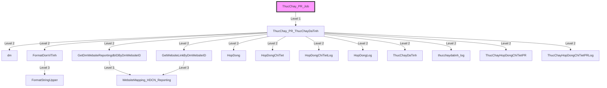

# Phân tích Luồng nghiệp vụ: `ThucChay_PR_Job`

## 1. Sơ đồ Call Graph (Mermaid)

## 2. Chi tiết Biến Đầu Vào (Parameters)

### `FormatDonViTinh`
| Tên tham số | Kiểu dữ liệu | Output |
|-------------|--------------|--------|
| `(Return)` | `nvarchar(100)` | Có |
| `@DonViTinh` | `nvarchar(100)` | Không |

### `FormatStringUpper`
| Tên tham số | Kiểu dữ liệu | Output |
|-------------|--------------|--------|
| `(Return)` | `nvarchar(100)` | Có |
| `@TenField` | `nvarchar(100)` | Không |

### `GetDmWebsiteReportingdbIDByDmWebsiteID`
| Tên tham số | Kiểu dữ liệu | Output |
|-------------|--------------|--------|
| `(Return)` | `int(4)` | Có |
| `@DmWebsiteID` | `int(4)` | Không |

### `GetWebsiteLinkByDmWebsiteID`
| Tên tham số | Kiểu dữ liệu | Output |
|-------------|--------------|--------|
| `(Return)` | `nvarchar(400)` | Có |
| `@DmWebsiteID` | `int(4)` | Không |
| `@TenWebsite` | `nvarchar(100)` | Không |

### `HopDong`
*(Không có tham số)*

### `HopDongChiTiet`
*(Không có tham số)*

### `HopDongChiTietLog`
*(Không có tham số)*

### `HopDongLog`
*(Không có tham số)*

### `ThucChayDaTinh`
*(Không có tham số)*

### `ThucChayHopDongChiTietPR`
*(Không có tham số)*

### `ThucChayHopDongChiTietPRLog`
*(Không có tham số)*

### `ThucChay_PR_Job`
*(Không có tham số)*

### `ThucChay_PR_ThucChayDaTinh`
| Tên tham số | Kiểu dữ liệu | Output |
|-------------|--------------|--------|
| `@NgayGhiNhan` | `date(3)` | Không |
| `@NgayCheckThayDoi` | `date(3)` | Không |
| `@NgayDanhSoGioiHan` | `date(3)` | Không |
| `@SoHopDong` | `nvarchar(200)` | Không |
| `@HopDongChiTietID` | `int(4)` | Không |

### `WebsiteMapping_HDCN_Reporting`
*(Không có tham số)*

### `dm`
*(Không có tham số)*

### `thucchaydatinh_log`
*(Không có tham số)*

