# Phân tích Luồng nghiệp vụ: `ThucChay_TinhCPM_With_DonViTinh_Ngay_BySQLJobs`

## 1. Sơ đồ Call Graph (Mermaid)

```mermaid
graph TD
    ThucChay_TinhCPM_With_DonViTinh_Ngay_BySQLJobs[ThucChay_TinhCPM_With_DonViTinh_Ngay_BySQLJobs]:::rootNode
    ThucChay_TinhCPM_With_DonViTinh_Ngay_BySQLJobs -->|Level 1| sp_TC_UpdateGiaTriThayDoiThucChayDaTinh_CPM_With_DonViTinh_Ngay
    ThucChay_TinhCPM_With_DonViTinh_Ngay_BySQLJobs -->|Level 1| ThucChay_ExcInsertThucChayDaTinhCPM_With_DonViTinh_Ngay_Site
    ThucChay_TinhCPM_With_DonViTinh_Ngay_BySQLJobs -->|Level 1| ThucChay_HopDongChiTietAndBanner
    ThucChay_TinhCPM_With_DonViTinh_Ngay_BySQLJobs -->|Level 1| ThucChay_UpdateHopDongChiTietAndBannerCPM_With_DonViTinh_Ngay
    sp_TC_UpdateGiaTriThayDoiThucChayDaTinh_CPM_With_DonViTinh_Ngay -->|Level 2| CheckDonViTinhHinhThucCPDAndNotCPD
    sp_TC_UpdateGiaTriThayDoiThucChayDaTinh_CPM_With_DonViTinh_Ngay -->|Level 2| HopDong
    sp_TC_UpdateGiaTriThayDoiThucChayDaTinh_CPM_With_DonViTinh_Ngay -->|Level 2| HopDongChiTiet
    sp_TC_UpdateGiaTriThayDoiThucChayDaTinh_CPM_With_DonViTinh_Ngay -->|Level 2| HopDongChiTietThayDoi
    sp_TC_UpdateGiaTriThayDoiThucChayDaTinh_CPM_With_DonViTinh_Ngay -->|Level 2| HopDongThayDoi
    sp_TC_UpdateGiaTriThayDoiThucChayDaTinh_CPM_With_DonViTinh_Ngay -->|Level 2| sp_TC_CheckHopDongCoThayDoi_CPM_With_DonViTinh_Ngay
    sp_TC_UpdateGiaTriThayDoiThucChayDaTinh_CPM_With_DonViTinh_Ngay -->|Level 2| sp_TC_UpdateGiaTriThayDoi_DoiTruToanBo_CPM_With_DonViTinh_Ngay
    sp_TC_UpdateGiaTriThayDoiThucChayDaTinh_CPM_With_DonViTinh_Ngay -->|Level 2| ThucChayDaTinh
    ThucChay_ExcInsertThucChayDaTinhCPM_With_DonViTinh_Ngay_Site -->|Level 2| DmWebsiteReportingdb
    ThucChay_ExcInsertThucChayDaTinhCPM_With_DonViTinh_Ngay_Site -->|Level 2| GetWebsiteLinkByDmWebsiteID
    ThucChay_ExcInsertThucChayDaTinhCPM_With_DonViTinh_Ngay_Site -->|Level 2| HopDong
    ThucChay_ExcInsertThucChayDaTinhCPM_With_DonViTinh_Ngay_Site -->|Level 2| HopDongChiTiet
    ThucChay_ExcInsertThucChayDaTinhCPM_With_DonViTinh_Ngay_Site -->|Level 2| ThucChay
    ThucChay_ExcInsertThucChayDaTinhCPM_With_DonViTinh_Ngay_Site -->|Level 2| ThucChay_InsertThucChayDaTinhCPM_With_DonViTinh_Ngay_Site
    ThucChay_ExcInsertThucChayDaTinhCPM_With_DonViTinh_Ngay_Site -->|Level 2| ThucChay_Update_ThucChayCPM_With_DonViTinh_Ngay_FixBug_KetThucChay
    ThucChay_ExcInsertThucChayDaTinhCPM_With_DonViTinh_Ngay_Site -->|Level 2| ThucChayDaTinh
    ThucChay_ExcInsertThucChayDaTinhCPM_With_DonViTinh_Ngay_Site -->|Level 2| ThucChayHopDongChiTietAndBanner
    ThucChay_ExcInsertThucChayDaTinhCPM_With_DonViTinh_Ngay_Site -->|Level 2| ThucChayTemp
    ThucChay_HopDongChiTietAndBanner -->|Level 2| Array
    ThucChay_HopDongChiTietAndBanner -->|Level 2| ArrayToTable
    ThucChay_HopDongChiTietAndBanner -->|Level 2| FormatString
    ThucChay_HopDongChiTietAndBanner -->|Level 2| HopDongChiTiet
    ThucChay_HopDongChiTietAndBanner -->|Level 2| ThucChayHopDongChiTiet
    ThucChay_HopDongChiTietAndBanner -->|Level 2| ThucChayHopDongChiTietAndBanner
    ThucChay_UpdateHopDongChiTietAndBannerCPM_With_DonViTinh_Ngay -->|Level 2| HopDongChiTiet
    ThucChay_UpdateHopDongChiTietAndBannerCPM_With_DonViTinh_Ngay -->|Level 2| ThucChayHopDongChiTietAndBanner
    ArrayToTable -->|Level 3| value
    CheckDonViTinhHinhThucCPDAndNotCPD -->|Level 3| FormatStringUpper
    GetWebsiteLinkByDmWebsiteID -->|Level 3| WebsiteMapping_HDCN_Reporting
    sp_TC_CheckHopDongCoThayDoi_CPM_With_DonViTinh_Ngay -->|Level 3| HopDongChiTiet
    sp_TC_CheckHopDongCoThayDoi_CPM_With_DonViTinh_Ngay -->|Level 3| HopDongChiTietThayDoi
    sp_TC_CheckHopDongCoThayDoi_CPM_With_DonViTinh_Ngay -->|Level 3| HopDongThayDoi
    sp_TC_CheckHopDongCoThayDoi_CPM_With_DonViTinh_Ngay -->|Level 3| sp_TC_UpdateGiaTriThayDoi_DoiTruToanBo_CPM_With_DonViTinh_Ngay
    sp_TC_CheckHopDongCoThayDoi_CPM_With_DonViTinh_Ngay -->|Level 3| ThucChay_ReInsertThucChayDaTinhCPM_With_DonViTinh_Ngay_ByHopDongChiTiet
    sp_TC_CheckHopDongCoThayDoi_CPM_With_DonViTinh_Ngay -->|Level 3| ThucChayDaTinh
    sp_TC_UpdateGiaTriThayDoi_DoiTruToanBo_CPM_With_DonViTinh_Ngay -->|Level 3| ThucChayDaTinh
    ThucChay_InsertThucChayDaTinhCPM_With_DonViTinh_Ngay_Site -->|Level 3| fn_TinhSoLuongThucChayCPM_With_DonViTinh_Ngay
    ThucChay_InsertThucChayDaTinhCPM_With_DonViTinh_Ngay_Site -->|Level 3| fn_TinhSoLuongThucChayLechTreoHaCPM_With_DonViTinh_Ngay
    ThucChay_InsertThucChayDaTinhCPM_With_DonViTinh_Ngay_Site -->|Level 3| fn_TinhTienThucChayCPM_With_DonViTinh_Ngay
    ThucChay_InsertThucChayDaTinhCPM_With_DonViTinh_Ngay_Site -->|Level 3| fn_TinhTienThucChayLechTreoHaCPM_With_DonViTinh_Ngay
    ThucChay_InsertThucChayDaTinhCPM_With_DonViTinh_Ngay_Site -->|Level 3| GetProductIDByTypeProduct
    ThucChay_InsertThucChayDaTinhCPM_With_DonViTinh_Ngay_Site -->|Level 3| GetProductNameByTypeProduct
    ThucChay_InsertThucChayDaTinhCPM_With_DonViTinh_Ngay_Site -->|Level 3| HopDong
    ThucChay_InsertThucChayDaTinhCPM_With_DonViTinh_Ngay_Site -->|Level 3| HopDongChiTiet
    ThucChay_InsertThucChayDaTinhCPM_With_DonViTinh_Ngay_Site -->|Level 3| ThucChay_GetSoLuongChuanTheoDonViTinhNotCPD
    ThucChay_InsertThucChayDaTinhCPM_With_DonViTinh_Ngay_Site -->|Level 3| ThucChayDaTinh
    ThucChay_InsertThucChayDaTinhCPM_With_DonViTinh_Ngay_Site -->|Level 3| ThucChayHopDongChiTiet
    ThucChay_Update_ThucChayCPM_With_DonViTinh_Ngay_FixBug_KetThucChay -->|Level 3| HopDongChiTiet
    ThucChay_Update_ThucChayCPM_With_DonViTinh_Ngay_FixBug_KetThucChay -->|Level 3| ThucChayDaTinh
    ThucChay_Update_ThucChayCPM_With_DonViTinh_Ngay_FixBug_KetThucChay -->|Level 3| ThucChayHopDongChiTiet
    fn_TinhSoLuongThucChayCPM_With_DonViTinh_Ngay -->|Level 4| HopDongChiTiet
    fn_TinhSoLuongThucChayCPM_With_DonViTinh_Ngay -->|Level 4| ThucChayDaTinh
    fn_TinhSoLuongThucChayLechTreoHaCPM_With_DonViTinh_Ngay -->|Level 4| ThucChayDaTinh
    fn_TinhTienThucChayCPM_With_DonViTinh_Ngay -->|Level 4| HopDongChiTiet
    fn_TinhTienThucChayCPM_With_DonViTinh_Ngay -->|Level 4| ThucChayDaTinh
    fn_TinhTienThucChayLechTreoHaCPM_With_DonViTinh_Ngay -->|Level 4| HopDongChiTiet
    fn_TinhTienThucChayLechTreoHaCPM_With_DonViTinh_Ngay -->|Level 4| ThucChayDaTinh
    sp_TC_UpdateGiaTriThayDoi_DoiTruToanBo_CPM_With_DonViTinh_Ngay -->|Level 4| ThucChayDaTinh
    ThucChay_ReInsertThucChayDaTinhCPM_With_DonViTinh_Ngay_ByHopDongChiTiet -->|Level 4| DmWebsiteReportingdb
    ThucChay_ReInsertThucChayDaTinhCPM_With_DonViTinh_Ngay_ByHopDongChiTiet -->|Level 4| GetDmSanPhamIDByTypeProductID
    ThucChay_ReInsertThucChayDaTinhCPM_With_DonViTinh_Ngay_ByHopDongChiTiet -->|Level 4| GetDmWebsiteReportingdbIDByDmWebsiteID
    ThucChay_ReInsertThucChayDaTinhCPM_With_DonViTinh_Ngay_ByHopDongChiTiet -->|Level 4| GetWebsiteLinkByDmWebsiteID
    ThucChay_ReInsertThucChayDaTinhCPM_With_DonViTinh_Ngay_ByHopDongChiTiet -->|Level 4| HopDong
    ThucChay_ReInsertThucChayDaTinhCPM_With_DonViTinh_Ngay_ByHopDongChiTiet -->|Level 4| HopDongChiTiet
    ThucChay_ReInsertThucChayDaTinhCPM_With_DonViTinh_Ngay_ByHopDongChiTiet -->|Level 4| ThucChay
    ThucChay_ReInsertThucChayDaTinhCPM_With_DonViTinh_Ngay_ByHopDongChiTiet -->|Level 4| ThucChay_Update_ThucChayCPM_With_DonViTinh_Ngay_FixBug_KetThucChay
    ThucChay_ReInsertThucChayDaTinhCPM_With_DonViTinh_Ngay_ByHopDongChiTiet -->|Level 4| ThucChay_UpdateGiaTriThayDoiCPM_With_DonViTinh_Ngay_Site
    ThucChay_ReInsertThucChayDaTinhCPM_With_DonViTinh_Ngay_ByHopDongChiTiet -->|Level 4| ThucChayDaTinh
    ThucChay_ReInsertThucChayDaTinhCPM_With_DonViTinh_Ngay_ByHopDongChiTiet -->|Level 4| ThucChayHopDongChiTietAndBanner
    ThucChay_ReInsertThucChayDaTinhCPM_With_DonViTinh_Ngay_ByHopDongChiTiet -->|Level 4| ThucChayTemp
    GetDmWebsiteReportingdbIDByDmWebsiteID -->|Level 5| WebsiteMapping_HDCN_Reporting
    GetWebsiteLinkByDmWebsiteID -->|Level 5| WebsiteMapping_HDCN_Reporting
    ThucChay_Update_ThucChayCPM_With_DonViTinh_Ngay_FixBug_KetThucChay -->|Level 5| HopDongChiTiet
    ThucChay_Update_ThucChayCPM_With_DonViTinh_Ngay_FixBug_KetThucChay -->|Level 5| ThucChayDaTinh
    ThucChay_Update_ThucChayCPM_With_DonViTinh_Ngay_FixBug_KetThucChay -->|Level 5| ThucChayHopDongChiTiet
    ThucChay_UpdateGiaTriThayDoiCPM_With_DonViTinh_Ngay_Site -->|Level 5| fn_TinhSoLuongThucChayCPM_With_DonViTinh_Ngay
    ThucChay_UpdateGiaTriThayDoiCPM_With_DonViTinh_Ngay_Site -->|Level 5| fn_TinhTienThucChayCPM_With_DonViTinh_Ngay
    ThucChay_UpdateGiaTriThayDoiCPM_With_DonViTinh_Ngay_Site -->|Level 5| GetProductIDByTypeProduct
    ThucChay_UpdateGiaTriThayDoiCPM_With_DonViTinh_Ngay_Site -->|Level 5| GetProductNameByTypeProduct
    ThucChay_UpdateGiaTriThayDoiCPM_With_DonViTinh_Ngay_Site -->|Level 5| HopDong
    ThucChay_UpdateGiaTriThayDoiCPM_With_DonViTinh_Ngay_Site -->|Level 5| HopDongChiTiet
    ThucChay_UpdateGiaTriThayDoiCPM_With_DonViTinh_Ngay_Site -->|Level 5| ThucChay_GetSoLuongChuanTheoDonViTinhNotCPD
    ThucChay_UpdateGiaTriThayDoiCPM_With_DonViTinh_Ngay_Site -->|Level 5| ThucChayDaTinh
    ThucChay_UpdateGiaTriThayDoiCPM_With_DonViTinh_Ngay_Site -->|Level 5| ThucChayHopDongChiTiet
    fn_TinhSoLuongThucChayCPM_With_DonViTinh_Ngay -->|Level 6| HopDongChiTiet
    fn_TinhSoLuongThucChayCPM_With_DonViTinh_Ngay -->|Level 6| ThucChayDaTinh
    fn_TinhTienThucChayCPM_With_DonViTinh_Ngay -->|Level 6| HopDongChiTiet
    fn_TinhTienThucChayCPM_With_DonViTinh_Ngay -->|Level 6| ThucChayDaTinh

    classDef rootNode fill:#f9f,stroke:#333,stroke-width:4px;
```

## 2. Chi tiết Biến Đầu Vào (Parameters)

### `Array`
| Tên tham số | Kiểu dữ liệu | Output |
|-------------|--------------|--------|
| `(Return)` | `xml` | Có |
| `@StringArray` | `varchar(8000)` | Không |
| `@Delimiter` | `varchar(10)` | Không |

### `ArrayToTable`
| Tên tham số | Kiểu dữ liệu | Output |
|-------------|--------------|--------|
| `@TheArray` | `xml` | Không |

### `CheckDonViTinhHinhThucCPDAndNotCPD`
| Tên tham số | Kiểu dữ liệu | Output |
|-------------|--------------|--------|
| `(Return)` | `int(4)` | Có |
| `@DonViTinhREF` | `int(4)` | Không |
| `@DonViTinh` | `nvarchar(100)` | Không |

### `DmWebsiteReportingdb`
*(Không có tham số)*

### `FormatString`
| Tên tham số | Kiểu dữ liệu | Output |
|-------------|--------------|--------|
| `(Return)` | `nvarchar(100)` | Có |
| `@TenField` | `nvarchar(100)` | Không |

### `FormatStringUpper`
| Tên tham số | Kiểu dữ liệu | Output |
|-------------|--------------|--------|
| `(Return)` | `nvarchar(100)` | Có |
| `@TenField` | `nvarchar(100)` | Không |

### `GetDmSanPhamIDByTypeProductID`
| Tên tham số | Kiểu dữ liệu | Output |
|-------------|--------------|--------|
| `(Return)` | `int(4)` | Có |
| `@DmSanPhamREF` | `int(4)` | Không |

### `GetDmWebsiteReportingdbIDByDmWebsiteID`
| Tên tham số | Kiểu dữ liệu | Output |
|-------------|--------------|--------|
| `(Return)` | `int(4)` | Có |
| `@DmWebsiteID` | `int(4)` | Không |

### `GetProductIDByTypeProduct`
| Tên tham số | Kiểu dữ liệu | Output |
|-------------|--------------|--------|
| `(Return)` | `int(4)` | Có |
| `@TypeProduct` | `int(4)` | Không |

### `GetProductNameByTypeProduct`
| Tên tham số | Kiểu dữ liệu | Output |
|-------------|--------------|--------|
| `(Return)` | `nvarchar(100)` | Có |
| `@TypeProduct` | `int(4)` | Không |

### `GetWebsiteLinkByDmWebsiteID`
| Tên tham số | Kiểu dữ liệu | Output |
|-------------|--------------|--------|
| `(Return)` | `nvarchar(400)` | Có |
| `@DmWebsiteID` | `int(4)` | Không |
| `@TenWebsite` | `nvarchar(100)` | Không |

### `HopDong`
*(Không có tham số)*

### `HopDongChiTiet`
*(Không có tham số)*

### `HopDongChiTietThayDoi`
*(Không có tham số)*

### `HopDongThayDoi`
*(Không có tham số)*

### `ThucChay`
*(Không có tham số)*

### `ThucChayDaTinh`
*(Không có tham số)*

### `ThucChayHopDongChiTiet`
*(Không có tham số)*

### `ThucChayHopDongChiTietAndBanner`
*(Không có tham số)*

### `ThucChayTemp`
*(Không có tham số)*

### `ThucChay_ExcInsertThucChayDaTinhCPM_With_DonViTinh_Ngay_Site`
| Tên tham số | Kiểu dữ liệu | Output |
|-------------|--------------|--------|
| `@StartDate` | `datetime(8)` | Không |
| `@EndDate` | `datetime(8)` | Không |

### `ThucChay_GetSoLuongChuanTheoDonViTinhNotCPD`
| Tên tham số | Kiểu dữ liệu | Output |
|-------------|--------------|--------|
| `(Return)` | `float(8)` | Có |
| `@DonViTinh` | `nvarchar(100)` | Không |

### `ThucChay_HopDongChiTietAndBanner`
| Tên tham số | Kiểu dữ liệu | Output |
|-------------|--------------|--------|
| `@DenNgay` | `datetime(8)` | Không |

### `ThucChay_InsertThucChayDaTinhCPM_With_DonViTinh_Ngay_Site`
| Tên tham số | Kiểu dữ liệu | Output |
|-------------|--------------|--------|
| `@NgayThucHien` | `datetime(8)` | Không |
| `@SoHopDong` | `nvarchar(100)` | Không |
| `@HopDongChiTietID` | `int(4)` | Không |
| `@TypeProduct` | `int(4)` | Không |
| `@DmWebsiteREF` | `int(4)` | Không |
| `@TenWebsite` | `nvarchar(100)` | Không |
| `@DmBannerREF` | `int(4)` | Không |
| `@TiLeBannerSiteHDCT` | `float(8)` | Không |
| `@TongViewThucChayBanner` | `bigint(8)` | Không |
| `@TongClickThucChayBanner` | `bigint(8)` | Không |

### `ThucChay_ReInsertThucChayDaTinhCPM_With_DonViTinh_Ngay_ByHopDongChiTiet`
| Tên tham số | Kiểu dữ liệu | Output |
|-------------|--------------|--------|
| `@pSoHopDong` | `nvarchar(200)` | Không |
| `@pHopDongChiTietID` | `int(4)` | Không |
| `@DmSanPhamREF` | `int(4)` | Không |
| `@NgayThucHienGhiNhan` | `datetime(8)` | Không |

### `ThucChay_TinhCPM_With_DonViTinh_Ngay_BySQLJobs`
*(Không có tham số)*

### `ThucChay_UpdateGiaTriThayDoiCPM_With_DonViTinh_Ngay_Site`
| Tên tham số | Kiểu dữ liệu | Output |
|-------------|--------------|--------|
| `@NgayThucHien` | `datetime(8)` | Không |
| `@SoHopDong` | `nvarchar(100)` | Không |
| `@HopDongChiTietID` | `int(4)` | Không |
| `@TypeProduct` | `int(4)` | Không |
| `@DmWebsiteREF` | `int(4)` | Không |
| `@TenWebsite` | `nvarchar(100)` | Không |
| `@DmBannerREF` | `int(4)` | Không |
| `@TiLeBannerSiteHDCT` | `float(8)` | Không |
| `@TongViewThucChayBanner` | `bigint(8)` | Không |
| `@TongClickThucChayBanner` | `bigint(8)` | Không |

### `ThucChay_UpdateHopDongChiTietAndBannerCPM_With_DonViTinh_Ngay`
*(Không có tham số)*

### `ThucChay_Update_ThucChayCPM_With_DonViTinh_Ngay_FixBug_KetThucChay`
| Tên tham số | Kiểu dữ liệu | Output |
|-------------|--------------|--------|
| `@NgayThucHien` | `datetime(8)` | Không |
| `@HopDongID` | `int(4)` | Không |
| `@HopDongChiTietID` | `int(4)` | Không |
| `@ThanhTienHDCT` | `bigint(8)` | Không |

### `WebsiteMapping_HDCN_Reporting`
*(Không có tham số)*

### `fn_TinhSoLuongThucChayCPM_With_DonViTinh_Ngay`
| Tên tham số | Kiểu dữ liệu | Output |
|-------------|--------------|--------|
| `(Return)` | `varchar(2000)` | Có |
| `@HopDongChiTietREF` | `int(4)` | Không |
| `@NgayThucHien` | `datetime(8)` | Không |
| `@DonGia` | `float(8)` | Không |
| `@TiLeBannerSiteHDCT` | `float(8)` | Không |
| `@ThanhTien` | `float(8)` | Không |
| `@ChietKhau` | `float(8)` | Không |
| `@TongViewThucChayBanner` | `bigint(8)` | Không |

### `fn_TinhSoLuongThucChayLechTreoHaCPM_With_DonViTinh_Ngay`
| Tên tham số | Kiểu dữ liệu | Output |
|-------------|--------------|--------|
| `(Return)` | `varchar(2000)` | Có |
| `@HopDongChiTietREF` | `int(4)` | Không |
| `@NgayThucHien` | `datetime(8)` | Không |
| `@DonGia` | `float(8)` | Không |
| `@TiLeBannerSiteHDCT` | `float(8)` | Không |
| `@ThanhTien` | `float(8)` | Không |
| `@ChietKhau` | `float(8)` | Không |
| `@TongViewThucChay` | `bigint(8)` | Không |

### `fn_TinhTienThucChayCPM_With_DonViTinh_Ngay`
| Tên tham số | Kiểu dữ liệu | Output |
|-------------|--------------|--------|
| `(Return)` | `varchar(2000)` | Có |
| `@HopDongChiTietREF` | `int(4)` | Không |
| `@NgayThucHien` | `datetime(8)` | Không |
| `@DonGia` | `float(8)` | Không |
| `@TiLeBannerSiteHDCT` | `float(8)` | Không |
| `@ThanhTien` | `float(8)` | Không |
| `@ChietKhau` | `float(8)` | Không |

### `fn_TinhTienThucChayLechTreoHaCPM_With_DonViTinh_Ngay`
| Tên tham số | Kiểu dữ liệu | Output |
|-------------|--------------|--------|
| `(Return)` | `varchar(2000)` | Có |
| `@HopDongChiTietREF` | `int(4)` | Không |
| `@NgayThucHien` | `datetime(8)` | Không |
| `@DonGia` | `float(8)` | Không |
| `@TiLeBannerSiteHDCT` | `float(8)` | Không |
| `@ThanhTien` | `float(8)` | Không |
| `@ChietKhau` | `float(8)` | Không |

### `sp_TC_CheckHopDongCoThayDoi_CPM_With_DonViTinh_Ngay`
| Tên tham số | Kiểu dữ liệu | Output |
|-------------|--------------|--------|
| `@HopDongREF` | `int(4)` | Không |
| `@DmSanPhamREF` | `int(4)` | Không |
| `@HopDongChiTietID` | `int(4)` | Không |
| `@NgayThucHien` | `datetime(8)` | Không |

### `sp_TC_UpdateGiaTriThayDoiThucChayDaTinh_CPM_With_DonViTinh_Ngay`
| Tên tham số | Kiểu dữ liệu | Output |
|-------------|--------------|--------|
| `@StartDate` | `datetime(8)` | Không |
| `@EndDate` | `datetime(8)` | Không |

### `sp_TC_UpdateGiaTriThayDoi_DoiTruToanBo_CPM_With_DonViTinh_Ngay`
| Tên tham số | Kiểu dữ liệu | Output |
|-------------|--------------|--------|
| `@HopDongID` | `int(4)` | Không |
| `@HopDongChiTietID` | `int(4)` | Không |
| `@NgayTinh` | `datetime(8)` | Không |

### `value`
*(Không có tham số)*

