# Phân tích Luồng nghiệp vụ: `ThucChay_job_TinhthucchayInventory`

## 1. Sơ đồ Call Graph (Mermaid)

```mermaid
graph TD
    ThucChay_job_TinhthucchayInventory[ThucChay_job_TinhthucchayInventory]:::rootNode
    ThucChay_job_TinhthucchayInventory -->|Level 1| ThucChay_ExecThucChayDaTinh_HopDongInventory
    ThucChay_job_TinhthucchayInventory -->|Level 1| ThucChay_ExecThucChayDaTinh_HopDongInventory_AdmaticProgrammatic
    ThucChay_job_TinhthucchayInventory -->|Level 1| ThucChay_Update_GTTD_ThucChayDaTinh_HopDongInventory
    ThucChay_ExecThucChayDaTinh_HopDongInventory -->|Level 2| DmThongTinHopDongBanInventory
    ThucChay_ExecThucChayDaTinh_HopDongInventory -->|Level 2| HopDongChiTiet
    ThucChay_ExecThucChayDaTinh_HopDongInventory -->|Level 2| ThucChay_InsertThongTinHopDongInventory
    ThucChay_ExecThucChayDaTinh_HopDongInventory -->|Level 2| ThucChay_InsertThucChayDaTinh_HopDongInventory
    ThucChay_ExecThucChayDaTinh_HopDongInventory_AdmaticProgrammatic -->|Level 2| DmThongTinHopDongBanInventory
    ThucChay_ExecThucChayDaTinh_HopDongInventory_AdmaticProgrammatic -->|Level 2| HopDong
    ThucChay_ExecThucChayDaTinh_HopDongInventory_AdmaticProgrammatic -->|Level 2| HopDongChiTiet
    ThucChay_ExecThucChayDaTinh_HopDongInventory_AdmaticProgrammatic -->|Level 2| ThucChay_InsertThongTinHopDongInventory
    ThucChay_ExecThucChayDaTinh_HopDongInventory_AdmaticProgrammatic -->|Level 2| ThucChay_InsertThucChayDaTinh_HopDongInventory
    ThucChay_ExecThucChayDaTinh_HopDongInventory_AdmaticProgrammatic -->|Level 2| ThucChayDaTinh
    ThucChay_ExecThucChayDaTinh_HopDongInventory_AdmaticProgrammatic -->|Level 2| ThucChayHopDongChiTiet
    ThucChay_Update_GTTD_ThucChayDaTinh_HopDongInventory -->|Level 2| DmThongTinHopDongBanInventory
    ThucChay_Update_GTTD_ThucChayDaTinh_HopDongInventory -->|Level 2| HopDong
    ThucChay_Update_GTTD_ThucChayDaTinh_HopDongInventory -->|Level 2| HopDongChiTiet
    ThucChay_Update_GTTD_ThucChayDaTinh_HopDongInventory -->|Level 2| HopDongChiTietThayDoi
    ThucChay_Update_GTTD_ThucChayDaTinh_HopDongInventory -->|Level 2| HopDongThayDoi
    ThucChay_Update_GTTD_ThucChayDaTinh_HopDongInventory -->|Level 2| ThucChayDaTinh
    ThucChay_Update_GTTD_ThucChayDaTinh_HopDongInventory -->|Level 2| ThucChayDaTinhAdmarket
    ThucChay_InsertThongTinHopDongInventory -->|Level 3| DmThongTinHopDongBanInventory
    ThucChay_InsertThongTinHopDongInventory -->|Level 3| HopDong
    ThucChay_InsertThongTinHopDongInventory -->|Level 3| HopDongChiTiet
    ThucChay_InsertThongTinHopDongInventory -->|Level 3| iv
    ThucChay_InsertThucChayDaTinh_HopDongInventory -->|Level 3| DmThongTinHopDongBanInventory
    ThucChay_InsertThucChayDaTinh_HopDongInventory -->|Level 3| GetDmWebsiteReportingdbIDByDmWebsiteID
    ThucChay_InsertThucChayDaTinh_HopDongInventory -->|Level 3| GetWebsiteLinkByDmWebsiteID
    ThucChay_InsertThucChayDaTinh_HopDongInventory -->|Level 3| HopDong
    ThucChay_InsertThucChayDaTinh_HopDongInventory -->|Level 3| HopDongChiTiet
    ThucChay_InsertThucChayDaTinh_HopDongInventory -->|Level 3| ThucChay_GetDonGiaByNgayThucHien
    ThucChay_InsertThucChayDaTinh_HopDongInventory -->|Level 3| ThucChayDaTinh
    ThucChay_InsertThucChayDaTinh_HopDongInventory -->|Level 3| ThucChayDaTinh_inventory_check
    ThucChay_InsertThucChayDaTinh_HopDongInventory -->|Level 3| ThucChayDaTinhAdmarket
    GetDmWebsiteReportingdbIDByDmWebsiteID -->|Level 4| WebsiteMapping_HDCN_Reporting
    GetWebsiteLinkByDmWebsiteID -->|Level 4| WebsiteMapping_HDCN_Reporting
    ThucChay_GetDonGiaByNgayThucHien -->|Level 4| HopDongChiTiet

    classDef rootNode fill:#f9f,stroke:#333,stroke-width:4px;
```

## 2. Chi tiết Biến Đầu Vào (Parameters)

### `DmThongTinHopDongBanInventory`
*(Không có tham số)*

### `GetDmWebsiteReportingdbIDByDmWebsiteID`
| Tên tham số | Kiểu dữ liệu | Output |
|-------------|--------------|--------|
| `(Return)` | `int(4)` | Có |
| `@DmWebsiteID` | `int(4)` | Không |

### `GetWebsiteLinkByDmWebsiteID`
| Tên tham số | Kiểu dữ liệu | Output |
|-------------|--------------|--------|
| `(Return)` | `nvarchar(400)` | Có |
| `@DmWebsiteID` | `int(4)` | Không |
| `@TenWebsite` | `nvarchar(100)` | Không |

### `HopDong`
*(Không có tham số)*

### `HopDongChiTiet`
*(Không có tham số)*

### `HopDongChiTietThayDoi`
*(Không có tham số)*

### `HopDongThayDoi`
*(Không có tham số)*

### `ThucChayDaTinh`
*(Không có tham số)*

### `ThucChayDaTinhAdmarket`
*(Không có tham số)*

### `ThucChayDaTinh_inventory_check`
*(Không có tham số)*

### `ThucChayHopDongChiTiet`
*(Không có tham số)*

### `ThucChay_ExecThucChayDaTinh_HopDongInventory`
| Tên tham số | Kiểu dữ liệu | Output |
|-------------|--------------|--------|
| `@NgayThucHien` | `datetime(8)` | Không |

### `ThucChay_ExecThucChayDaTinh_HopDongInventory_AdmaticProgrammatic`
| Tên tham số | Kiểu dữ liệu | Output |
|-------------|--------------|--------|
| `@NgayThucHien` | `datetime(8)` | Không |

### `ThucChay_GetDonGiaByNgayThucHien`
| Tên tham số | Kiểu dữ liệu | Output |
|-------------|--------------|--------|
| `(Return)` | `float(8)` | Có |
| `@NgayThucHien` | `datetime(8)` | Không |
| `@HopDongChiTietID` | `int(4)` | Không |
| `@DonGia` | `float(8)` | Không |

### `ThucChay_InsertThongTinHopDongInventory`
| Tên tham số | Kiểu dữ liệu | Output |
|-------------|--------------|--------|
| `@NgayThucHien` | `datetime(8)` | Không |

### `ThucChay_InsertThucChayDaTinh_HopDongInventory`
| Tên tham số | Kiểu dữ liệu | Output |
|-------------|--------------|--------|
| `@NgayThucHien` | `datetime(8)` | Không |
| `@HopDongID` | `int(4)` | Không |
| `@HopDongChitietID` | `int(4)` | Không |
| `@DmSanPhamREF` | `int(4)` | Không |
| `@TenSanPham` | `nvarchar(400)` | Không |
| `@CreateBy` | `nvarchar(100)` | Không |

### `ThucChay_Update_GTTD_ThucChayDaTinh_HopDongInventory`
| Tên tham số | Kiểu dữ liệu | Output |
|-------------|--------------|--------|
| `@NgayThucHien` | `datetime(8)` | Không |

### `ThucChay_job_TinhthucchayInventory`
*(Không có tham số)*

### `WebsiteMapping_HDCN_Reporting`
*(Không có tham số)*

### `iv`
*(Không có tham số)*

