# Phân tích Luồng nghiệp vụ: `job_prc_asd_calc_admarket_PhanBo`

## 1. Sơ đồ Call Graph (Mermaid)

```mermaid
graph TD
    job_prc_asd_calc_admarket_PhanBo[job_prc_asd_calc_admarket_PhanBo]:::rootNode
    job_prc_asd_calc_admarket_PhanBo -->|Level 1| prc_asd_insert_thucchaydatinh_admarket_hopdonghuy_PhanBo
    job_prc_asd_calc_admarket_PhanBo -->|Level 1| prc_asd_TinhThucChay_Admarket_ThayDoiGiaTri_HopDong_PhanBo
    job_prc_asd_calc_admarket_PhanBo -->|Level 1| prc_asd_tinhthucchay_sanphamadmarket_PhanBo
    job_prc_asd_calc_admarket_PhanBo -->|Level 1| prc_insert_thucchaydatinh_admarket_PhanBo
    job_prc_asd_calc_admarket_PhanBo -->|Level 1| ThucChayDaTinhAdmarket_InsertThucChayNoContract_PhanBo
    prc_asd_insert_thucchaydatinh_admarket_hopdonghuy_PhanBo -->|Level 2| hopdong
    prc_asd_insert_thucchaydatinh_admarket_hopdonghuy_PhanBo -->|Level 2| prc_asd_insert_thucchaydatinh_admarket_hopdonghuy_chitiet_PhanBo
    prc_asd_TinhThucChay_Admarket_ThayDoiGiaTri_HopDong_PhanBo -->|Level 2| HopDongChiTietLog
    prc_asd_TinhThucChay_Admarket_ThayDoiGiaTri_HopDong_PhanBo -->|Level 2| prc_asd_TinhGiaTri_ThayDoi_HopDong_Per_PhanBo
    prc_asd_tinhthucchay_sanphamadmarket_PhanBo -->|Level 2| DmThongTinHopDongBanInventory
    prc_asd_tinhthucchay_sanphamadmarket_PhanBo -->|Level 2| DmWebsiteReportingdb
    prc_asd_tinhthucchay_sanphamadmarket_PhanBo -->|Level 2| GetWebsiteIDByDomainName
    prc_asd_tinhthucchay_sanphamadmarket_PhanBo -->|Level 2| HopDong
    prc_asd_tinhthucchay_sanphamadmarket_PhanBo -->|Level 2| hopdongchitiet
    prc_asd_tinhthucchay_sanphamadmarket_PhanBo -->|Level 2| prc_asd_insert_HopDong_CanhBaoThucChay_Admarket_PhanBo
    prc_asd_tinhthucchay_sanphamadmarket_PhanBo -->|Level 2| prc_asd_insert_khongsohopdong_Admarket_PhanBo
    prc_asd_tinhthucchay_sanphamadmarket_PhanBo -->|Level 2| prc_asd_tinhthucchay_admarket_chitiet_PhanBo
    prc_asd_tinhthucchay_sanphamadmarket_PhanBo -->|Level 2| prc_insert_ThucChayAdmarket_HopDong_online_PhanBo
    prc_asd_tinhthucchay_sanphamadmarket_PhanBo -->|Level 2| ThucChayAdmarket_PhanBo
    prc_asd_tinhthucchay_sanphamadmarket_PhanBo -->|Level 2| thucchaydatinh
    prc_asd_tinhthucchay_sanphamadmarket_PhanBo -->|Level 2| thucchaydatinhadmarket
    prc_asd_tinhthucchay_sanphamadmarket_PhanBo -->|Level 2| ThucChayDaTinhAdmarket_InsertNoContractByProduct_PhanBo
    prc_insert_thucchaydatinh_admarket_PhanBo -->|Level 2| DmThongTinHopDongBanInventory
    prc_insert_thucchaydatinh_admarket_PhanBo -->|Level 2| DmWebsiteReportingdb
    prc_insert_thucchaydatinh_admarket_PhanBo -->|Level 2| GetWebsiteIDByDomainName
    prc_insert_thucchaydatinh_admarket_PhanBo -->|Level 2| ThucChayAdmarket_PhanBo
    prc_insert_thucchaydatinh_admarket_PhanBo -->|Level 2| ThucChayDaTinh
    ThucChayDaTinhAdmarket_InsertThucChayNoContract_PhanBo -->|Level 2| ThucChayDaTinh
    ThucChayDaTinhAdmarket_InsertThucChayNoContract_PhanBo -->|Level 2| ThucChayDaTinhAdmarket
    ThucChayDaTinhAdmarket_InsertThucChayNoContract_PhanBo -->|Level 2| ThucChayDaTinhAdmarket_InsertNoContractByProduct_PhanBo
    GetWebsiteIDByDomainName -->|Level 3| DmWebsiteReportingdb
    prc_asd_insert_HopDong_CanhBaoThucChay_Admarket_PhanBo -->|Level 3| HopDong_CanhBaoThucChayVuot_Admarket_PhanBo
    prc_asd_insert_khongsohopdong_Admarket_PhanBo -->|Level 3| HopDong_CanhBaoThucChayKhongSoHopDong_Admarket_PhanBo
    prc_asd_insert_thucchaydatinh_admarket_hopdonghuy_chitiet_PhanBO -->|Level 3| hopdongchitiet
    prc_asd_insert_thucchaydatinh_admarket_hopdonghuy_chitiet_PhanBO -->|Level 3| thucchaydatinhadmarket
    prc_asd_TinhGiaTri_ThayDoi_HopDong_Per_PhanBo -->|Level 3| DmWebsiteReportingdb
    prc_asd_TinhGiaTri_ThayDoi_HopDong_Per_PhanBo -->|Level 3| GetWebsiteIDByDomainName
    prc_asd_TinhGiaTri_ThayDoi_HopDong_Per_PhanBo -->|Level 3| HopDong
    prc_asd_TinhGiaTri_ThayDoi_HopDong_Per_PhanBo -->|Level 3| HopDongChiTiet
    prc_asd_TinhGiaTri_ThayDoi_HopDong_Per_PhanBo -->|Level 3| prc_asd_ThucChayDaTinhAdmarket_InsertByPhanBoID_ThayDoiHopDong_PhanBo
    prc_asd_TinhGiaTri_ThayDoi_HopDong_Per_PhanBo -->|Level 3| prc_insert_ThucChayAdmarket_HopDong_online_PhanBo
    prc_asd_TinhGiaTri_ThayDoi_HopDong_Per_PhanBo -->|Level 3| ThucChay_InsertGTTDThucChayDaTinhAdmarket_XulyConfirm_DoiTruOnline_v2
    prc_asd_TinhGiaTri_ThayDoi_HopDong_Per_PhanBo -->|Level 3| ThucChayAdmarket_HopDong_online
    prc_asd_TinhGiaTri_ThayDoi_HopDong_Per_PhanBo -->|Level 3| ThucChayDaTinhAdmarket
    prc_asd_tinhthucchay_admarket_chitiet_PhanBo -->|Level 3| DmWebsiteReportingdb
    prc_asd_tinhthucchay_admarket_chitiet_PhanBo -->|Level 3| GetWebsiteIDByDomainName
    prc_asd_tinhthucchay_admarket_chitiet_PhanBo -->|Level 3| HopDongChitiet
    prc_asd_tinhthucchay_admarket_chitiet_PhanBo -->|Level 3| prc_asd_ThucChayDaTinhAdmarket_InsertTCDT_PhanBo
    prc_asd_tinhthucchay_admarket_chitiet_PhanBo -->|Level 3| thucchaydatinhadmarket
    prc_insert_ThucChayAdmarket_HopDong_online_PhanBo -->|Level 3| DmWebsiteReportingdb
    prc_insert_ThucChayAdmarket_HopDong_online_PhanBo -->|Level 3| GetWebsiteIDByDomainName
    prc_insert_ThucChayAdmarket_HopDong_online_PhanBo -->|Level 3| hopdong
    prc_insert_ThucChayAdmarket_HopDong_online_PhanBo -->|Level 3| hopdongchitiet
    prc_insert_ThucChayAdmarket_HopDong_online_PhanBo -->|Level 3| ThucChayAdmarket_HopDong_online
    ThucChayDaTinhAdmarket_InsertNoContractByProduct_PhanBo -->|Level 3| ThucChayDaTinhAdmarket
    GetWebsiteIDByDomainName -->|Level 4| DmWebsiteReportingdb
    prc_asd_ThucChayDaTinhAdmarket_InsertByPhanBoID_ThayDoiHopDong_PhanBo -->|Level 4| GetDotChayBookingByHopDongChiTiet
    prc_asd_ThucChayDaTinhAdmarket_InsertByPhanBoID_ThayDoiHopDong_PhanBo -->|Level 4| GetSoLuongDotChayBookingByHopDongChiTiet
    prc_asd_ThucChayDaTinhAdmarket_InsertByPhanBoID_ThayDoiHopDong_PhanBo -->|Level 4| HopDong
    prc_asd_ThucChayDaTinhAdmarket_InsertByPhanBoID_ThayDoiHopDong_PhanBo -->|Level 4| HopDongChiTiet
    prc_asd_ThucChayDaTinhAdmarket_InsertByPhanBoID_ThayDoiHopDong_PhanBo -->|Level 4| ThucChay_GetDonGiaByNgayThucHien
    prc_asd_ThucChayDaTinhAdmarket_InsertByPhanBoID_ThayDoiHopDong_PhanBo -->|Level 4| ThucChay_GetDonGiaChuanTheoDonViTinh
    prc_asd_ThucChayDaTinhAdmarket_InsertByPhanBoID_ThayDoiHopDong_PhanBo -->|Level 4| ThucChay_GetSoLuongChuanTheoDonViTinhNotCPD
    prc_asd_ThucChayDaTinhAdmarket_InsertByPhanBoID_ThayDoiHopDong_PhanBo -->|Level 4| ThucChayDaTinhAdmarket
    prc_asd_ThucChayDaTinhAdmarket_InsertByPhanBoID_ThayDoiHopDong_PhanBo -->|Level 4| ThucChayDaTinhAdmarket_InsertNoContractByProduct_PhanBo
    prc_asd_ThucChayDaTinhAdmarket_InsertTCDT_PhanBo -->|Level 4| GetDotChayBookingByHopDongChiTiet
    prc_asd_ThucChayDaTinhAdmarket_InsertTCDT_PhanBo -->|Level 4| GetSoLuongDotChayBookingByHopDongChiTiet
    prc_asd_ThucChayDaTinhAdmarket_InsertTCDT_PhanBo -->|Level 4| HopDong
    prc_asd_ThucChayDaTinhAdmarket_InsertTCDT_PhanBo -->|Level 4| HopDongChiTiet
    prc_asd_ThucChayDaTinhAdmarket_InsertTCDT_PhanBo -->|Level 4| ThucChay_GetDonGiaByNgayThucHien
    prc_asd_ThucChayDaTinhAdmarket_InsertTCDT_PhanBo -->|Level 4| ThucChay_GetDonGiaChuanTheoDonViTinh
    prc_asd_ThucChayDaTinhAdmarket_InsertTCDT_PhanBo -->|Level 4| ThucChay_GetSoLuongChuanTheoDonViTinhNotCPD
    prc_asd_ThucChayDaTinhAdmarket_InsertTCDT_PhanBo -->|Level 4| ThucChayDaTinhAdmarket
    prc_insert_ThucChayAdmarket_HopDong_online_PhanBo -->|Level 4| DmWebsiteReportingdb
    prc_insert_ThucChayAdmarket_HopDong_online_PhanBo -->|Level 4| GetWebsiteIDByDomainName
    prc_insert_ThucChayAdmarket_HopDong_online_PhanBo -->|Level 4| hopdong
    prc_insert_ThucChayAdmarket_HopDong_online_PhanBo -->|Level 4| hopdongchitiet
    prc_insert_ThucChayAdmarket_HopDong_online_PhanBo -->|Level 4| ThucChayAdmarket_HopDong_online
    ThucChay_InsertGTTDThucChayDaTinhAdmarket_XulyConfirm_DoiTruOnline_v2 -->|Level 4| HopDong
    ThucChay_InsertGTTDThucChayDaTinhAdmarket_XulyConfirm_DoiTruOnline_v2 -->|Level 4| HopDongChiTiet
    ThucChay_InsertGTTDThucChayDaTinhAdmarket_XulyConfirm_DoiTruOnline_v2 -->|Level 4| ThucChayDaTinhAdmarket
    GetDotChayBookingByHopDongChiTiet -->|Level 5| DotChayHopDongChiTiet
    GetDotChayBookingByHopDongChiTiet -->|Level 5| ThucChayHopDongChiTiet
    GetSoLuongDotChayBookingByHopDongChiTiet -->|Level 5| Booking
    GetSoLuongDotChayBookingByHopDongChiTiet -->|Level 5| DotChayHopDongChiTiet
    GetWebsiteIDByDomainName -->|Level 5| DmWebsiteReportingdb
    ThucChay_GetDonGiaByNgayThucHien -->|Level 5| HopDongChiTiet
    ThucChay_GetDonGiaChuanTheoDonViTinh -->|Level 5| ThucChay_GetDonGiaByNgayThucHien
    ThucChay_GetDonGiaChuanTheoDonViTinh -->|Level 5| ThucChay_GetSoLuongChuanTheoDonViTinh
    ThucChay_GetDonGiaChuanTheoDonViTinh -->|Level 5| ThucChay_GetSoLuongChuanTheoDonViTinhNotCPD
    ThucChayDaTinhAdmarket_InsertNoContractByProduct_PhanBo -->|Level 5| ThucChayDaTinhAdmarket
    ThucChay_GetDonGiaByNgayThucHien -->|Level 6| HopDongChiTiet
    ThucChay_GetSoLuongChuanTheoDonViTinh -->|Level 6| DotChayHopDongChiTiet
    ThucChay_GetSoLuongChuanTheoDonViTinh -->|Level 6| FormatString
    ThucChay_GetSoLuongChuanTheoDonViTinh -->|Level 6| HopDongChiTiet
    ThucChay_GetSoLuongChuanTheoDonViTinh -->|Level 6| ThucChay_GetSoLuong_DonViTinh
    ThucChay_GetSoLuongChuanTheoDonViTinh -->|Level 6| ThucChay_GetSoLuongChuanTheoDonViTinhNotCPD

    classDef rootNode fill:#f9f,stroke:#333,stroke-width:4px;
```

## 2. Chi tiết Biến Đầu Vào (Parameters)

### `Booking`
*(Không có tham số)*

### `DmThongTinHopDongBanInventory`
*(Không có tham số)*

### `DmWebsiteReportingdb`
*(Không có tham số)*

### `DotChayHopDongChiTiet`
*(Không có tham số)*

### `FormatString`
| Tên tham số | Kiểu dữ liệu | Output |
|-------------|--------------|--------|
| `(Return)` | `nvarchar(100)` | Có |
| `@TenField` | `nvarchar(100)` | Không |

### `GetDotChayBookingByHopDongChiTiet`
| Tên tham số | Kiểu dữ liệu | Output |
|-------------|--------------|--------|
| `(Return)` | `nvarchar(2000)` | Có |
| `@HopDongChiTietID` | `int(4)` | Không |
| `@LayDotChayYN` | `nvarchar(2)` | Không |

### `GetSoLuongDotChayBookingByHopDongChiTiet`
| Tên tham số | Kiểu dữ liệu | Output |
|-------------|--------------|--------|
| `(Return)` | `int(4)` | Có |
| `@HopDongChiTietID` | `int(4)` | Không |

### `GetWebsiteIDByDomainName`
| Tên tham số | Kiểu dữ liệu | Output |
|-------------|--------------|--------|
| `(Return)` | `int(4)` | Có |
| `@TenWebsite` | `nvarchar(2000)` | Không |

### `HopDong`
*(Không có tham số)*

### `HopDongChiTiet`
*(Không có tham số)*

### `HopDongChiTietLog`
*(Không có tham số)*

### `HopDongChitiet`
*(Không có tham số)*

### `HopDong_CanhBaoThucChayKhongSoHopDong_Admarket_PhanBo`
*(Không có tham số)*

### `HopDong_CanhBaoThucChayVuot_Admarket_PhanBo`
*(Không có tham số)*

### `ThucChayAdmarket_HopDong_online`
*(Không có tham số)*

### `ThucChayAdmarket_PhanBo`
*(Không có tham số)*

### `ThucChayDaTinh`
*(Không có tham số)*

### `ThucChayDaTinhAdmarket`
*(Không có tham số)*

### `ThucChayDaTinhAdmarket_InsertNoContractByProduct_PhanBo`
| Tên tham số | Kiểu dữ liệu | Output |
|-------------|--------------|--------|
| `@DmSanPhamREF` | `int(4)` | Không |
| `@TenSanPham` | `nvarchar(100)` | Không |
| `@DonViTinh` | `nvarchar(100)` | Không |
| `@DmWebsiteREF` | `int(4)` | Không |
| `@TenWebsite` | `nvarchar(510)` | Không |
| `@NgayThucHien` | `datetime(8)` | Không |
| `@SoLuongThucChay` | `int(4)` | Không |
| `@SoLuongThhucChayKM` | `int(4)` | Không |
| `@ThanhTienThucChay` | `float(8)` | Không |
| `@ThanhTienThucChayKM` | `float(8)` | Không |
| `@DmMaHopDongREF` | `int(4)` | Không |
| `@TenMaHopDong` | `nvarchar(100)` | Không |
| `@GhiChu` | `nvarchar(510)` | Không |
| `@GiaTriThayDoi` | `float(8)` | Không |
| `@SoLuongThayDoi` | `int(4)` | Không |
| `@DmViTriREF` | `int(4)` | Không |
| `@TenViTri` | `nvarchar(100)` | Không |
| `@NhanHang` | `nvarchar(100)` | Không |
| `@HopDongChiTietREF` | `int(4)` | Không |
| `@Data_Type` | `smallint(2)` | Không |

### `ThucChayDaTinhAdmarket_InsertThucChayNoContract_PhanBo`
| Tên tham số | Kiểu dữ liệu | Output |
|-------------|--------------|--------|
| `@NgayThucHien` | `datetime(8)` | Không |

### `ThucChayHopDongChiTiet`
*(Không có tham số)*

### `ThucChay_GetDonGiaByNgayThucHien`
| Tên tham số | Kiểu dữ liệu | Output |
|-------------|--------------|--------|
| `(Return)` | `float(8)` | Có |
| `@NgayThucHien` | `datetime(8)` | Không |
| `@HopDongChiTietID` | `int(4)` | Không |
| `@DonGia` | `float(8)` | Không |

### `ThucChay_GetDonGiaChuanTheoDonViTinh`
| Tên tham số | Kiểu dữ liệu | Output |
|-------------|--------------|--------|
| `(Return)` | `float(8)` | Có |
| `@SoLuong` | `int(4)` | Không |
| `@DonViTinh` | `nvarchar(100)` | Không |
| `@DonGia` | `float(8)` | Không |
| `@NgayKyHopDong` | `datetime(8)` | Không |
| `@NgayThucHien` | `datetime(8)` | Không |
| `@HopDongChiTietID` | `nvarchar(100)` | Không |

### `ThucChay_GetSoLuongChuanTheoDonViTinh`
| Tên tham số | Kiểu dữ liệu | Output |
|-------------|--------------|--------|
| `(Return)` | `float(8)` | Có |
| `@SoLuong` | `int(4)` | Không |
| `@DonViTinh` | `nvarchar(100)` | Không |
| `@HopDongChiTietID` | `nvarchar(100)` | Không |

### `ThucChay_GetSoLuongChuanTheoDonViTinhNotCPD`
| Tên tham số | Kiểu dữ liệu | Output |
|-------------|--------------|--------|
| `(Return)` | `float(8)` | Có |
| `@DonViTinh` | `nvarchar(100)` | Không |

### `ThucChay_GetSoLuong_DonViTinh`
| Tên tham số | Kiểu dữ liệu | Output |
|-------------|--------------|--------|
| `(Return)` | `float(8)` | Có |
| `@SoLuong` | `int(4)` | Không |
| `@DonViTinh` | `nvarchar(100)` | Không |

### `ThucChay_InsertGTTDThucChayDaTinhAdmarket_XulyConfirm_DoiTruOnline_v2`
| Tên tham số | Kiểu dữ liệu | Output |
|-------------|--------------|--------|
| `@NgayThucHien` | `datetime(8)` | Không |
| `@ThucChay_PerformanceBase_ThayDoi_ID` | `int(4)` | Không |
| `@HopDongID` | `int(4)` | Không |
| `@HopDongChiTietID` | `int(4)` | Không |
| `@DmSanPhamREF` | `int(4)` | Không |
| `@Tk` | `nvarchar(100)` | Không |
| `@DmViTriREF` | `int(4)` | Không |
| `@TenViTri` | `nvarchar(200)` | Không |
| `@DmWebsiteREF` | `int(4)` | Không |
| `@TenWebsite` | `nvarchar(400)` | Không |
| `@GiaTriThayDoi` | `float(8)` | Không |
| `@GiaTriKMThayDoi` | `float(8)` | Không |
| `@GhiChu` | `nvarchar(400)` | Không |
| `@ThucChayDaTinhID_output` | `nvarchar(100)` | Có |

### `hopdong`
*(Không có tham số)*

### `hopdongchitiet`
*(Không có tham số)*

### `job_prc_asd_calc_admarket_PhanBo`
*(Không có tham số)*

### `prc_asd_ThucChayDaTinhAdmarket_InsertByPhanBoID_ThayDoiHopDong_PhanBo`
| Tên tham số | Kiểu dữ liệu | Output |
|-------------|--------------|--------|
| `@NgayThucHien` | `datetime(8)` | Không |
| `@SoHopDong` | `nvarchar(100)` | Không |
| `@PhanBoID` | `int(4)` | Không |
| `@DmSanPhamREF` | `int(4)` | Không |
| `@TenSanPham` | `nvarchar(100)` | Không |
| `@DmWebsiteREF` | `int(4)` | Không |
| `@TenWebsite` | `nvarchar(100)` | Không |
| `@TongViewThucChay` | `int(4)` | Không |
| `@TongClickThucChay` | `int(4)` | Không |
| `@SoLuongThucChay` | `int(4)` | Không |
| `@ThanhTienThucChay` | `float(8)` | Không |
| `@SoLuongThucChayKM` | `int(4)` | Không |
| `@ThanhTienThucChayKM` | `float(8)` | Không |
| `@SoLuongLechTreoHa` | `int(4)` | Không |
| `@ThanhTienLechTreoHa` | `float(8)` | Không |
| `@TypeInsert` | `int(4)` | Không |
| `@DonViTinhSanPham` | `nvarchar(100)` | Không |
| `@GhiChu` | `nvarchar(510)` | Không |
| `@DmViTriREF` | `int(4)` | Không |
| `@TenViTri` | `nvarchar(100)` | Không |
| `@DmNhanHangREF` | `nvarchar(400)` | Không |

### `prc_asd_ThucChayDaTinhAdmarket_InsertTCDT_PhanBo`
| Tên tham số | Kiểu dữ liệu | Output |
|-------------|--------------|--------|
| `@NgayThucHien` | `datetime(8)` | Không |
| `@SoHopDong` | `nvarchar(100)` | Không |
| `@PhanBoID` | `int(4)` | Không |
| `@DmSanPhamREF` | `int(4)` | Không |
| `@TenSanPham` | `nvarchar(100)` | Không |
| `@DmWebsiteREF` | `int(4)` | Không |
| `@TenWebsite` | `nvarchar(100)` | Không |
| `@TongViewThucChay` | `int(4)` | Không |
| `@TongClickThucChay` | `int(4)` | Không |
| `@SoLuongThucChay` | `int(4)` | Không |
| `@ThanhTienThucChay` | `float(8)` | Không |
| `@SoLuongThucChayKM` | `int(4)` | Không |
| `@ThanhTienThucChayKM` | `float(8)` | Không |
| `@SoLuongLechTreoHa` | `int(4)` | Không |
| `@ThanhTienLechTreoHa` | `float(8)` | Không |
| `@TypeInsert` | `int(4)` | Không |
| `@DonViTinhSanPham` | `nvarchar(100)` | Không |
| `@GhiChu` | `nvarchar(510)` | Không |
| `@DmViTriREF` | `int(4)` | Không |
| `@TenViTri` | `nvarchar(100)` | Không |
| `@DmNhanHangREF` | `nvarchar(400)` | Không |

### `prc_asd_TinhGiaTri_ThayDoi_HopDong_Per_PhanBo`
| Tên tham số | Kiểu dữ liệu | Output |
|-------------|--------------|--------|
| `@NgayThucHien` | `datetime(8)` | Không |
| `@HopDong_ID` | `int(4)` | Không |
| `@PhanBo_ID` | `int(4)` | Không |
| `@DmSanPham_ID` | `int(4)` | Không |
| `@TenSanPham` | `nvarchar(400)` | Không |
| `@GiaTriTaiThoiDiemTinhThucChay` | `money(8)` | Không |
| `@GiaTriGanNhatThayDoi` | `money(8)` | Không |

### `prc_asd_TinhThucChay_Admarket_ThayDoiGiaTri_HopDong_PhanBo`
| Tên tham số | Kiểu dữ liệu | Output |
|-------------|--------------|--------|
| `@NgayThucHien` | `datetime(8)` | Không |

### `prc_asd_insert_HopDong_CanhBaoThucChay_Admarket_PhanBo`
| Tên tham số | Kiểu dữ liệu | Output |
|-------------|--------------|--------|
| `@NgayThucHien` | `datetime(8)` | Không |
| `@SoHopDong` | `nvarchar(100)` | Không |
| `@HopDongChiTietREF` | `int(4)` | Không |
| `@DmSanPhamREF` | `int(4)` | Không |
| `@TenSanPham` | `nvarchar(1000)` | Không |
| `@DmViTriREF` | `int(4)` | Không |
| `@TenViTri` | `nvarchar(1000)` | Không |
| `@GiaTriHopDong` | `money(8)` | Không |
| `@GiaTriThucChay_HienTai` | `money(8)` | Không |
| `@GiaTriThucChay_TraVe` | `money(8)` | Không |
| `@Created_By` | `nvarchar(100)` | Không |

### `prc_asd_insert_khongsohopdong_Admarket_PhanBo`
| Tên tham số | Kiểu dữ liệu | Output |
|-------------|--------------|--------|
| `@NgayThucHien` | `datetime(8)` | Không |
| `@HopDongChiTietREF` | `int(4)` | Không |
| `@DmSanPhamREF` | `int(4)` | Không |
| `@TenSanPham` | `nvarchar(1000)` | Không |
| `@DmViTriREF` | `int(4)` | Không |
| `@TenViTri` | `nvarchar(1000)` | Không |
| `@TongView` | `int(4)` | Không |
| `@TongClick` | `int(4)` | Không |
| `@GiaTriThucChay_TraVe` | `money(8)` | Không |
| `@Created_By` | `nvarchar(100)` | Không |

### `prc_asd_insert_thucchaydatinh_admarket_hopdonghuy_PhanBo`
| Tên tham số | Kiểu dữ liệu | Output |
|-------------|--------------|--------|
| `@NgayThucHien` | `datetime(8)` | Không |

### `prc_asd_insert_thucchaydatinh_admarket_hopdonghuy_chitiet_PhanBO`
| Tên tham số | Kiểu dữ liệu | Output |
|-------------|--------------|--------|
| `@HopDongID` | `int(4)` | Không |
| `@NgayThucHien` | `datetime(8)` | Không |
| `@GhiChu` | `nvarchar(400)` | Không |

### `prc_asd_insert_thucchaydatinh_admarket_hopdonghuy_chitiet_PhanBo`
*(Không có tham số)*

### `prc_asd_tinhthucchay_admarket_chitiet_PhanBo`
| Tên tham số | Kiểu dữ liệu | Output |
|-------------|--------------|--------|
| `@user_id` | `nvarchar(200)` | Không |
| `@username` | `nvarchar(200)` | Không |
| `@isnoibo` | `nvarchar(200)` | Không |
| `@contract_number` | `nvarchar(200)` | Không |
| `@promotion` | `float(8)` | Không |
| `@domain_name` | `nvarchar(200)` | Không |
| `@domain_tt_click` | `int(4)` | Không |
| `@domain_tt_view` | `int(4)` | Không |
| `@domain_money` | `float(8)` | Không |
| `@domain_promotion` | `float(8)` | Không |
| `@HopDongChiTietREF` | `int(4)` | Không |
| `@DmSanPhamREF` | `int(4)` | Không |
| `@TenSanPham` | `nvarchar(200)` | Không |
| `@DmViTriREF` | `int(4)` | Không |
| `@TenViTri` | `nvarchar(200)` | Không |
| `@DonViTinh` | `nvarchar(40)` | Không |
| `@NhanHang` | `nvarchar(200)` | Không |
| `@NgayThucHien` | `datetime(8)` | Không |
| `@GhiChu` | `nvarchar(2000)` | Không |

### `prc_asd_tinhthucchay_sanphamadmarket_PhanBo`
| Tên tham số | Kiểu dữ liệu | Output |
|-------------|--------------|--------|
| `@NgayThucHien` | `datetime(8)` | Không |

### `prc_insert_ThucChayAdmarket_HopDong_online_PhanBo`
| Tên tham số | Kiểu dữ liệu | Output |
|-------------|--------------|--------|
| `@user_id` | `nvarchar(200)` | Không |
| `@username` | `nvarchar(200)` | Không |
| `@isnoibo` | `nvarchar(200)` | Không |
| `@contract_number` | `nvarchar(200)` | Không |
| `@promotion` | `float(8)` | Không |
| `@domain_name` | `nvarchar(200)` | Không |
| `@domain_tt_click` | `int(4)` | Không |
| `@domain_tt_view` | `int(4)` | Không |
| `@domain_money` | `float(8)` | Không |
| `@domain_promotion` | `float(8)` | Không |
| `@campaign_id` | `nvarchar(200)` | Không |
| `@HopDongChiTietREF` | `int(4)` | Không |
| `@DmSanPhamREF` | `int(4)` | Không |
| `@TenSanPham` | `nvarchar(200)` | Không |
| `@DmViTriREF` | `int(4)` | Không |
| `@TenViTri` | `nvarchar(200)` | Không |
| `@NgayThucHien` | `datetime(8)` | Không |
| `@DonViTinh` | `nvarchar(100)` | Không |
| `@NhanHang` | `nvarchar(200)` | Không |
| `@data_type` | `int(4)` | Không |

### `prc_insert_thucchaydatinh_admarket_PhanBo`
| Tên tham số | Kiểu dữ liệu | Output |
|-------------|--------------|--------|
| `@ngaythuchien` | `datetime(8)` | Không |

### `thucchaydatinh`
*(Không có tham số)*

### `thucchaydatinhadmarket`
*(Không có tham số)*

