# Phân tích Luồng nghiệp vụ: `prc_asd_calc_admarket_UpdateValue_With_HopDong`

## 1. Sơ đồ Call Graph (Mermaid)

```mermaid
graph TD
    prc_asd_calc_admarket_UpdateValue_With_HopDong[prc_asd_calc_admarket_UpdateValue_With_HopDong]:::rootNode
    prc_asd_calc_admarket_UpdateValue_With_HopDong -->|Level 1| ADX_Job_UpdateStatusThayDoiThucChay
    prc_asd_calc_admarket_UpdateValue_With_HopDong -->|Level 1| prc_asd_DeletedThucChay_Admarket_With_HopDong_MKT_FEE
    prc_asd_calc_admarket_UpdateValue_With_HopDong -->|Level 1| prc_asd_TinhThucChay_Admarket_With_HopDong_NgayDauThang_ThangDuGP
    prc_asd_calc_admarket_UpdateValue_With_HopDong -->|Level 1| prc_asd_TinhThucChay_Admarket_With_HopDong_ThangDuGP
    prc_asd_calc_admarket_UpdateValue_With_HopDong -->|Level 1| prc_asd_UpdateTrangThai_ThucChay_PerformanceBase_ThayDoi_With_HopDong
    prc_asd_DeletedThucChay_Admarket_With_HopDong_MKT_FEE -->|Level 2| ThucChay_PerformanceBase_ThayDoi
    prc_asd_DeletedThucChay_Admarket_With_HopDong_MKT_FEE -->|Level 2| ThucChay_PerformanceBase_ThayDoi_HopDong
    prc_asd_DeletedThucChay_Admarket_With_HopDong_MKT_FEE -->|Level 2| ThucChayDaTinh
    prc_asd_TinhThucChay_Admarket_With_HopDong_NgayDauThang_ThangDuGP -->|Level 2| HopDong
    prc_asd_TinhThucChay_Admarket_With_HopDong_NgayDauThang_ThangDuGP -->|Level 2| prc_asd_InsertThucChay_Admarket_With_HopDong_Admarket_ThangDuGP
    prc_asd_TinhThucChay_Admarket_With_HopDong_NgayDauThang_ThangDuGP -->|Level 2| prc_asd_InsertThucChay_Admarket_With_HopDong_NB_SH_KPI
    prc_asd_TinhThucChay_Admarket_With_HopDong_NgayDauThang_ThangDuGP -->|Level 2| prc_asd_InsertThucChay_Admarket_With_HopDong_QC
    prc_asd_TinhThucChay_Admarket_With_HopDong_NgayDauThang_ThangDuGP -->|Level 2| prc_asd_InsertThucChay_Admarket_With_HopDong_QC_KPI
    prc_asd_TinhThucChay_Admarket_With_HopDong_NgayDauThang_ThangDuGP -->|Level 2| ThucChay_PerformanceBase_ThayDoi
    prc_asd_TinhThucChay_Admarket_With_HopDong_NgayDauThang_ThangDuGP -->|Level 2| ThucChay_PerformanceBase_ThayDoi_HopDong
    prc_asd_TinhThucChay_Admarket_With_HopDong_NgayDauThang_ThangDuGP -->|Level 2| ThucChayDaTinh
    prc_asd_TinhThucChay_Admarket_With_HopDong_NgayDauThang_ThangDuGP -->|Level 2| ThucChayDaTinh_MuaNgoai
    prc_asd_TinhThucChay_Admarket_With_HopDong_NgayDauThang_ThangDuGP -->|Level 2| ThucChayDaTinhAdmarket
    prc_asd_TinhThucChay_Admarket_With_HopDong_ThangDuGP -->|Level 2| HopDong
    prc_asd_TinhThucChay_Admarket_With_HopDong_ThangDuGP -->|Level 2| prc_asd_InsertThucChay_Admarket_With_HopDong_Admarket_ThangDuGP
    prc_asd_TinhThucChay_Admarket_With_HopDong_ThangDuGP -->|Level 2| prc_asd_InsertThucChay_Admarket_With_HopDong_MKT_FEE
    prc_asd_TinhThucChay_Admarket_With_HopDong_ThangDuGP -->|Level 2| prc_asd_InsertThucChay_Admarket_With_HopDong_NB_SH_KPI
    prc_asd_TinhThucChay_Admarket_With_HopDong_ThangDuGP -->|Level 2| prc_asd_InsertThucChay_Admarket_With_HopDong_QC
    prc_asd_TinhThucChay_Admarket_With_HopDong_ThangDuGP -->|Level 2| prc_asd_InsertThucChay_Admarket_With_HopDong_QC_KPI
    prc_asd_TinhThucChay_Admarket_With_HopDong_ThangDuGP -->|Level 2| ThucChay_PerformanceBase_ThayDoi
    prc_asd_TinhThucChay_Admarket_With_HopDong_ThangDuGP -->|Level 2| ThucChay_PerformanceBase_ThayDoi_HopDong
    prc_asd_UpdateTrangThai_ThucChay_PerformanceBase_ThayDoi_With_HopDong -->|Level 2| ThucChay_PerformanceBase_ThayDoi
    prc_asd_UpdateTrangThai_ThucChay_PerformanceBase_ThayDoi_With_HopDong -->|Level 2| ThucChay_PerformanceBase_ThayDoi_HopDong
    prc_asd_InsertThucChay_Admarket_With_HopDong_Admarket_ThangDuGP -->|Level 3| HopDongChiTiet
    prc_asd_InsertThucChay_Admarket_With_HopDong_Admarket_ThangDuGP -->|Level 3| ThucChay_InsertGTTDThucChayDaTinhAdmarket_With_HopDong_Admarket_ThangDuGP
    prc_asd_InsertThucChay_Admarket_With_HopDong_Admarket_ThangDuGP -->|Level 3| ThucChay_PerformanceBase_ThayDoi_HopDong
    prc_asd_InsertThucChay_Admarket_With_HopDong_Admarket_ThangDuGP -->|Level 3| ThucChayDaTinh
    prc_asd_InsertThucChay_Admarket_With_HopDong_Admarket_ThangDuGP -->|Level 3| ThucChayDaTinhAdmarket
    prc_asd_InsertThucChay_Admarket_With_HopDong_MKT_FEE -->|Level 3| HopDong
    prc_asd_InsertThucChay_Admarket_With_HopDong_MKT_FEE -->|Level 3| HopDongChiTiet
    prc_asd_InsertThucChay_Admarket_With_HopDong_MKT_FEE -->|Level 3| ThucChay_PerformanceBase_ThayDoi_HopDong
    prc_asd_InsertThucChay_Admarket_With_HopDong_MKT_FEE -->|Level 3| ThucChayDaTinh
    prc_asd_InsertThucChay_Admarket_With_HopDong_NB_SH_KPI -->|Level 3| HopDongChiTiet
    prc_asd_InsertThucChay_Admarket_With_HopDong_NB_SH_KPI -->|Level 3| ThucChay_InsertGTTDThucChayDaTinhAdmarket_With_HopDong_NB_SH_KPI
    prc_asd_InsertThucChay_Admarket_With_HopDong_NB_SH_KPI -->|Level 3| ThucChay_PerformanceBase_ThayDoi_HopDong
    prc_asd_InsertThucChay_Admarket_With_HopDong_NB_SH_KPI -->|Level 3| ThucChayDaTinhAdmarket
    prc_asd_InsertThucChay_Admarket_With_HopDong_QC -->|Level 3| HopDongChiTiet
    prc_asd_InsertThucChay_Admarket_With_HopDong_QC -->|Level 3| ThucChay_CPCAdmarket_ViewAll_BF_VAT
    prc_asd_InsertThucChay_Admarket_With_HopDong_QC -->|Level 3| ThucChay_InsertGTTDThucChayDaTinhAdmarket_With_HopDong_QC
    prc_asd_InsertThucChay_Admarket_With_HopDong_QC -->|Level 3| ThucChay_PerformanceBase_ThayDoi_HopDong
    prc_asd_InsertThucChay_Admarket_With_HopDong_QC -->|Level 3| ThucChayDaTinhAdmarket
    prc_asd_InsertThucChay_Admarket_With_HopDong_QC_KPI -->|Level 3| HopDongChiTiet
    prc_asd_InsertThucChay_Admarket_With_HopDong_QC_KPI -->|Level 3| ThucChay_InsertGTTDThucChayDaTinhAdmarket_With_HopDong_NB_SH_KPI
    prc_asd_InsertThucChay_Admarket_With_HopDong_QC_KPI -->|Level 3| ThucChay_PerformanceBase_ThayDoi_HopDong
    prc_asd_InsertThucChay_Admarket_With_HopDong_QC_KPI -->|Level 3| ThucChayDaTinhAdmarket
    ThucChay_CPCAdmarket_ViewAll_BF_VAT -->|Level 4| ThucChayAdmarket_ADX_CPC_HopDong
    ThucChay_CPCAdmarket_ViewAll_BF_VAT -->|Level 4| ThucChayAdmarket_PhanBo
    ThucChay_CPCAdmarket_ViewAll_BF_VAT -->|Level 4| ThucChayAdmarket_ViewPlus_HopDong
    ThucChay_CPCAdmarket_ViewAll_BF_VAT -->|Level 4| ThucChayAdmarketUsers
    ThucChay_CPCAdmarket_ViewAll_BF_VAT -->|Level 4| ThucChayAdXForUsers
    ThucChay_CPCAdmarket_ViewAll_BF_VAT -->|Level 4| ThucChayViewPlusForUsers
    ThucChay_InsertGTTDThucChayDaTinhAdmarket_With_HopDong_Admarket_ThangDuGP -->|Level 4| GetDmWebsiteReportingdbIDByDmWebsiteID
    ThucChay_InsertGTTDThucChayDaTinhAdmarket_With_HopDong_Admarket_ThangDuGP -->|Level 4| GetWebsiteLinkByDmWebsiteID
    ThucChay_InsertGTTDThucChayDaTinhAdmarket_With_HopDong_Admarket_ThangDuGP -->|Level 4| HopDong
    ThucChay_InsertGTTDThucChayDaTinhAdmarket_With_HopDong_Admarket_ThangDuGP -->|Level 4| HopDongChiTiet
    ThucChay_InsertGTTDThucChayDaTinhAdmarket_With_HopDong_Admarket_ThangDuGP -->|Level 4| HopDongChiTietLog
    ThucChay_InsertGTTDThucChayDaTinhAdmarket_With_HopDong_Admarket_ThangDuGP -->|Level 4| ThucChayDaTinh
    ThucChay_InsertGTTDThucChayDaTinhAdmarket_With_HopDong_Admarket_ThangDuGP -->|Level 4| ThucChayDaTinh_MuaNgoai
    ThucChay_InsertGTTDThucChayDaTinhAdmarket_With_HopDong_Admarket_ThangDuGP -->|Level 4| ThucChayDaTinhAdmarket
    ThucChay_InsertGTTDThucChayDaTinhAdmarket_With_HopDong_NB_SH_KPI -->|Level 4| HopDong
    ThucChay_InsertGTTDThucChayDaTinhAdmarket_With_HopDong_NB_SH_KPI -->|Level 4| HopDongChiTiet
    ThucChay_InsertGTTDThucChayDaTinhAdmarket_With_HopDong_NB_SH_KPI -->|Level 4| HopDongChiTietLog
    ThucChay_InsertGTTDThucChayDaTinhAdmarket_With_HopDong_NB_SH_KPI -->|Level 4| ThucChayDaTinh
    ThucChay_InsertGTTDThucChayDaTinhAdmarket_With_HopDong_NB_SH_KPI -->|Level 4| ThucChayDaTinhAdmarket
    ThucChay_InsertGTTDThucChayDaTinhAdmarket_With_HopDong_QC -->|Level 4| HopDong
    ThucChay_InsertGTTDThucChayDaTinhAdmarket_With_HopDong_QC -->|Level 4| HopDongChiTiet
    ThucChay_InsertGTTDThucChayDaTinhAdmarket_With_HopDong_QC -->|Level 4| HopDongChiTietLog
    ThucChay_InsertGTTDThucChayDaTinhAdmarket_With_HopDong_QC -->|Level 4| ThucChayDaTinhAdmarket
    GetDmWebsiteReportingdbIDByDmWebsiteID -->|Level 5| WebsiteMapping_HDCN_Reporting
    GetWebsiteLinkByDmWebsiteID -->|Level 5| WebsiteMapping_HDCN_Reporting

    classDef rootNode fill:#f9f,stroke:#333,stroke-width:4px;
```

## 2. Chi tiết Biến Đầu Vào (Parameters)

### `ADX_Job_UpdateStatusThayDoiThucChay`
*(Không có tham số)*

### `GetDmWebsiteReportingdbIDByDmWebsiteID`
| Tên tham số | Kiểu dữ liệu | Output |
|-------------|--------------|--------|
| `(Return)` | `int(4)` | Có |
| `@DmWebsiteID` | `int(4)` | Không |

### `GetWebsiteLinkByDmWebsiteID`
| Tên tham số | Kiểu dữ liệu | Output |
|-------------|--------------|--------|
| `(Return)` | `nvarchar(400)` | Có |
| `@DmWebsiteID` | `int(4)` | Không |
| `@TenWebsite` | `nvarchar(100)` | Không |

### `HopDong`
*(Không có tham số)*

### `HopDongChiTiet`
*(Không có tham số)*

### `HopDongChiTietLog`
*(Không có tham số)*

### `ThucChayAdXForUsers`
*(Không có tham số)*

### `ThucChayAdmarketUsers`
*(Không có tham số)*

### `ThucChayAdmarket_ADX_CPC_HopDong`
*(Không có tham số)*

### `ThucChayAdmarket_PhanBo`
*(Không có tham số)*

### `ThucChayAdmarket_ViewPlus_HopDong`
*(Không có tham số)*

### `ThucChayDaTinh`
*(Không có tham số)*

### `ThucChayDaTinhAdmarket`
*(Không có tham số)*

### `ThucChayDaTinh_MuaNgoai`
*(Không có tham số)*

### `ThucChayViewPlusForUsers`
*(Không có tham số)*

### `ThucChay_CPCAdmarket_ViewAll_BF_VAT`
*(Không có tham số)*

### `ThucChay_InsertGTTDThucChayDaTinhAdmarket_With_HopDong_Admarket_ThangDuGP`
| Tên tham số | Kiểu dữ liệu | Output |
|-------------|--------------|--------|
| `@NgayThucHien` | `datetime(8)` | Không |
| `@ThucChay_PerformanceBase_ThayDoi_ID` | `int(4)` | Không |
| `@HopDongID` | `int(4)` | Không |
| `@HopDongChiTietID` | `int(4)` | Không |
| `@DmSanPhamREF` | `int(4)` | Không |
| `@Tk` | `nvarchar(100)` | Không |
| `@DmViTriREF` | `int(4)` | Không |
| `@TenViTri` | `nvarchar(200)` | Không |
| `@DmWebsiteREF` | `int(4)` | Không |
| `@TenWebsite` | `nvarchar(400)` | Không |
| `@TienThucChay_GhiNhan` | `float(8)` | Không |
| `@GhiChu` | `nvarchar(400)` | Không |
| `@ThucChayDaTinhID_output` | `nvarchar(100)` | Có |

### `ThucChay_InsertGTTDThucChayDaTinhAdmarket_With_HopDong_NB_SH_KPI`
| Tên tham số | Kiểu dữ liệu | Output |
|-------------|--------------|--------|
| `@NgayThucHien` | `datetime(8)` | Không |
| `@ThucChay_PerformanceBase_ThayDoi_ID` | `int(4)` | Không |
| `@HopDongID` | `int(4)` | Không |
| `@HopDongChiTietID` | `int(4)` | Không |
| `@DmSanPhamREF` | `int(4)` | Không |
| `@Tk` | `nvarchar(100)` | Không |
| `@DmViTriREF` | `int(4)` | Không |
| `@TenViTri` | `nvarchar(200)` | Không |
| `@DmWebsiteREF` | `int(4)` | Không |
| `@TenWebsite` | `nvarchar(400)` | Không |
| `@GiaTriThayDoi` | `float(8)` | Không |
| `@GhiChu` | `nvarchar(400)` | Không |
| `@TypeNB_SH_KPI` | `smallint(2)` | Không |
| `@ThucChayDaTinhID_output` | `nvarchar(100)` | Có |

### `ThucChay_InsertGTTDThucChayDaTinhAdmarket_With_HopDong_QC`
| Tên tham số | Kiểu dữ liệu | Output |
|-------------|--------------|--------|
| `@NgayThucHien` | `datetime(8)` | Không |
| `@ThucChay_PerformanceBase_ThayDoi_ID` | `int(4)` | Không |
| `@HopDongID` | `int(4)` | Không |
| `@HopDongChiTietID` | `int(4)` | Không |
| `@DmSanPhamREF` | `int(4)` | Không |
| `@Tk` | `nvarchar(100)` | Không |
| `@DmViTriREF` | `int(4)` | Không |
| `@TenViTri` | `nvarchar(200)` | Không |
| `@DmWebsiteREF` | `int(4)` | Không |
| `@TenWebsite` | `nvarchar(400)` | Không |
| `@GiaTriThayDoi` | `float(8)` | Không |
| `@GhiChu` | `nvarchar(400)` | Không |
| `@ThucChayDaTinhID_output` | `nvarchar(100)` | Có |

### `ThucChay_PerformanceBase_ThayDoi`
*(Không có tham số)*

### `ThucChay_PerformanceBase_ThayDoi_HopDong`
*(Không có tham số)*

### `WebsiteMapping_HDCN_Reporting`
*(Không có tham số)*

### `prc_asd_DeletedThucChay_Admarket_With_HopDong_MKT_FEE`
| Tên tham số | Kiểu dữ liệu | Output |
|-------------|--------------|--------|
| `@NgayThucHien` | `datetime(8)` | Không |

### `prc_asd_InsertThucChay_Admarket_With_HopDong_Admarket_ThangDuGP`
| Tên tham số | Kiểu dữ liệu | Output |
|-------------|--------------|--------|
| `@NgayThucHien` | `datetime(8)` | Không |
| `@SoHopDong` | `nvarchar(200)` | Không |
| `@HopDongID` | `int(4)` | Không |
| `@HopDongChitietID` | `int(4)` | Không |
| `@ThucChay_PerformanceBase_ThayDoi_ID` | `int(4)` | Không |
| `@DmSanPhamID` | `int(4)` | Không |
| `@TK_Admarket` | `nvarchar(1000)` | Không |
| `@DmViTriID` | `int(4)` | Không |
| `@TienThucChay_GhiNhan` | `float(8)` | Không |

### `prc_asd_InsertThucChay_Admarket_With_HopDong_MKT_FEE`
| Tên tham số | Kiểu dữ liệu | Output |
|-------------|--------------|--------|
| `@NgayThucHien` | `datetime(8)` | Không |
| `@SoHopDong` | `nvarchar(200)` | Không |
| `@HopDongID` | `int(4)` | Không |
| `@HopDongChitietID` | `int(4)` | Không |
| `@ThucChay_PerformanceBase_ThayDoi_ID` | `int(4)` | Không |
| `@DmSanPhamID` | `int(4)` | Không |
| `@TK_Admarket` | `nvarchar(1000)` | Không |
| `@DmViTriID` | `int(4)` | Không |
| `@TienThucChay_GhiNhan` | `float(8)` | Không |

### `prc_asd_InsertThucChay_Admarket_With_HopDong_NB_SH_KPI`
| Tên tham số | Kiểu dữ liệu | Output |
|-------------|--------------|--------|
| `@NgayThucHien` | `datetime(8)` | Không |
| `@SoHopDong` | `nvarchar(200)` | Không |
| `@HopDongID` | `int(4)` | Không |
| `@HopDongChitietID` | `int(4)` | Không |
| `@ThucChay_PerformanceBase_ThayDoi_ID` | `int(4)` | Không |
| `@DmSanPhamID` | `int(4)` | Không |
| `@TK_Admarket` | `nvarchar(1000)` | Không |
| `@DmViTriID` | `int(4)` | Không |
| `@TienThucChay_GhiNhan` | `float(8)` | Không |
| `@TienThucChayKPI` | `float(8)` | Không |
| `@TypeNB_SH_KPI` | `smallint(2)` | Không |

### `prc_asd_InsertThucChay_Admarket_With_HopDong_QC`
| Tên tham số | Kiểu dữ liệu | Output |
|-------------|--------------|--------|
| `@NgayThucHien` | `datetime(8)` | Không |
| `@SoHopDong` | `nvarchar(200)` | Không |
| `@HopDongID` | `int(4)` | Không |
| `@HopDongChitietID` | `int(4)` | Không |
| `@ThucChay_PerformanceBase_ThayDoi_ID` | `int(4)` | Không |
| `@DmSanPhamID` | `int(4)` | Không |
| `@TK_Admarket` | `nvarchar(1000)` | Không |
| `@DmViTriID` | `int(4)` | Không |
| `@TienThucChay_GhiNhan` | `float(8)` | Không |

### `prc_asd_InsertThucChay_Admarket_With_HopDong_QC_KPI`
| Tên tham số | Kiểu dữ liệu | Output |
|-------------|--------------|--------|
| `@NgayThucHien` | `datetime(8)` | Không |
| `@SoHopDong` | `nvarchar(200)` | Không |
| `@HopDongID` | `int(4)` | Không |
| `@HopDongChitietID` | `int(4)` | Không |
| `@ThucChay_PerformanceBase_ThayDoi_ID` | `int(4)` | Không |
| `@DmSanPhamID` | `int(4)` | Không |
| `@TK_Admarket` | `nvarchar(1000)` | Không |
| `@DmViTriID` | `int(4)` | Không |
| `@TienThucChayKPI` | `float(8)` | Không |

### `prc_asd_TinhThucChay_Admarket_With_HopDong_NgayDauThang_ThangDuGP`
| Tên tham số | Kiểu dữ liệu | Output |
|-------------|--------------|--------|
| `@NgayThucHien` | `datetime(8)` | Không |
| `@NgayGhiNhanThucChay` | `datetime(8)` | Không |

### `prc_asd_TinhThucChay_Admarket_With_HopDong_ThangDuGP`
| Tên tham số | Kiểu dữ liệu | Output |
|-------------|--------------|--------|
| `@NgayThucHien` | `datetime(8)` | Không |

### `prc_asd_UpdateTrangThai_ThucChay_PerformanceBase_ThayDoi_With_HopDong`
| Tên tham số | Kiểu dữ liệu | Output |
|-------------|--------------|--------|
| `@NgayThucHien` | `datetime(8)` | Không |

### `prc_asd_calc_admarket_UpdateValue_With_HopDong`
*(Không có tham số)*

